# Laporan Praktikum #10 - Polimorfisme

## Kompetensi

Setelah melakukan percobaan pada jobsheet ini, diharapkan mahasiswa mampu:

1. Memahami konsep dan bentuk dasar polimorfisme
2. Memahami konsep virtual method invication
3. Menerapkan polimorfisme pada pembuatan heterogeneous collection
4. Menerapkan polimorfisme pada parameter/argument method
5. Menerapkan object casting untuk meng-ubah bentuk objek

## Ringkasan Materi

Polimorfisme merupakan kemampuan suatu objek untuk memiliki banyak bentuk. Penggunaan polimorfisme yang paling umum dalam OOP terjadi ketika ada referensi super class yang digunakan untuk merujuk ke objek dari sub class. Dengan kata lain, ketika ada suatu objek yang dideklarasikan dari
super class, maka objek tersebut bisa diinstansiasi sebagai objek dari sub
class. Dari uraian tersebut bisa dilihat bahwa konsep polimorfisme bisa
diterapkan pada class-class yang memiliki relasi inheritance (relasi generalisasi atau IS-A).

Selain pada class-class yang memiliki relasi inheritance, polimorfisme juga bisa diterapkan pada interface. Ketika ada objek yang dideklarasikan dari suatu interface, maka ia bisa digunakan untuk mereferensi ke objek dari class-class yang implements ke interface tersebut.

```java
public interface Vegetarian{}
public class Animal{}
public class Deer extends Animal implements Vegetarian{}
public class Lion extends Animal {}
 ```

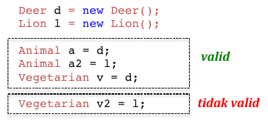

### Virtual method Invocation

Virtual method invocation terjadi ketika ada pemanggilan overriding method dari suatu objek polimorfisme. Disebut virtual karena antara method yang dikenali oleh compiler dan method yang dijalankan oleh JVM berbeda.

```java
public class Animal{
  public void walk(){
    System.out.println(“The animal is walking around the jungle”);
  }
}

public class Deer extends Animal {
  @override
  public void walk(){
    System.out.println(“The deer is walking around the jungle”);
  }
}
```

Ketika ada suatu objek polimorfisme a, misalkan:

```java
Deer d = new Deer();
Animal a = d;
```

Kemudian dipanggil method overriding darinya, maka saat itu terjadi
pemanggilan method virtual, seperti:

```java
a.walk();
```

Saat compile time, compiler akan mengenali method walk() yang akan
dipanggil adalah method walk() yang ada di class Animal, karena objek a
bertipe Animal. Tetapi saat dijalankan (run time), maka yang dijalankan oleh JVM justru method walk() yang ada di class Deer. Akan berbeda halnya
jika pemanggilan method walk() dilakukan dari objek d (bukan objek
polimorfisme), seperti

```java
d.walk();
```

maka method walk() yang dikenali saat compile time oleh compiler dan
yang dijalankan saat runtime oleh JVM adalah sama-sama method walk()
yang ada di class Deer (karena objek d dideklarasikan dari class Deer).

### Heterogenous Collection

Dengan adanya konsep polimorfisme, maka variabel array bisa dibuat heterogen. Artinya di dalam array tersebut bisa berisi berbagai macam objek yang berbeda. Contoh:

```java
Animal arr[] = new Animal[2];
arr[0] = new Deer();
arr[1] = new Lion();
```

Dari contoh tersebut data pertama dari array arr berisi objek Deer, dan data kedua dari arr berisi objek Lion. Hal ini bisa dilakukan karena array arr dideklarasikan dari class Animal (superclass dari Deer dan Lion).

### Polymorphic Argument

Polimorfisme juga bisa diterapkan pada argument suatu method. Tujuannya agar method tersebut bisa menerima nilai argument dari berbagai bentuk objek. Misalkan dibuat class baru sebagai berikut:

```java
public class Human{
  public void drive(Animal anim){
    anim.walk();
  }
}
```

Perhatikan method drive(), ia memiliki argument berupa Animal. Karena Animal memiliki subclass Lion dan Deer, maka method drive() tersebut akan bisa menerima argument berupa objek dari Deer maupun objek dari Lion.

```java
Deer d = new Deer();
Lion l = new Lion();
Human hum = new Human();
hum.drive(d);
hum.drive(l);
```

### Operator instanceof

Operator instanceof bisa digunakan untuk mengecek apakah suatu objek merupakan hasil instansiasi dari suatu class tertentu. Hasil dari instanceof berupa nilai boolean. Misalkan dibuat objek d dan l.

```java
Deer d
 = new Deer();
Lion l
 = new Lion();
Animal
 a1 = d;
Animal
 a2 = l;
```

Jika kemudian digunakan operator instanceof, misalkan

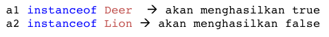

### Object Casting

Casting objek digunakan untuk mengubah tipe dari suatu objek. Jika ada suatu objek dari subclass kemudian tipenya diubah ke superclass, maka hal ini termasuk ke upcasting. Contoh:

```java
Deer d = new Deer();
Animal a1 = d; // proses ini bisa disebut juga upcasting
```

Downcast terjadi jika ada suatu objek superclass, kemudian diubah menjadi objek dari subclass. Contoh:

```java
Deer d = new Deer();
Animal a1 = d; // proses ini bisa disebut juga upcasting
Deer d = (Deer) a1; //proses downcasting
```

Proses downcasting sering disebut juga sebagai explicit casting, karena bentuk tujuan dari casting harus dituliskan dalam tanda kurung, di depan objek yang akan di-casting

## Percobaan

`UML`

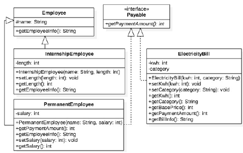

Dalam suatu perusahaan, pemilik pada tiap bulannya harus membayar gaji pegawai tetap dan rekening listrik. Selain pegawai tetap perusahaan juga memiliki pegawai magang, dimana pegawai ini tidak mendapatkan gaji.

### Percobaan 1

`Screenshot`


`Kode Program`

* [Employee1841720019Sultan.java](../../src/10_Polimorfisme/percobaan/Employee1841720019Sultan.java)
* [InternshipEmployee1841720019Sultan.java](../../src/10_Polimorfisme/percobaan/InternshipEmployee1841720019Sultan.java)
* [PermanentEmployee1841720019Sultan.java](../../src/10_Polimorfisme/percobaan/PermanentEmployee1841720019Sultan.java)
* [IPayable1841720019Sultan.java](../../src/10_Polimorfisme/percobaan/IPayable1841720019Sultan.java)
* [ElectricityBill1841720019Sultan.java](../../src/10_Polimorfisme/percobaan/ElectricityBill1841720019Sultan.java)
* [Tester11841720019Sultan.java](../../src/10_Polimorfisme/percobaan/Tester11841720019Sultan.java)

`Pertanyaan`

1. Class apa sajakah yang merupakan turunan dari class `Employee`?

    `Jawaban`

    class yang merupakan turunan dari class `Employee` adalah class `InternshipEmployee` dan `PermanentEmployee`.

2. Class apa sajakah yang implements ke interface `Payable`?

    `Jawaban`

    Class yang implements interdace `Payable` adalah class `ElectricityBill` dan `PermanentEmployee`.

3. Perhatikan class `Tester1`, baris ke-10 dan 11. Mengapa `e`, bisa diisi dengan objek `pEmp` (merupakan objek dari class `PermanentEmployee`) dan objek `iEmp` (merupakan objek dari class `InternshipEmploye`) ?

    `Jawaban`

    Dikarenakan kedua object class tersebut merupakan object turunan dari Employee.

4. Perhatikan class `Tester1`, baris ke-12 dan 13. Mengapa `p`, bisa diisi dengan objek `pEmp` (merupakan objek dari class `PermanentEmployee`) dan objek `eBill` (merupakan objek dari class `ElectricityBill`) ?

    `Jawaban`

    Dikarenakan kedua object class tersebut mengimplements Inteface IPayable.

5. Coba tambahkan sintaks:

    ```java
    p = iEmp;
    e = eBill;
    ```

    pada baris 14 dan 15 (baris terakhir dalam method `main`)! Apa yang menyebabkan error?

    `Jawaban`

    Error terjadi dikarenakan kedua object class yang digunakan sama sekali tidak memiliki hubungan relasi.

6. Ambil kesimpulan tentang konsep/bentuk dasar polimorfisme!

    `Jawaban`

    Konsep dasar polimorfisme ialah setiap objek yang dideklarasikan dari super class, maka objek tersebut bisa diinstansiasi sebagai objek dari sub class. Dan konsep polimorfisme bisa diterapkan pada class-class yang memiliki relasi inheritance

### Percobaan 2

`Screenshot`

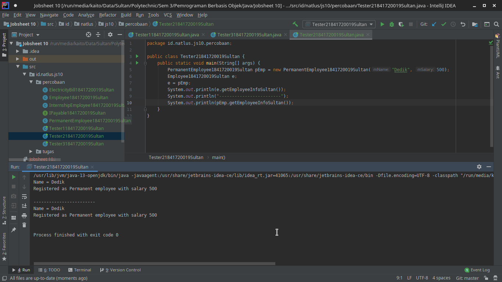

`Kode Program`

* [Employee1841720019Sultan.java](../../src/10_Polimorfisme/percobaan/Employee1841720019Sultan.java)
* [InternshipEmployee1841720019Sultan.java](../../src/10_Polimorfisme/percobaan/InternshipEmployee1841720019Sultan.java)
* [PermanentEmployee1841720019Sultan.java](../../src/10_Polimorfisme/percobaan/PermanentEmployee1841720019Sultan.java)
* [IPayable1841720019Sultan.java](../../src/10_Polimorfisme/percobaan/IPayable1841720019Sultan.java)
* [ElectricityBill1841720019Sultan.java](../../src/10_Polimorfisme/percobaan/ElectricityBill1841720019Sultan.java)
* [Tester21841720019Sultan.java](../../src/10_Polimorfisme/percobaan/Tester21841720019Sultan.java)

`Pertanyaan`

1. Perhatikan class `Tester2` di atas, mengapa pemanggilan `e.getEmployeeInfo()` pada baris 8 dan `pEmp.getEmployeeInfo()` pada baris 10 menghasilkan hasil sama?

    `Jawaban`

    Dikarenakan kita menggunakan suatu cara bernama Virtual Method Invocation yang artinya Saat compile time, compiler akan mengenali method getEmployeeInfo() yang akan dipanggil adalah method getEmployeeInfo() yang ada di class Employee, karena objek e bertipe Employee. Tetapi saat dijalankan (run time), maka yang dijalankan oleh JVM justru method getEmployeeInfo() yang ada di class PermanentEmployee

2. Mengapa pemanggilan method `e.getEmployeeInfo()` disebut sebagai pemanggilan method virtual (virtual method invication), sedangkan `pEmp.getEmployeeInfo()` tidak?

    `Jawaban`

    Dikarenakan saat compile time oleh compiler dan yang dijalankan saat runtime oleh JVM adalah sama-sama method getEmployeeInfo() yang ada di class PermanentEmployee(karena objek pEmp dideklarasikan dari class PermanentEmployee)

3. Jadi apakah yang dimaksud dari virtual method invocation? Mengapa disebut virtual?

    `Jawaban`

    Virtual Method Invocation adalah ketika ada pemanggilan overriding method dari suatu objek polimorfisme. Disebut virtual karena antara method yang dikenali oleh compiler dan method yang dijalankan oleh JVM berbeda.

### Percobaan 3

`Screenshot`

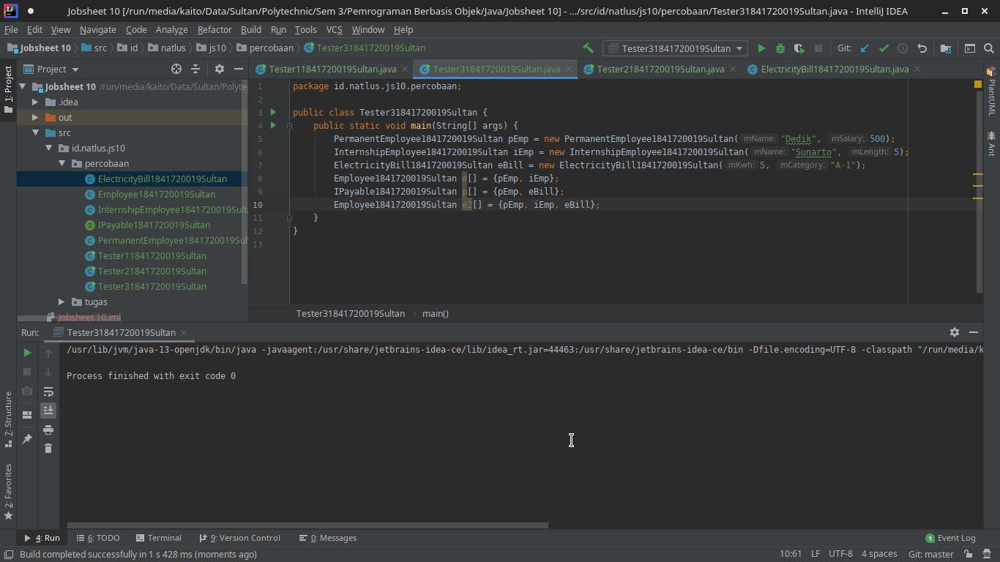

`Kode Program`

* [Employee1841720019Sultan.java](../../src/10_Polimorfisme/percobaan/Employee1841720019Sultan.java)
* [InternshipEmployee1841720019Sultan.java](../../src/10_Polimorfisme/percobaan/InternshipEmployee1841720019Sultan.java)
* [PermanentEmployee1841720019Sultan.java](../../src/10_Polimorfisme/percobaan/PermanentEmployee1841720019Sultan.java)
* [IPayable1841720019Sultan.java](../../src/10_Polimorfisme/percobaan/IPayable1841720019Sultan.java)
* [ElectricityBill1841720019Sultan.java](../../src/10_Polimorfisme/percobaan/ElectricityBill1841720019Sultan.java)
* [Tester31841720019Sultan.java](../../src/10_Polimorfisme/percobaan/Tester31841720019Sultan.java)

`Pertanyaan`

1. Perhatikan array `e` pada baris ke-8, mengapa ia bisa diisi dengan objek-objek dengan tipe yang berbeda, yaitu objek `pEmp` (objek dari `PermanentEmployee`) dan objek `iEmp` (objek dari `InternshipEmployee`) ?

    `Jawaban`

    Dikarenakan array E dideklarasikan dari class Employee (Superclass dari InternshipEmployee dan PermanentEmployee) objek keduanya saling memiliki relasi terhadap object Array Employee.

2. Perhatikan juga baris ke-9, mengapa array `p` juga biisi dengan objek-objek dengan tipe yang berbeda, yaitu objek `pEmp` (objek dari `PermanentEmployee`) dan objek `eBill` (objek  dari `ElectricityBilling`) ?

    `Jawaban`

    Jawaban hampir sama dengan nomor 1 dikarenakan array p merupakan pendeklarasian dari interface IPayable (implements yang ada pada class PermanentEmployee dan ElectricityBilling) dan objek keduanya juga memiliki relasi Interface Inheritance terhadap object interface IPayable

3. Perhatikan baris ke-10, mengapa terjadi error?

    `Jawaban`

    Terjadi error dikarenakan array tersebut merupakan pendeklarasian dari Employee sedangkan eBill tidak memiliki relasi sama sekali dengan class Employee.

### Percobaan 4

`Screenshot`

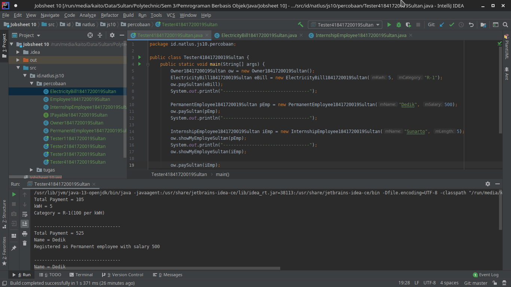
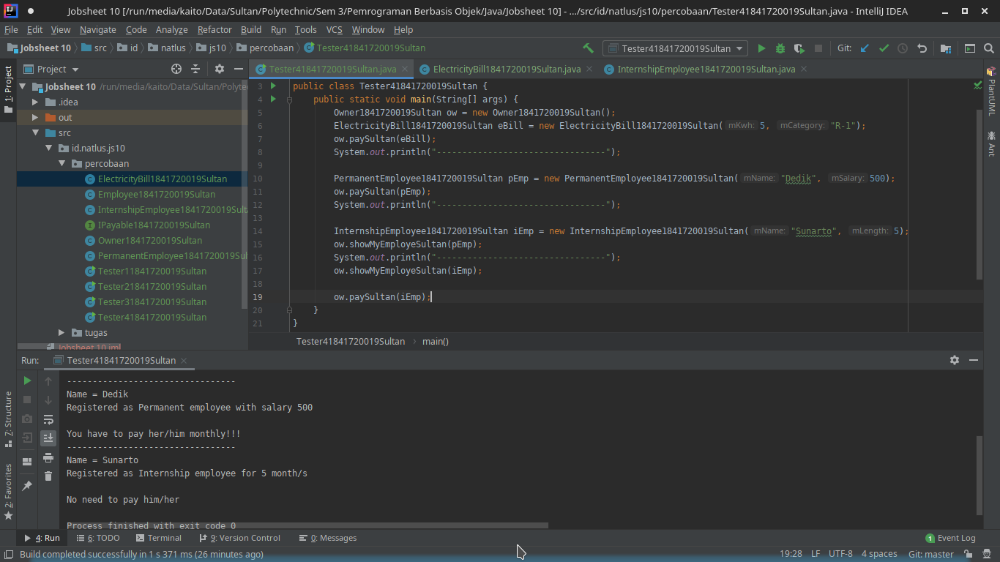

`Kode Program`

* [Employee1841720019Sultan.java](../../src/10_Polimorfisme/percobaan/Employee1841720019Sultan.java)
* [InternshipEmployee1841720019Sultan.java](../../src/10_Polimorfisme/percobaan/InternshipEmployee1841720019Sultan.java)
* [PermanentEmployee1841720019Sultan.java](../../src/10_Polimorfisme/percobaan/PermanentEmployee1841720019Sultan.java)
* [IPayable1841720019Sultan.java](../../src/10_Polimorfisme/percobaan/IPayable1841720019Sultan.java)
* [ElectricityBill1841720019Sultan.java](../../src/10_Polimorfisme/percobaan/ElectricityBill1841720019Sultan.java)
* [Owner1841720019Sultan.java](../../src/10_Polimorfisme/percobaan/Owner1841720019Sultan.java)
* [Tester41841720019Sultan.java](../../src/10_Polimorfisme/percobaan/Tester41841720019Sultan.java)

`Pertanyaan`

1. Perhatikan class `Tester4` baris ke-7 dan baris ke-11 mengapa pemanggilan `ow.pay(eBill)` dan `ow.pay(pEmp)` bisa dilakukan, padahal jika diperhatikan method `pay()` yang ada di dalam class `Owner` memiliki argument/parameter bertipe `Payable?` Jika diperhatikan lebih detil eBill merupakan objek dari `ElectricityBill` dan pEmp merupakan objek dari `PermanentEmployee`?

    `Jawaban`

    Tentu bisa dikarenakan kedua object tersebut sama sama implements payment dari IPayable

2. Jadi apakah tujuan membuat argument bertipe Payable pada method pay() yang ada di dalam class Owner?

    `Jawaban`

    Agar bisa mendapatkan total jumlah pembayaran yang methodnya didapat dari implementasi interface IPayable

3. Coba pada baris terakhir method main() yang ada di dalam class Tester4 ditambahkan perintah ow.pay(iEmp);

    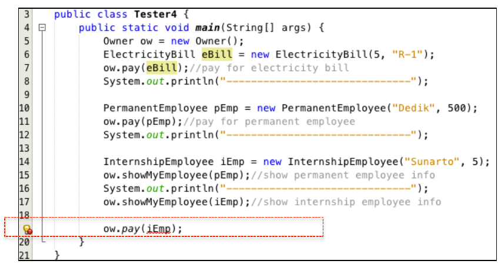

    Mengapa terjadi error?

    `Jawaban`

    Karena class InternshipEmployee tidak mengimplements method IPayable.

4. Perhatikan class `owner` ,diperlukan untuk apakah sintaks `p instanceof ElectricityBill` pada baris ke-6?

    `Jawaban`

    Dikarenakan p disana diartikan sebagai instansiasi object pada class main, jadi di main semisal kita memasukan eBill, pada Owner Payable P merupakan sebuah object yang nantinya akan di overwrite oleh eBill, dikarenakan kita di class main menset ow.pay(eBill). Dan pada saat instanceof kita disana membandingkan eBill (eBill apakah bagian dari ElectricityBill? Jika iya maka akan melanjutkan atau melakukan syntax dibawahnya.

5. Perhatikan kembali class Owner baris ke-7, untuk apakah casting objek disana (`ElectricityBill eb = (ElectricityBill) p`) diperlukan ? Mengapa objek `p` yang bertipe `Payable` harus di-casting ke dalam objek `eb` yang bertipe `ElectricityBill` ?

    `Jawaban`

    Disebut downcasting yang berfungsi sebagai mengakses perilaku objek yang lebih spesifik, disini kita ingin mengakses getBillInfo dengan mendowncast p sedangkan p sendiri ialah EBill. Dan harus didowncast agar bisa mendapatkan info dari p (inputan instansiasi object pada main)

## Tugas

Dalam suatu permainan, Zombie dan Barrier bisa dihancurkan oleh Plant dan bisa menyembuhkan diri. Terdapat dua jenis Zombie, yaitu Walking Zombie dan Jumping Zombie. Kedua Zombie tersebut memiliki cara penyembuhan yang berbeda, demikian juga cara penghancurannya, yaitu ditentukan oleh
aturan berikut ini:

* Pada WalkingZombie
  * Penyembuhan : Penyembuhan ditentukan berdasar level zombie yang bersangkutan
    * Jika zombie level 1, maka setiap kali penyembuhan, health akan bertambah 20%
    * Jika zombie level 2, maka setiap kali penyembuhan, health akan bertambah 30%
    * Jika zombie level 3, maka setiap kali penyembuhan, health akan bertambah 40%
  * Penghancuran : setiap kali penghancuran, health akan berkurang 2%
* Pada Jumping Zombie
  * Penyembuhan : Penyembuhan ditentukan berdasar level zombie yang bersangkutan
    * Jika zombie level 1, maka setiap kali penyembuhan, health akan bertambah 30%
    * Jika zombie level 2, maka setiap kali penyembuhan, health akan bertambah 40%
    * Jika zombie level 3, maka setiap kali penyembuhan, health akan bertambah 50%
  * Penghancuran : setiap kali penghancuran, health akan berkurang 1%

Buat program dari class diagram di bawah ini!

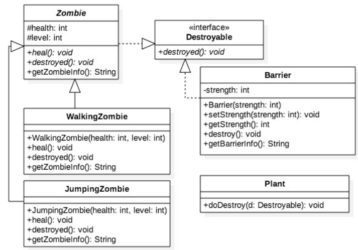

`Jawaban`

`Screenshot`

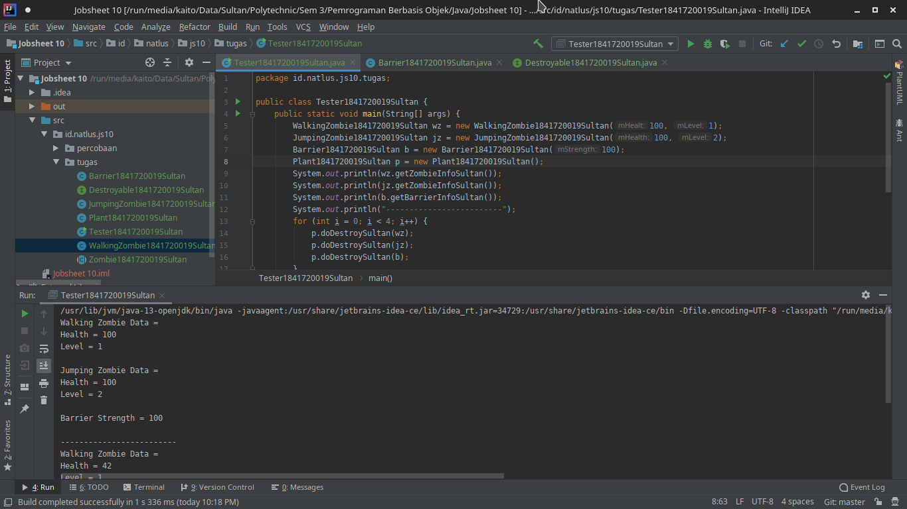

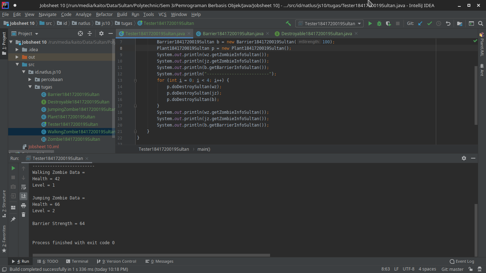

`Kode Program`

* [Barrier1841720019Sultan.java](../../src/10_Polimorfisme/tugas/Barrier1841720019Sultan.java)
* [Destroyable1841720019Sultan.java](../../src/10_Polimorfisme/tugas/Destroyable1841720019Sultan.java)
* [JumpingZombie1841720019Sultan.java](../../src/10_Polimorfisme/tugas/JumpingZombie1841720019Sultan.java)
* [Plant1841720019Sultan.java](../../src/10_Polimorfisme/tugas/Plant1841720019Sultan.java)
* [WalkingZombie1841720019Sultan.java](../../src/10_Polimorfisme/tugas/WalkingZombie1841720019Sultan.java)
* [Zombie1841720019Sultan.java](../../src/10_Polimorfisme/tugas/Zombie1841720019Sultan.java)
* [Tester1841720019Sultan.java](../../src/10_Polimorfisme/tugas/Tester1841720019Sultan.java)

## Kesimpulan

1. Saya dapat m]mahami konsep dan bentuk dasar polimorfisme
2. Saya dapat memahami konsep virtual method invication
3. Saya dapat menerapkan polimorfisme pada pembuatan heterogeneous collection
4. Saya dapat menerapkan polimorfisme pada parameter/argument method
5. Saya dapat menerapkan object casting untuk meng-ubah bentuk objek

## Pernyataan Diri

Saya menyatakan isi tugas, kode program, dan laporan praktikum ini dibuat oleh saya sendiri. Saya tidak melakukan plagiasi, kecurangan, menyalin/menggandakan milik orang lain.

Jika saya melakukan plagiasi, kecurangan, atau melanggar hak kekayaan intelektual, saya siap untuk mendapat sanksi atau hukuman sesuai peraturan perundang-undangan yang berlaku.

Ttd,

***Sultan Achmad Qum Masykuro NS***
