# Laporan Praktikum #11 - GUI

## Kompetensi

1. Membuat aplikasi Graphical User Interface sederhana dengan bahasa pemrograman java.
2. Mengenal komponen GUI seperti frame, label, textfield, combobox, radiobutton, checkbox, textarea, menu, serta table.
3. Menambahkan event handling pada aplikasi GUI.

## Ringkasan Materi

Pada bab-bab sebelumnya interaksi antara user dengan program hanya berbasis console editor dengan tampilan dos yang membosankan, maka agar interaksi antara user dengan program tidak membosankan diperlukanlah sebuah interface yang menghubungkan antara user dengan program dengan tampilan grafis, interface ini dinamakan dengan GUI (Graphical User Interface). Dalam pemrograman GUI terdapat beberapa bagian yang harus dilakukan yaitu:

1. Membuat windows utama
2. Menentukan komponen-komponen pendukung program
3. Menentukan tata letak layout agar nantinya semua komponen – komponen yang sudah dipersiapkan bisa diaatur sedemikian rupa
4. Event Handling dari sebuah aktivitas, seperti penekanan button, check box dan lain-lain

Java Swing merupakan bagian dari JFC (Java Foundation Classes) yang menyediakan API untuk
menangani hal yang berkaitan dengan GUI bagi program Java. Kita bisa membedakan komponen
Swing dengan komponen AWT, di mana pada umumnya kelas-kelas yang berada dalam komponen
Swing diawali dengan huruf J, misal: JButton, JLabel, JTextField, JRadioButton.

1. Buat JFrame.
2. Buat JPanel dan tentukan layout yang diinginkan.
3. Masukkan komponen yang diinginkan kedalam JPanel dan atur.
4. Tambahkan event listener dsb untuk merespon input dari pengguna

## Percobaan

### Percobaan 1

Membuat Frame awala aplikasi java menggunakan JFrame.

`Screenshot`

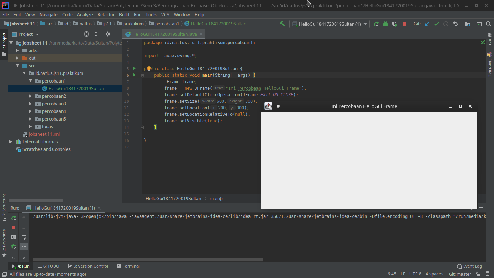

`Kode Program`

[HelloGui1841720019Sultan.java](../../src/11_GUI/percobaan1/HelloGui1841720019Sultan.java)

### Percobaan 2

Selanjutnya adalah bagaimana memanfaatkan komponen-komponen GUI pada Java untuk menangani inputan, dengan memanfaatkan JFrame, JButton, JLabel, JTextField, JPanel dsb.

`Screenshot`

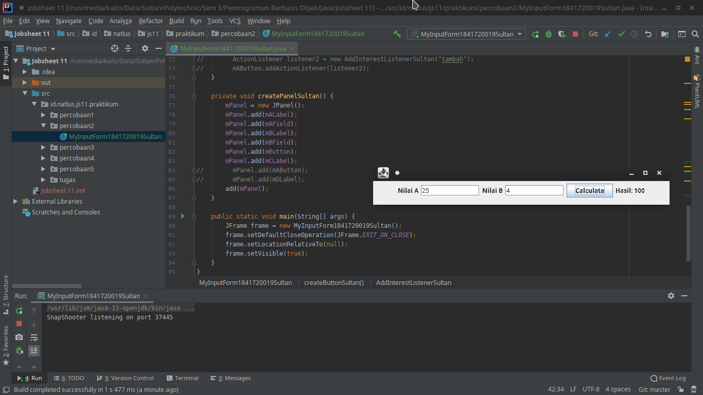

`Kode Program`

[MyInputForm1841720019Sultan.java](../../src/11_GUI/percobaan2/MyInputForm1841720019Sultan.java)

**`Pertanyaan`**

1. Modifikasi kode program dengan menambahkan JButton baru untuk melakukan fungsi perhitungan penambahan, sehingga ketika button di klik (event click) maka akan menampilkan hasil penambahan dari nilai A dan B

    `Jawaban`

    `Screenshot`

    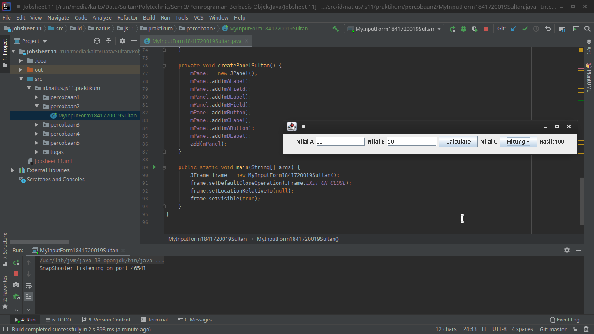

    `Kode Program`

    [MyInputForm1841720019Sultan.java](../../src/11_GUI/percobaan2/MyInputForm1841720019Sultan.java)

### Percobaan 3

Java GUI menyediakan beberapa layout yang dapat digunakan pada program. Pada modul praktikum ini akan dijelaskan 3 contoh GUI layout, yaitu:

* Border layout
* Grid layout
* Box layout

Sebuah layout border dapat diilustrasikan pada Gambar dibawah, di mana kita dapat meletakkan komponen GUI pada lokasi tertentu misal utara, barat, tengah, timur, dan selatan. Untuk menentukan jenis layout yang akan digunakan, kita dapat memanggil method setLayout() dan selanjutnya memasukkan objek Border Layout.

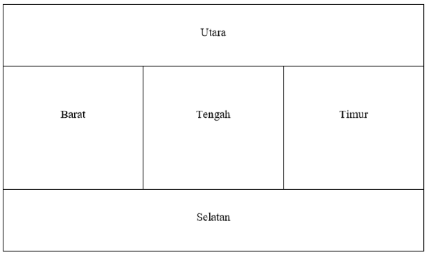

`Screenshot`

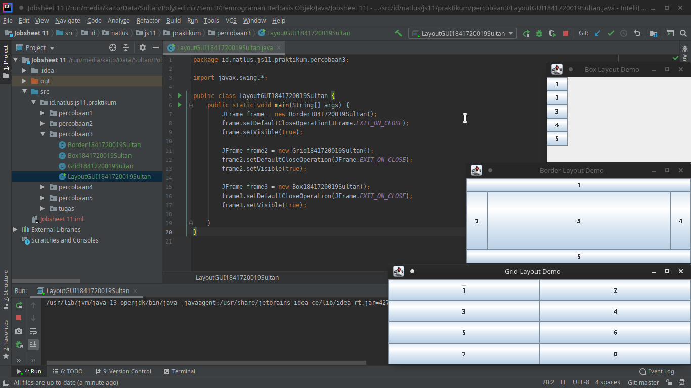

`Kode Program`

* [Border1841720019Sultan.java](../../src/11_GUI/percobaan3/Border1841720019Sultan.java)
* [Box1841720019Sultan.java](../../src/11_GUI/percobaan3/Box1841720019Sultan.java)
* [Grid1841720019Sultan.java](../../src/11_GUI/percobaan3/Grid1841720019Sultan.java)
* [LayoutGUI1841720019Sultan.java](../../src/11_GUI/percobaan3/LayoutGUI1841720019Sultan.java)

**`Pertanyaan`**

1. Apa perbedaan dari Grid Layout, Box Layout dan Border Layout?

    `Jawaban`

    * Grid Layout

        Komponen ditempatkan dalam bentuk `rectangular grid` dan membaginya ke ukuran yang sama dalam bentuk kotak dan masing masing komponen di letakkan pada satu kotak

    * Box Layout

        Komponen ditempatkan berbentuk box yang dapat diatur secara vertikal maupun horizontal

    * Border Layout

        Terdiri dari 5 bagian yaitu : `NORTH`, `SOUTH`, `EAST`, `WEST`, dan `CENTER`. Masing - masing bagian ini dapat menampung lebih dari satu komponen

2. Apakah fungsi dari masing-masing kode berikut?

    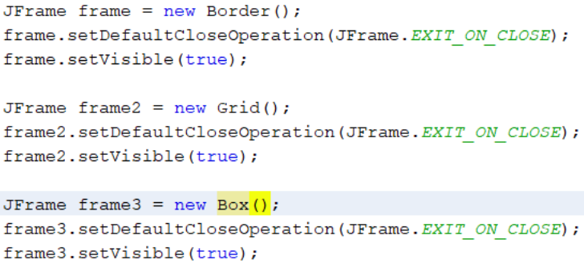

    `Jawaban`

    Fungsi dari kode program diatas adalah untuk menampilkan aplikasi, pada kode program

    `1`

    ```java
    JFrame frameX = new layout();
    ```

    Berfungsi untuk membuat frame baru dengan objek dari class layout yang tadi telah dibuat

    `2`

    ```java
    frameX.setDefaultCloseOperation(JFrame.EXIT_ON_CLOSE);
    ```

    Berfungsi untuk memberikan pengaturan pada bagaimana untuk mengkahiri operasi, yaitu dengan cara klik tanda silang ( :x: ) yang biasanya terdapat di pojok kanan atas atau pojok kiri atas dari aplikasi.

    `3`

    ```java
    frameX.setVisible(true);
    ```

    Bergfungsi untuk membuat frame yang telah dibuat tadi agar dapat dilihat dan muncul sebagai program desktop pada umumnya.

### Percobaan 4

`Screenshot`

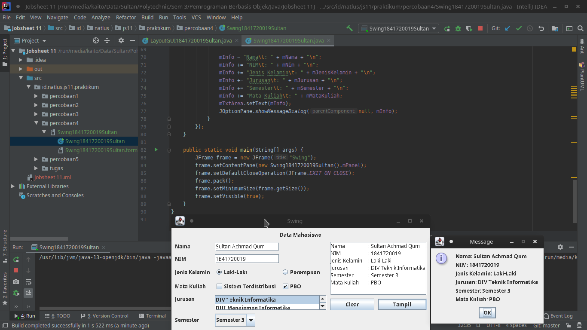

`Kode Program`

* [Swing1841720019Sultan.java](../../src/11_GUI/percobaan4/Swing1841720019Sultan.java)

* [Swing1841720019Sultan.form](../../src/11_GUI/percobaan4/Swing1841720019Sultan.form)

**`Pertanyaan`**

1. Apakah fungsi dari kode berikut?

    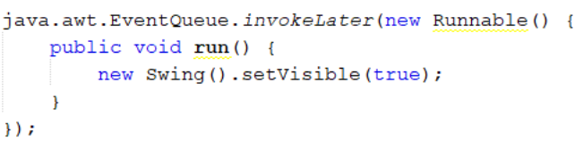

    `Jawaban`

    Fungsi dari kode program diatas adalah untuk membuat class `Swing` muncul saat program dijalankan dan tampil pada desktop.

2. Mengapa pada bagian logika checkbox dan radio button digunakan multiple if ?

    `Jawaban`

    Karena pada percobaan ini setiap checkbox dan radio button merupakan tombol yang tidak saling terkait satu sama lain, sehingga jika dicoba tombol radio button laki laki dipilih dan radio button perempuan dipiilih akan tampil teks `laki-lakiperempuan` karena bukanlah groupbutton yang harus dipilih salah satu

    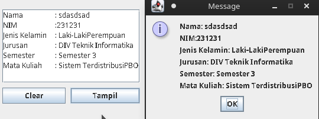

3. Lakukan modifikasi pada program untuk melakukan menambahkan inputan berupa alamat dan berikan fungsi pemeriksaan pada nilai Alamat tersebut jika belum diisi dengan menampilkan pesan peringatan.

    `Jawaban`

    `Screenshot`

    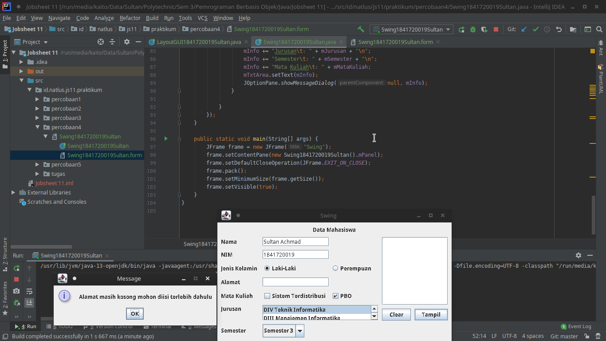

    `Kode Program`

    * [Swing1841720019Sultan.java](../../src/11_GUI/percobaan4/Swing1841720019Sultan.java)
    * [Swing1841720019Sultan.form](../../src/11_GUI/percobaan4/Swing1841720019Sultan.form)

### Percobaan 5

`Screenshot`

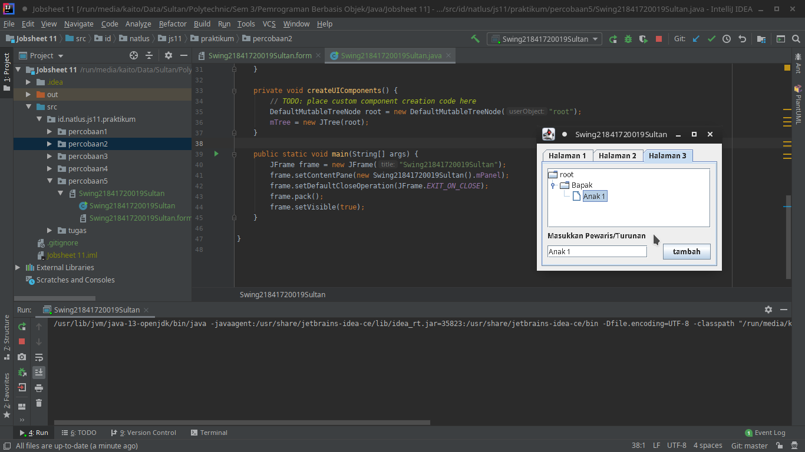

`Kode Program`

* [Swing21841720019Sultan.java](../../src/11_GUI/percobaan5/Swing21841720019Sultan.java)
* [Swing21841720019Sultan.form](../../src/11_GUI/percobaan5/Swing21841720019Sultan.form)

**`Pertanyaan`**

1. Apa kegunaan komponen swing JTabPane, JTree, pada percobaan 5?

    `Jawaban`

    * JTabPane

        Komponen swing JTabpane digunakan untuk membuat panel yang menyediakan tab yang bisa membuat sekaligus beberapa halaman di satu panel.

    * JTree

        Komponen swing Jtree untuk menampilkan data dengan hirarki properti dengan menambahkan node ke node dan menyimpan konsep induk dan anak node.

2. Modifikasi program untuk menambahakan komponen JTable pada tab Halaman 1 dan tab Halaman 2

    `Jawaban`

    `Screenshot`

    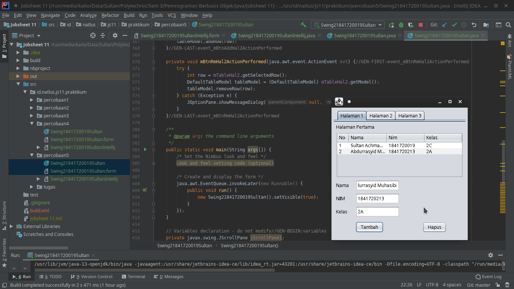
    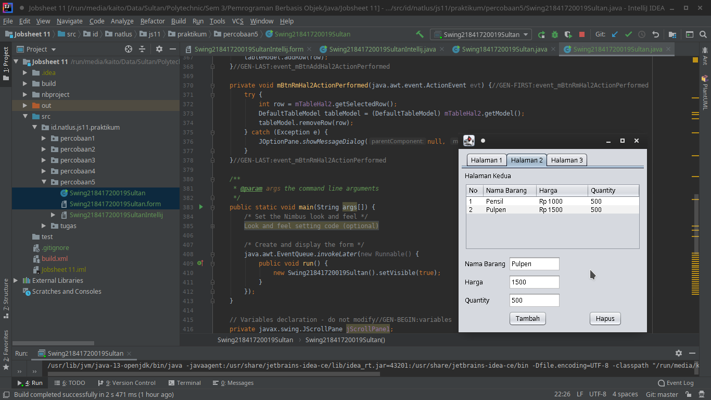

    `Kode Program`

   * [Swing21841720019Sultan.java](../../src/11_GUI/percobaan5/Swing21841720019Sultan.java)
   * [Swing21841720019Sultan.form](../../src/11_GUI/percobaan5/Swing21841720019Sultan.form)

## Tugas

Buatlah Sebuah Program yang mempunyai fungsi seperti kalkulator (mampu menjumlahkan, mengurangkan, mengalikan dan membagikan. Dengan tampilan seperti berikut.

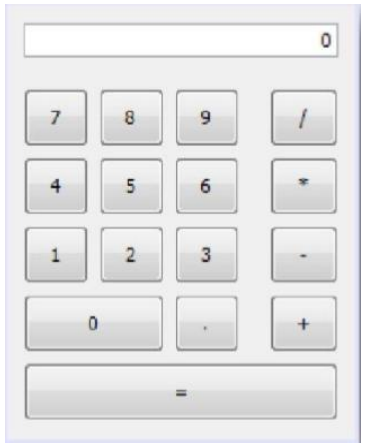

`Jawaban`

`Screenshot`

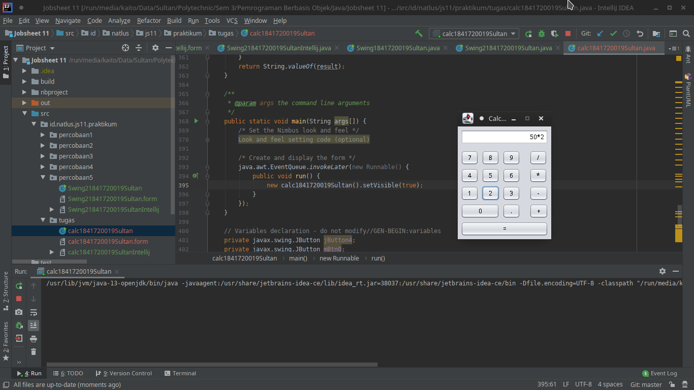
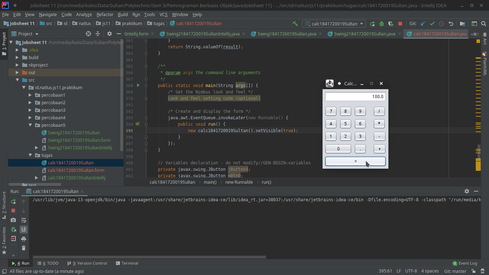

`Kode Program`

* [calc1841720019Sultan.java](../../src/11_GUI/tugas/calc1841720019Sultan.java)
* [calc1841720019Sultan.form](../../src/11_GUI/tugas/calc1841720019Sultan.form)

## Kesimpulan

1. Saya dapat membuat aplikasi Graphical User Interface sederhana dengan bahasa pemrograman java.
2. Saya mampu mengenal komponen GUI seperti frame, label, textfield, combobox, radiobutton, checkbox, textarea, menu, serta table.
3. Saya mampu menambahkan event handling pada aplikasi GUI.

## Pernyataan Diri

Saya menyatakan isi tugas, kode program, dan laporan praktikum ini dibuat oleh saya sendiri. Saya tidak melakukan plagiasi, kecurangan, menyalin/menggandakan milik orang lain.

Jika saya melakukan plagiasi, kecurangan, atau melanggar hak kekayaan intelektual, saya siap untuk mendapat sanksi atau hukuman sesuai peraturan perundang-undangan yang berlaku.

Ttd,

***Sultan Achmad Qum Masykuro NS***
