# Laporan Praktikum #12 - Java API

## Kompetensi

* Memahami cara penyimpanan objek menggunakan Collection dan Map.
* Mengetahui pengelompokan dari Collection.
* Mengetahui perbedaan dari interface Set, List dan Map.
* Mengetahui penggunaan class-class dari interface Set, List, dan Map.
* Memahami koneksi database menggunakan JDBC dan JDBC API.

## Ringkasan Materi

Collection adalah suatu objek yang bisa digunakan untuk menyimpan sekumpulan objek. Objek yang ada dalam Collection disebut elemen. Collection menyimpan elemen yang bertipe Object, sehingga berbagai tipe object bisa disimpan dalam Collection. Class-class mengenai Collection tergabung dalam Java Collection Framework. Class-class Collection diletakkan dalam package java.util dan mempunyai dua interface utama yaitu **Collection**.  
Collection terbagi menjadi 3 kelompok yaitu

1. Set

    Set mengikuti model himpunan, dimana objek/anggota yang tersimpan dalam Set harus unik. Urutan maupun letak dari anggota tidak penting, hanya keberadaan anggota saja yang penting. Kelas konkrit yang mengimplementasikan **Set** harus memastikan bahwa tidak terdapat elemen duplikat yang dapat ditambahkan ke dalam set. Yaitu, tidak terdapat dua elemen **e1** dan **e2** yang berada di dalam set yang membuat **e1.equals(e2)** bernilai **true**. ClassClass yang mengimplementasikan interface Set adalah HashSet.

    HashSet dapat digunakan untuk menyimpan elemen-elemen bebas-duplikat. Kelas HashSet merupakan suatu kelas konkrit yang mengimplementasikan Set. Pembuatan objek HashSet adalah sebagai berikut:

    ```java
    Set<nama_objek_HashSet> = new HashSet();
    ```

2. List

    List digunakan untuk menyimpan sekumpulan objek berdasarkan urutan masuk (ordered) dan menerima duplikat. Cara penyimpanannya seperti array, oleh sebab itu memiliki posisi awal dan posisi akhir, menyisipkan objek pada posisi tertentu, mengakses dan menghapus isi list, dimana semua proses ini selalu didasarkan pada urutannya. Class-class yang mengimplementasikan interface List adalah Vector, Stack, Linked List dan Array List. Pada jobsheet ini yang akan dibahas adalah ArrayList.

    ArrayList digunakan untuk membuat array yang ukurannya dinamis. Berbeda dengan array biasa yang ukurannya harus ditentukan di awal deklarasi array, dengan ArrayList, ukurannya akan fleksibel tergantung banyaknya elemen yang dimasukkan. Pendeklarasian object ArrayList sebaiknya diikuti dengan nama class yang akan dimasukkan dalam List tersebut.  Tujuannya agar method dan property dari setiap object dalam ArrayList dapat diakses secara langsung. Pembuatan objek ArrayList adalah sebagai berikut:

    ```java
    ArrayList<nama_objek_arraylist> = new ArrayList();
    ```

3. Map

    Perbedaaan mendasar map dengan collection yang lain, untuk menyimpan objek pada Map, perlu sepasang objek, yaitu key yang bersifat unik dan nilai yang disimpan. Untuk mengakses nilai tersebut maka kita perlu mengetahui key dari nilai tersebut. Map juga dikenal sebagai dictionary/kamus. Pada saat menggunakan kamus, perlu suatu kata yang digunakan untuk pencarian. Class-class yang mengimplementasikan Map adalah Hashtable,HashMap, LinkedHashMap. Pada jobsheet ini yang akan dibahas adalah HashMap.

    HashMap adalah class implementasi dar Map, Map itu sendiri adalah interface yang memiliki fungsi untuk memetakan nilai dengan key unik. HashMap berfungsi sebagai memory record management, dimana setiap record dapat disimpan dalam sebuah Map. kemudian setiap Map diletakkan pada vektor, list atau set yang masih turunan dari collection. Pembuatan objek HashMap adalah sebagai berikut:

    ```java
    HashMap<nama_objek_HashMap> = new HashMap();
    ```

4. JDBC API

   JDBC API merupakan Java Database Connectivity Application Programming Interface ( JDBC API). Pada dasarnya JDBC API terdiri dari satu set kelas dan interface yang digunakan untuk berinteraksi dengan database dari aplikasi Java. Umumnya, JDBC API melakukan 3 (tiga) fungsi berikut :

   * Membangun koneksi antara aplikasi Java dan database
   * Membangun dan mengeksekusi query
   * Memproses hasil

## Percobaan

### Percobaan 1 (HashSet)

`Screenshot`

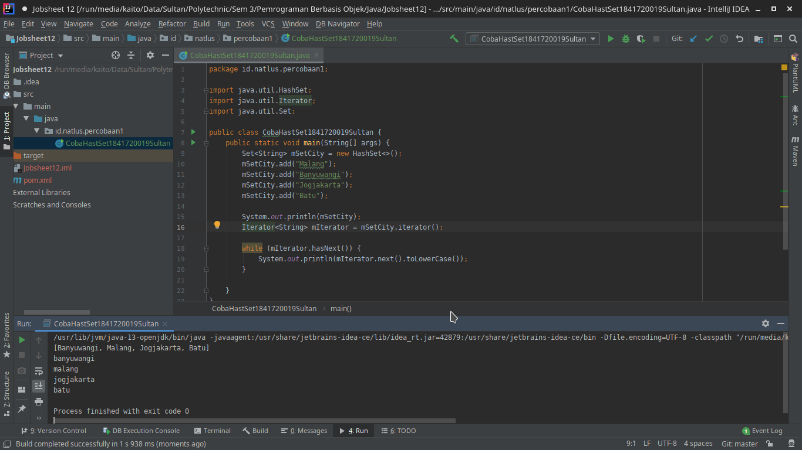

`Kode Program`

* [CobaHastSet1841720019Sultan.java](../../src/12_Java_API/percobaan1/CobaHastSet1841720019Sultan.java)

`Pertanyaan`

1. Apakah fungsi **import java.util.*;** pada program diatas!

    `Jawban`

    Fungsi dari `import java.util.*;` adalah untuk meng import library util yang berisi berbagai macam class seperti `HashSet`. `Set`, `ArrayLis` dll.

2. Pada baris program keberapakah yang berfungsi untuk menciptakan object HashSet?

   `Jawaban`

    Jika pada file [CobaHastSet1841720019Sultan](../../src/12_Java_API/percobaan1/CobaHastSet1841720019Sultan.java) fungsi untuk menciptakan object HashSet berada pada `line 9`.

3. Apakah fungsi potongan program dibawah ini pada percobaan 1!

   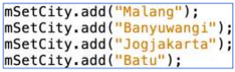

   `Jawaban`

   Fungsinya adalah untuk menambahkan element kedalam HashSet bernama `mSetCity`.

4. Tambahkan **set.add(“Malang”);** kemudian jalankan program! Amati hasilnya dan jelaskan mengapa terjadi error!

    `Jawaban`

    `Screenshot`

    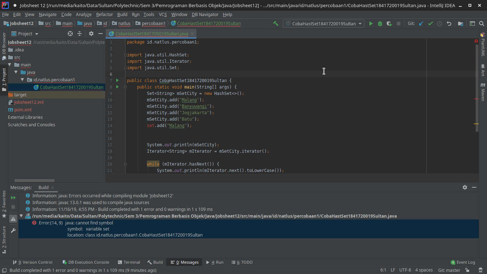

    Terjadi error dikarenakan HashSet / Set bernama `set` belum ada sehingga menjadi error.

5. Jelaskan fungsi potongan program dibawah ini pada percobaan 1!

   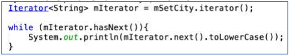

   `Jawaban`

   Fungsi dari interface `Iterator<String> mIterator = mSetCity.iterator();` adalah untuk memperbolehkan kita traverse, akses data dan menghapus data dari collection `(mSetCity)`

   dan fungsi dari perulangan `while` adalah melakukan traverse `mSetCity`

### Percobaan 2 (List)

`Screenshot`

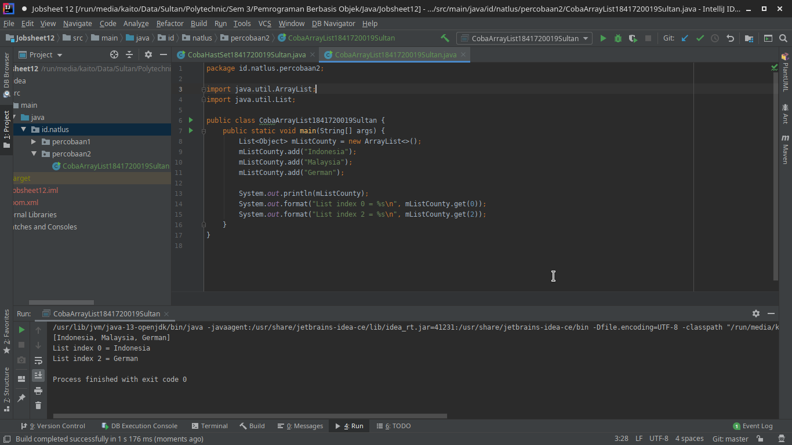

`Kode Program`

* [CobaArrayList1841720019Sultan.java](../../src/12_Java_API/percobaan2/CobaArrayList1841720019Sultan.java)

`Pertanyaan`

1. Apakah fungsi potongan program dibawah ini!

   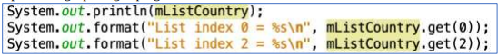

    `Jawaban`

    Fungsi dari kode program tersebut adalah untuk print seluruh data dari `mListArray` dan pada program `system.out.format` berfungsi untuk print data secara spesifik, pada potongan kode diatas diambil data dari mListArray `index 0` dan `index 2`

2. Ganti potongan program pada soal no 1 menjadi sebagai berikut

   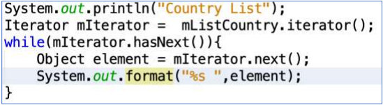

    Kemudian jalankan program tersebut!

    `Jawaban`

    `Screenshot`

    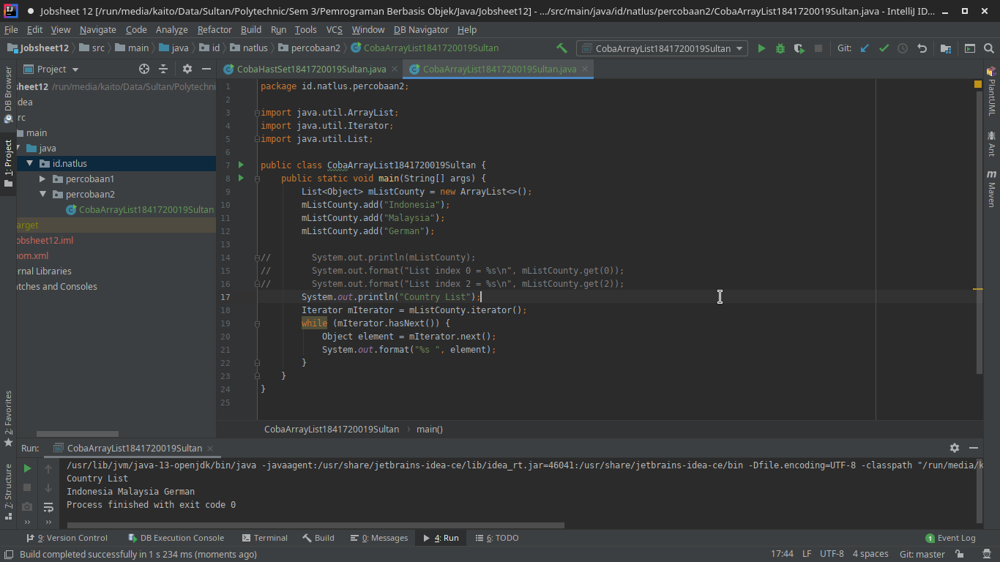

    `Kode Program`

   * [CobaArrayList1841720019Sultan.java](../../src/12_Java_API/percobaan2/CobaArrayList1841720019Sultan.java)

3. Jelaskan perbedaan menampilkan data pada ArrayList menggunakan potongan program pada soal no 1 dan no 2!

    `Jawaban`

    Perbedaannya adalah jika pada soal no 1 menampilkan data secara spesifik pada index berapa tanpa melakukan traverse, sedangkan pada soal no 2 dilakukan traverse kemudian setiap element di print hingga akhir.

### Percobaan 3 (Map)

`Screenshot`

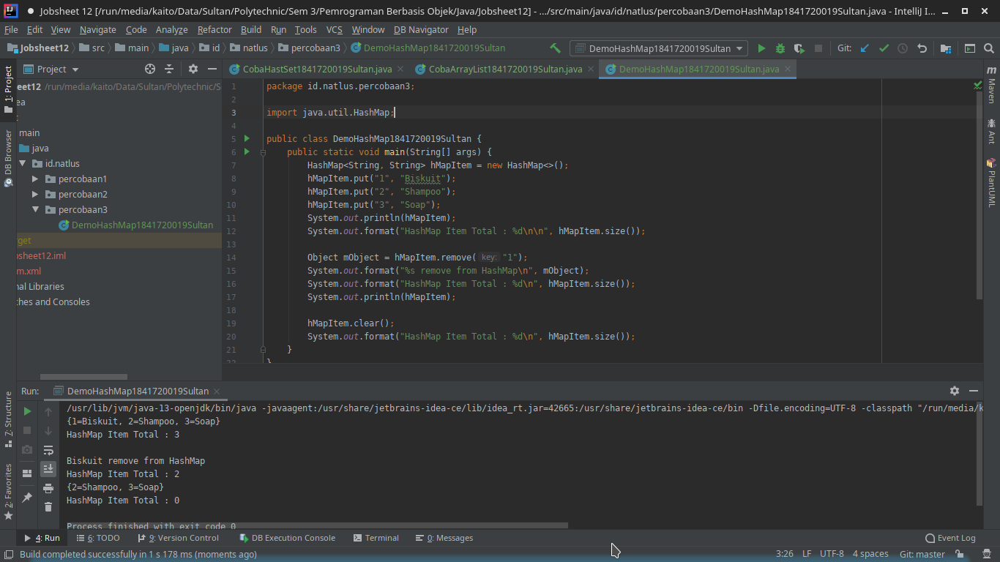

`Kode Program`

* [DemoHashMap1841720019Sultan.java](../../src/12_Java_API/percobaan3/DemoHashMap1841720019Sultan.java)

`Pertanyaan`

1. Jelaskan fungsi `hMapItem.put("1","Biskuit")` pada program!

    `Jawaban`

    Fungsi dari `hMapItem.put("1","Biskuit")` adalah untuk menambahkan element pada `HashMap` dengan key `1` dan value `Biskuit`.

2. Jelaskan fungsi `hMapItem.size()` pada program!

   `Jawaban`

    Fungsi dari `hMapItem.size()` adalah untuk mendapatkan banyaknya data yang ada dalam `HashMap`.

3. Jelaskan fungsi `hMapItem.remove("1")` pada program!

   `Jawaban`

    Fungsi dari `hMapItem.remove("1")` adalah untuk menghapus data dengan acuan data yang dihapus adalah data pada key `1`.

4. Jelaskan fungsi `hMapItem.clear()` pada program!

   `Jawaban`

    Fungsi dari `hMapItem.clear()` adalah untuk menghapus semua data yang ada dalam `HashMap`.

5. Tambahkan kode program yang di blok pada program yang sudah anda buat!

   `Jawaban`

   Sudah

    `Screenshot`
   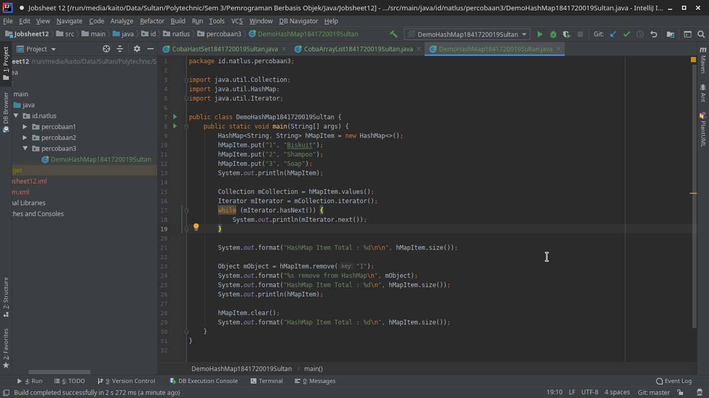

6. Jalankan program dan amati apa yang terjadi!

   `Jawaban`

    `Screenshot`
   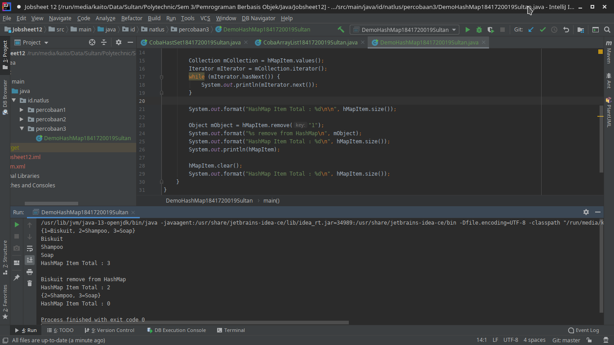

7. Apakah perbedaan program sebelumnya dan setelah ditambahkan kode program pada soal no 5 diatas? Jelaskan!

   `Jawaban`

   Perbedaannya adalah values dari `hMapItem` telah dimasukkan kedalam Collection bernama `mCollection` sehingga tidak perlu menggunakan `key` untuk mengakses `value` kemudian dilakukan traverse pada `mCollection` hingga akhir.

### Percobaan 4 (Implementasi ArrayList dalam GUI)

`Screenshot`

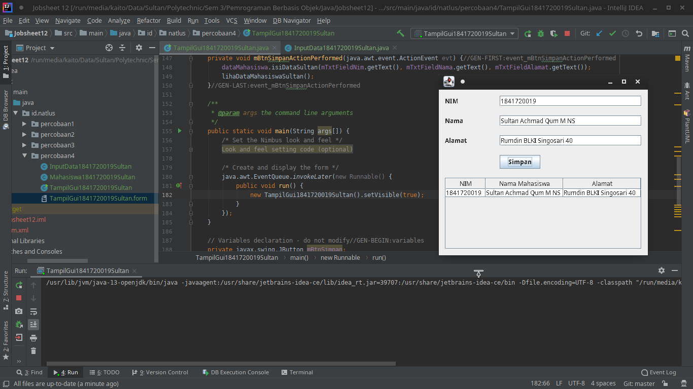

`Kode Program`

* [InputData1841720019Sultan.java](../../src/12_Java_API/percobaan4/InputData1841720019Sultan.java)
* [Mahasiswa1841720019Sultan.java](../../src/12_Java_API/percobaan4/Mahasiswa1841720019Sultan.java)
* [TampilGui1841720019Sultan.java](../../src/12_Java_API/percobaan4/TampilGui1841720019Sultan.java)
* [TampilGui1841720019Sultan.form](../../src/12_Java_API/percobaan4/TampilGui1841720019Sultan.form)

### Percobaan 5 (Aplikasi Biodata)

`Screenshot`

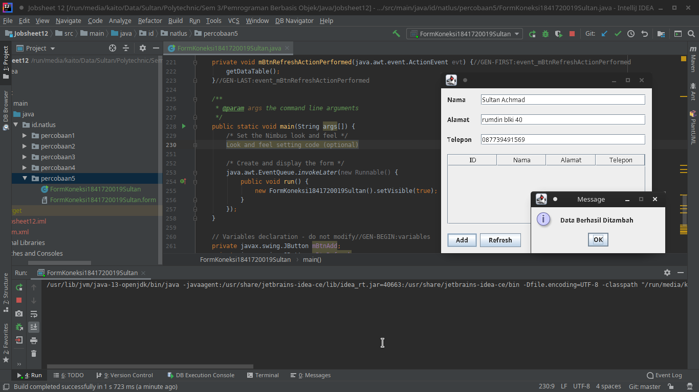

`Kode Program`

* [FormKoneksi1841720019Sultan.java](../../src/12_Java_API/percobaan5/FormKoneksi1841720019Sultan.java)
* [FormKoneksi1841720019Sultan.form](../../src/12_Java_API/percobaan5/FormKoneksi1841720019Sultan.form)

`Pertanyaan`

1. Setelah menambah code pada action button klik, coba jalankan program dan tambahkan data. Apakah program berhasil menambahkan data? Jika tidak apakah penyebabnya.

    `Jawaban`

    Program berhasil menambahkan data

    `Screenshot`

    

2. Jelaskan maksud source code untuk melakukan insert data diatas?

    `Jawaban`

    Maksudnya adalah :

    1. buka koneksi ke database.
    2. memperiapkan query INSERT.
    3. mempersiapkan statement query.
    4. mengeksekusi query yang baru ditambahkan.
    5. menutup koneksi ke database
    6. memberikan informasi berupa pop up message data berhasil ditambahkan
    7. Jika langkah dari 3 hingga 6 ada yang error maka akan muncul pop up message  terjadi kesalahan serta pesan sistem error.

3. Jelaskan alur dari method ambil_data_tabel?

    `Jawaban`

    1. hapus semua data dari tabel.
    2. buka koneksi ke database.
    3. membuat statement query.
    4. mengeksekusi query yang telah disiapkan.
    5. mendapatkan seluruh data dari hasil query dan dimasukkan kedalam baris tabel
    6. menutup koneksi ke database
    7. Jika langkah dari 2 hingga 6 ada yang error maka akan muncul pop up message  terjadi kesalahan serta pesan sistem error.

4. Buat fungsi untuk merefresh sehingga data yang baru dapat ditampilkan pada tabel.

    `Jawaban`

    Sudah, hanya perlu memanggil method `getDataTable()` untuk action listener button refresh

    ```java
    private void mBtnRefreshActionPerformed(java.awt.event.ActionEvent evt) {//GEN-FIRST:event_mBtnRefreshActionPerformed
        getDataTable();
    }//GEN-LAST:event_mBtnRefreshActionPerformed
    ```

    `Screenshot`

    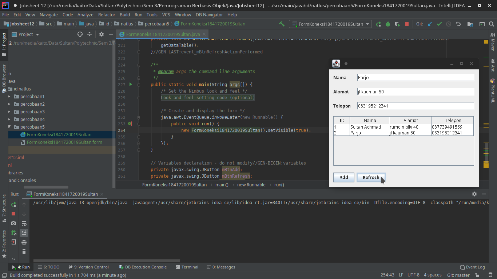

## Kesimpulan

* Saya mampu memahami cara penyimpanan objek menggunakan Collection dan Map.
* Saya mampu mengetahui pengelompokan dari Collection.
* Saya mampu mengetahui perbedaan dari interface Set, List dan Map.
* Saya mampu mengetahui penggunaan class-class dari interface Set, List, dan Map.
* Saya mampu memahami koneksi database menggunakan JDBC dan JDBC API.

## Pernyataan Diri

Saya menyatakan isi tugas, kode program, dan laporan praktikum ini dibuat oleh saya sendiri. Saya tidak melakukan plagiasi, kecurangan, menyalin/menggandakan milik orang lain.

Jika saya melakukan plagiasi, kecurangan, atau melanggar hak kekayaan intelektual, saya siap untuk mendapat sanksi atau hukuman sesuai peraturan perundang-undangan yang berlaku.

Ttd,

***Sultan Achmad Qum Masykuro NS***
