# Laporan Praktikum #14 - GUI dan Database

## Kompetensi

Setelah menempuh materi percobaan ini, mahasiswa mampu mengenal:

1. Menggunakan paradigma berorientasi objek untuk interaksi dengan database.
2. Membuat backend dan frontend.
3. Membuat form sebagai frontend.

## Ringkasan Materi

Secara umum, tahapan yang akan kita lakukan adalah sebagai berikut:

1. Membuat database dan tabel-tabelnya.
2. Membuat backend yang berisi class-class yang mewakili data yang ada pada database, dan
class helper untuk melakukan eksekusi query database.
3. Membuat frontend yang merupakan antarmuka kepada pengguna. Frontend ini bisa

berbasis teks (console), GUI, web, mobile, dan sebagainya. Library yang digunakan untuk project ini antara lain:

1. JDBC, untuk melakukan interaksi ke database.
2. ArrayList, untuk menampung data hasil query ke database.
3. Swing, untuk membuat tampilan GUI.

## Percobaan

### Percobaan 1

Membuat Database

`Screenshot`

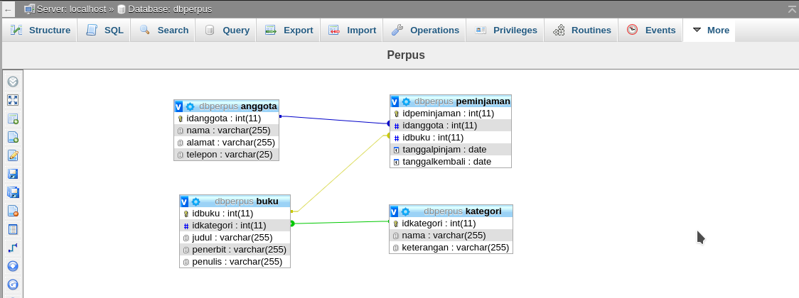

### Percobaan 2

Membuat Project

`Screenshot`

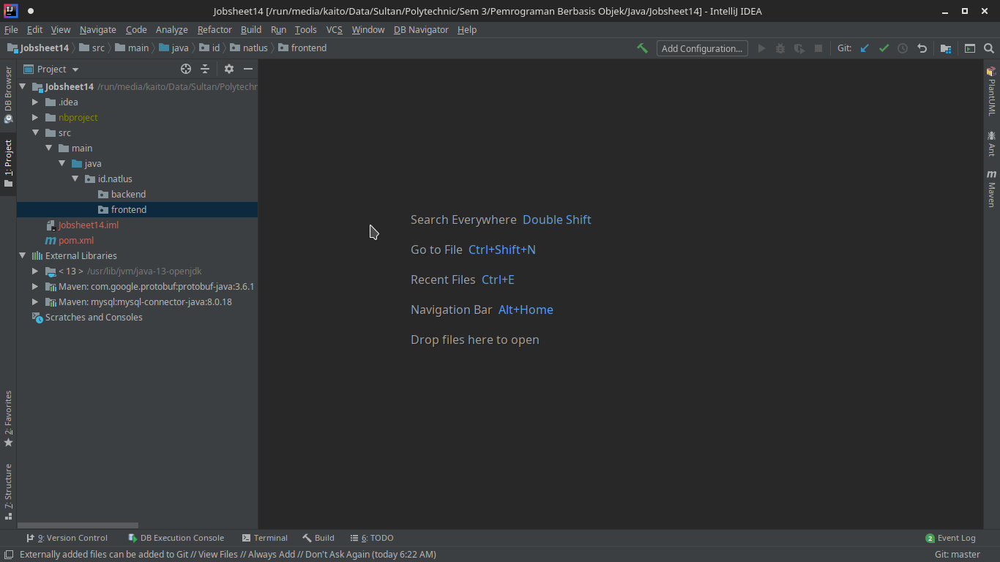

### Percobaan 3

Membuat class helper untuk mengeksekusi query SQL.

`Screenshot`

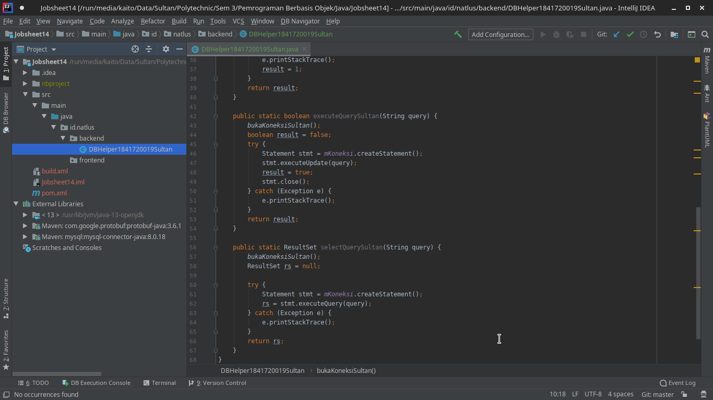

`Kode Program`

[DBHelper1841720019Sultan.java](../../src/14_GUI_dan_Database/backend/DBHelper1841720019Sultan.java)

### Percobaan 4

Membuat class **Kategori** untuk menghandle CRUD pada tabel kategori.

`Screenshot`

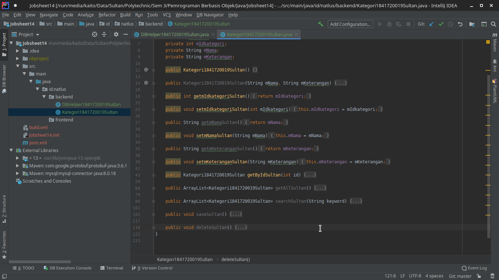

`Kode Program`

[Kategori1841720019Sultan.java](../../src/14_GUI_dan_Database/backend/Kategori1841720019Sultan.java)

### Percobaan 5

Mencoba backed yang sudah dibuat dengan mengoperasikannya lewat frontend berbasis teks (console). Percobaan ini dapat anda skip jika anda telah yakin bahwa backend yang anda buat sudah berfungsi dengan baik.

`Screenshot`

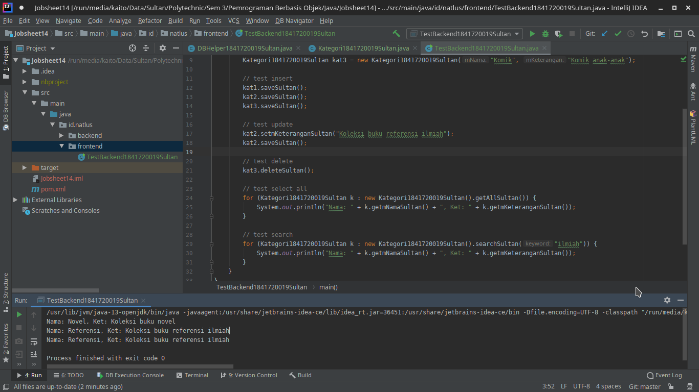

`Kode Program`

[TestBackend1841720019Sultan.java](../../src/14_GUI_dan_Database/frontend/TestBackend1841720019Sultan.java)

### Percobaan 6

Pada percobaan ini kita akan membuat interface utama untuk program kita yaitu GUI.

* FrmKategori

    `Screenshot`

    

    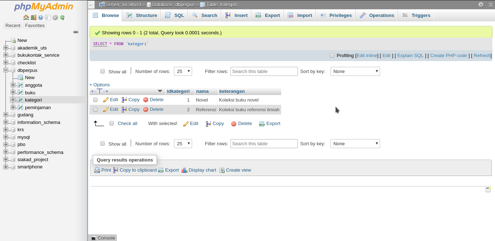

    `Kode Program`

  * [FrmKategori1841720019Sultan.java](../../src/14_GUI_dan_Database/frontend/FrmKategori1841720019Sultan.java)
  * [FrmKategori1841720019Sultan.form](../../src/14_GUI_dan_Database/frontend/FrmKategori1841720019Sultan.form)

Lakukan hal yang sama untuk data **Anggota**!

* Anggota

    `Screenshot`

    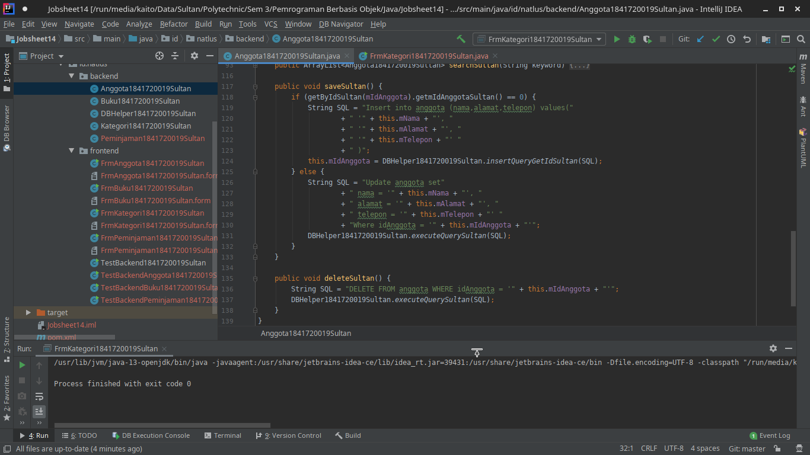

    `Kode Program`

    [Anggota1841720019Sultan.java](../../src/14_GUI_dan_Database/backend/Anggota1841720019Sultan.java)

* TestBackendAnggota

    `Screenshot`

    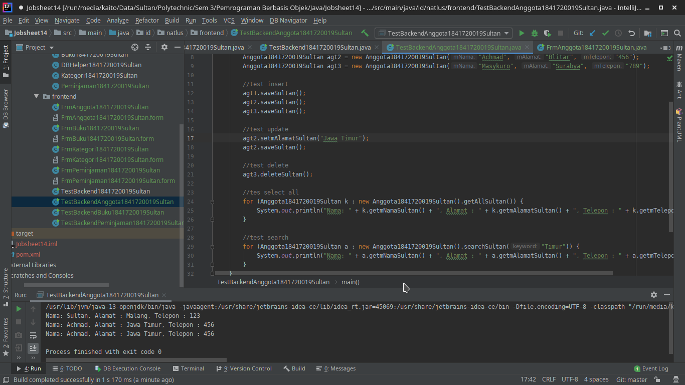

    `Kode Program`

    [TestBackendAnggota1841720019Sultan.java](../../src/14_GUI_dan_Database/frontend/TestBackendAnggota1841720019Sultan.java)

### Percobaan 7

Buat form untuk data Anggota.

* FrmAnggota

    `Screenshot`

    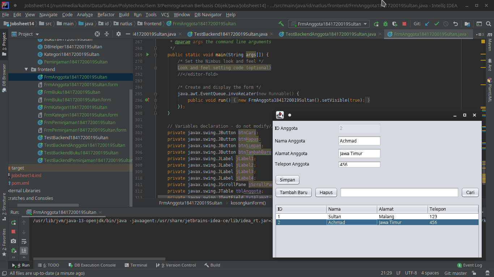

    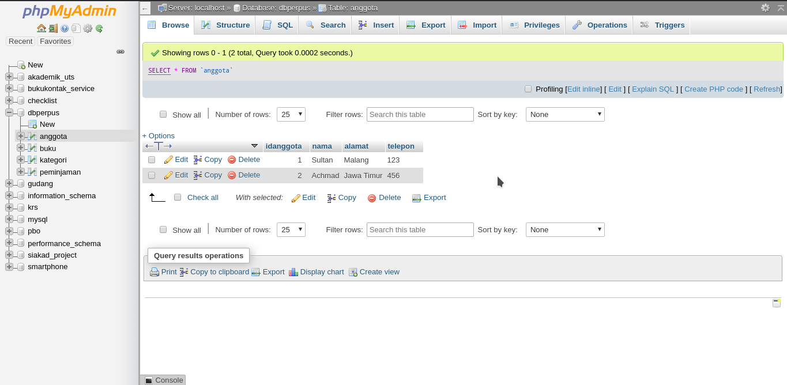

    `Kode Program`

  * [FrmAnggota1841720019Sultan.java](../../src/14_GUI_dan_Database/frontend/FrmAnggota1841720019Sultan.java)
  * [FrmAnggota1841720019Sultan.form](../../src/14_GUI_dan_Database/frontend/FrmAnggota1841720019Sultan.form)

Untuk data **Buku**, caranya kurang lebih sama seperti data Kategori dan Anggota. Hanya saja yang
berbeda adalah:

* Pemanggilan **getKategori().getIdKategori()** pada query insert dan update untuk mengeset **idkategori** pada tabel buku
* Query select yang melibatkan join table.

Kode lengkap class Buku dapat anda lihat di **Lampiran 1**. Untuk test buku pada **frontend**, bisa anda lihat di **Lampiran 2**.

* Buku

    `Screenshot`

    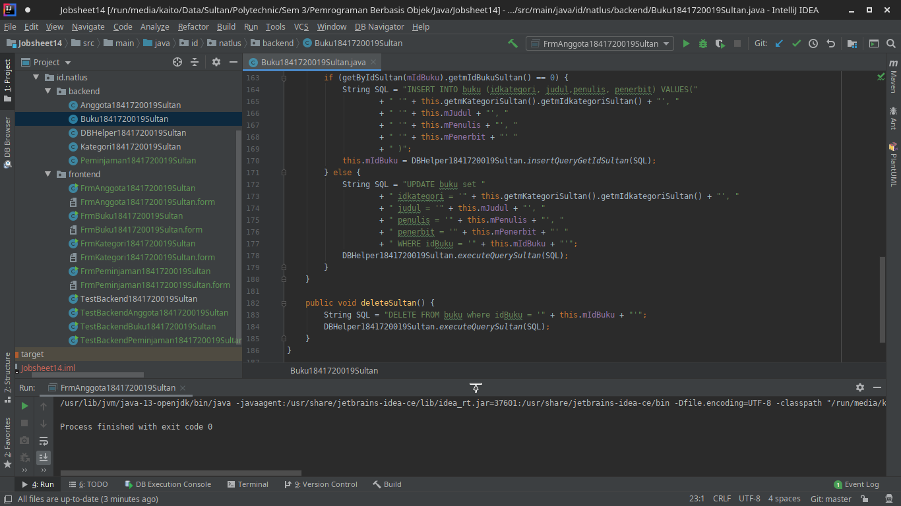

    `Kode Program`

    [Buku1841720019Sultan.java](../../src/14_GUI_dan_Database/backend/Buku1841720019Sultan.java)

* TestBackendBuku

    `Screenshot`

    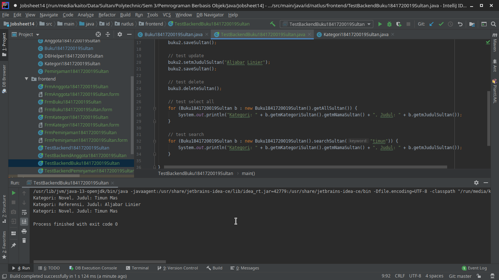

    `Kode Program`

    [TestBackendBuku1841720019Sultan.java](../../src/14_GUI_dan_Database/frontend/TestBackendBuku1841720019Sultan.java)

### Percobaan 8

Membuat GUI untuk data Buku, yang dilengkapi dengan combo box untuk memilih kategori, yang terhubung dengan tabel kategori.

* FrmBuku

    `Screenshot`

    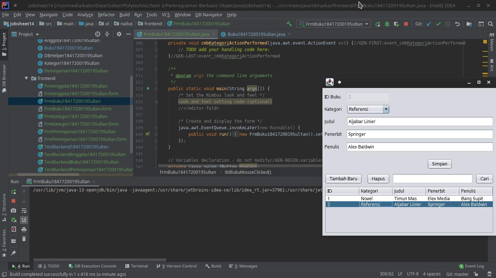

    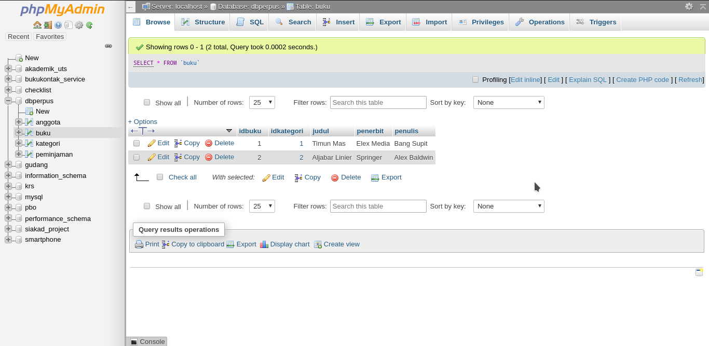

    `Kode Program`

  * [FrmBuku1841720019Sultan.java](../../src/14_GUI_dan_Database/frontend/FrmBuku1841720019Sultan.java)
  * [FrmBuku1841720019Sultan.form](../../src/14_GUI_dan_Database/frontend/FrmBuku1841720019Sultan.form)

## Tugas

1. Buatlah class **Peminjaman**.

    * Peminjaman

        `Screenshot`

        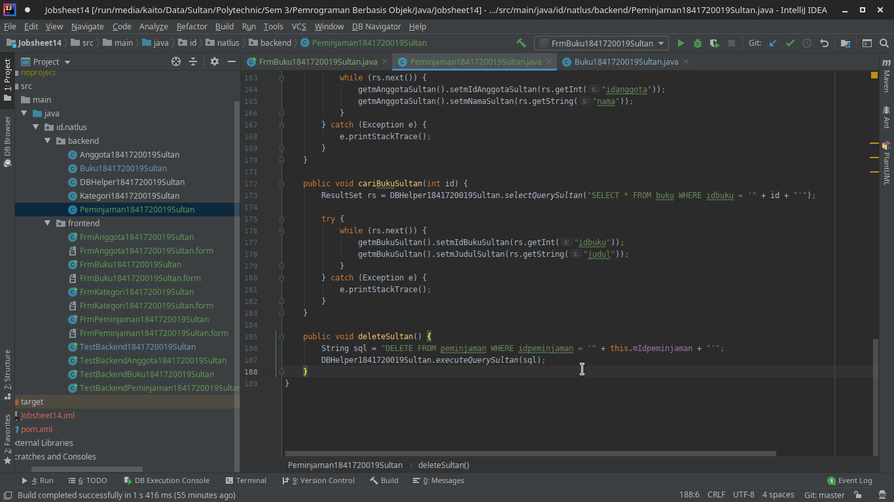

        `Kode Program`

        [Peminjaman1841720019Sultan.java](../../src/14_GUI_dan_Database/backend/Peminjaman1841720019Sultan.java)

    * TestBackendPeminjaman

        `Screenshot`

        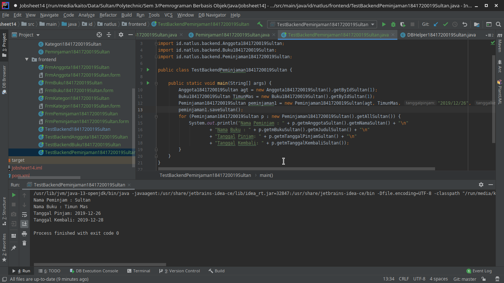

        `Kode Program`

        [TestBackendPeminjaman1841720019Sultan.java](../../src/14_GUI_dan_Database/frontend/TestBackendPeminjaman1841720019Sultan.java)

2. Buatlah class **FrmPeminjaman** dan susun sebagai berikut:

    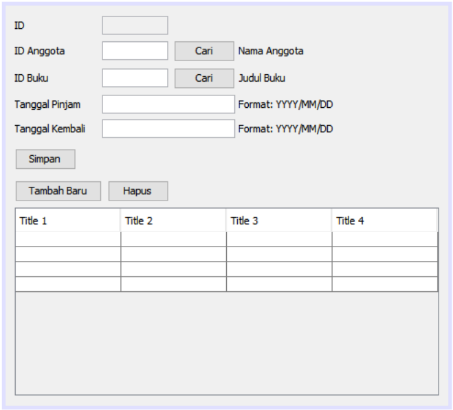

    `Screenshot`

    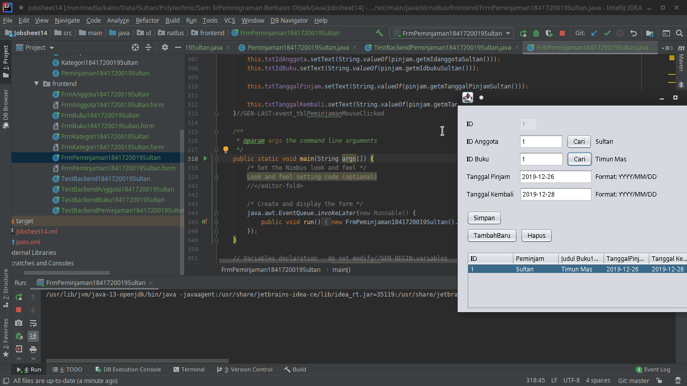

    `Kode Program`

    * [FrmPeminjaman1841720019Sultan.java](../../src/14_GUI_dan_Database/frontend/FrmPeminjaman1841720019Sultan.java)
    * [FrmPeminjaman1841720019Sultan.form](../../src/14_GUI_dan_Database/frontend/FrmPeminjaman1841720019Sultan.form)

3. Atur kode program agar dapat menangani transaksi peminjaman dan pengembalian

`Screenshot`

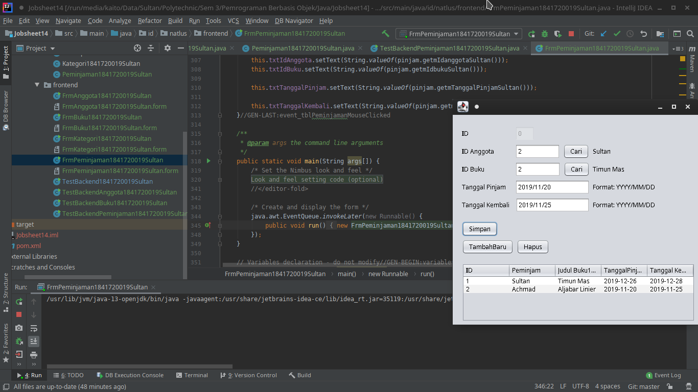

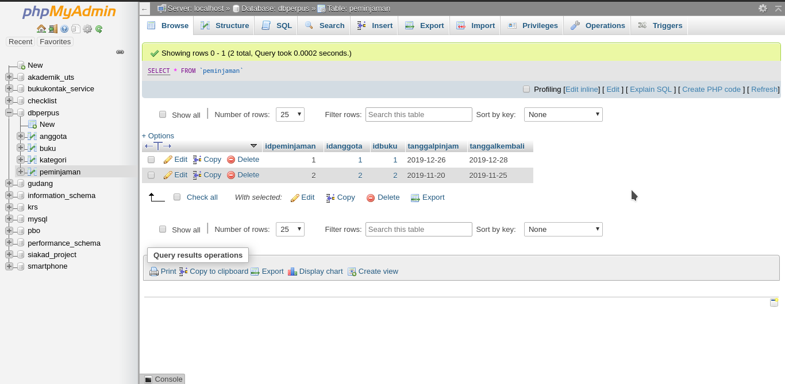

`Kode Program`

* [FrmPeminjaman1841720019Sultan.java](../../src/14_GUI_dan_Database/frontend/FrmPeminjaman1841720019Sultan.java)
* [FrmPeminjaman1841720019Sultan.form](../../src/14_GUI_dan_Database/frontend/FrmPeminjaman1841720019Sultan.form)

## Kesimpulan

1. Saya mampu menggunakan paradigma berorientasi objek untuk interaksi dengan database.
2. Saya mampu membuat backend dan frontend.
3. Saya mampu membuat form sebagai frontend.

## Pernyataan Diri

Saya menyatakan isi tugas, kode program, dan laporan praktikum ini dibuat oleh saya sendiri. Saya tidak melakukan plagiasi, kecurangan, menyalin/menggandakan milik orang lain.

Jika saya melakukan plagiasi, kecurangan, atau melanggar hak kekayaan intelektual, saya siap untuk mendapat sanksi atau hukuman sesuai peraturan perundang-undangan yang berlaku.

Ttd,

***Sultan Achmad Qum Masykuro NS***
