# Laporan Praktikum #2 - Class dan Object

## Kompetensi

1. Mahasiswa dapat memahami deskripsi dari class dan object
2. Mahasiswa memahami implementasi dari class
3. Mahasiswa dapat memahami implementasi dari attribute
4. Mahasiswa dapat memahami implementasi dari method
5. Mahasiswa dapat memahami implementasi dari proses instansiasi
6. Mahasiswa dapat memahami implementasi dari try-catch
7. Mahasiswa dapat memahami proses pemodelan class diagram menggunakan UML

## Ringkasan Materi

Try-Catch untuk handling error.

~~*`aman santuy`*~~

## Percobaan

### Percobaan 1

Dalam suatu perusahaan salah satu data yang diolah adalah data karyawan. Setiap
karyawan memiliki id, nama, jenis kelamin, jabatan, jabatan, dan gaji. Setiap mahasiswa
juga bisa menampilkan data diri pribadi dan melihat gajinya.

1. Gambarkan desain class diagram dari studi kasus diatas!

   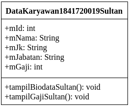

2. Sebutkan Class apa saja yang bisa dibuat dari studi kasus diatas!,

    1 (satu) Class saja yaitu dataKaryawan1841720019Sultan untuk kemudahan dalam membuat program.
3. Sebutkan atribut beserta tipe datanya yang dapat diidentifikasi dari masing-masing class dari studi kasus diatas!

    * mId: int
    * mNama: String
    * mJk: String
    * mJabatan: String
    * mGaji: int

4. Sebutkan method-method yang sudah anda buat dari masing-masing class pada studi kasus diatas!
    * tampilBiodataSultan(): void
    * tampilGajiSultan(): void

`Screenshot Percobaan 1:`
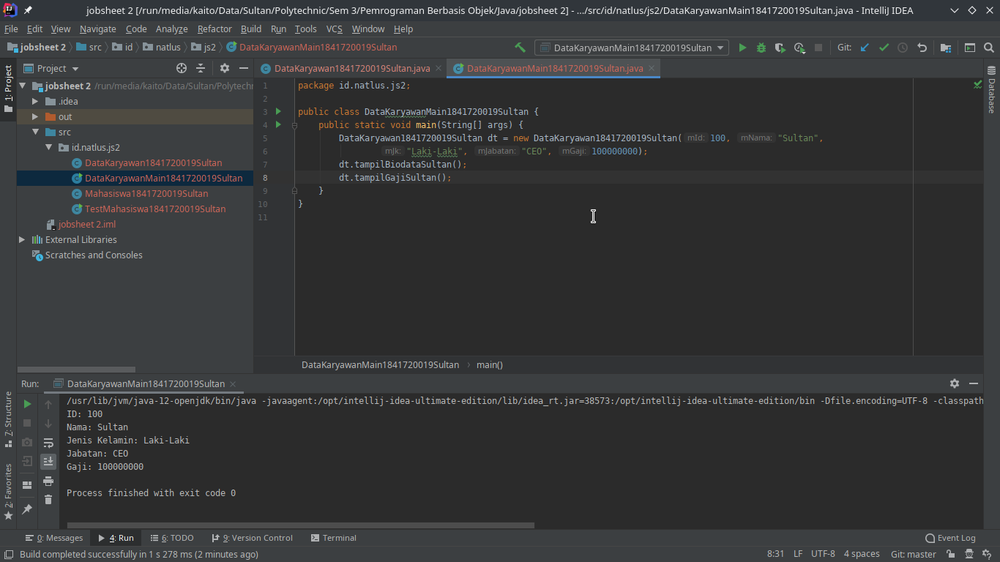

`Kode Program:`

* [DataKaryawan1841720019Sultan.java](../../src/2_Class_dan_Object/DataKaryawan1841720019Sultan.java)
* [DataKaryawanMain1841720019Sultan.java](../../src/2_Class_dan_Object/DataKaryawanMain1841720019Sultan.java)

### Percobaan 2

Membuat program berdasarkan class diagram.

Class Diagram

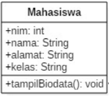

`Screenshot Percobaan 2:`

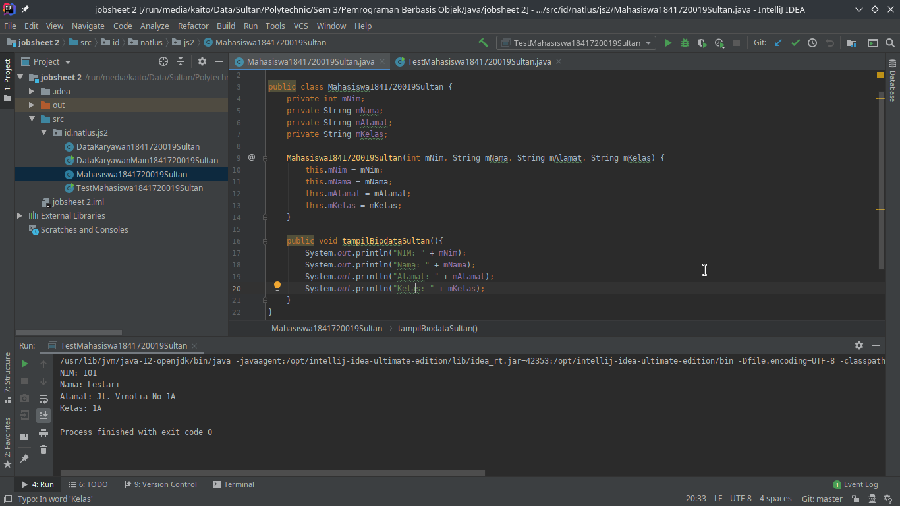
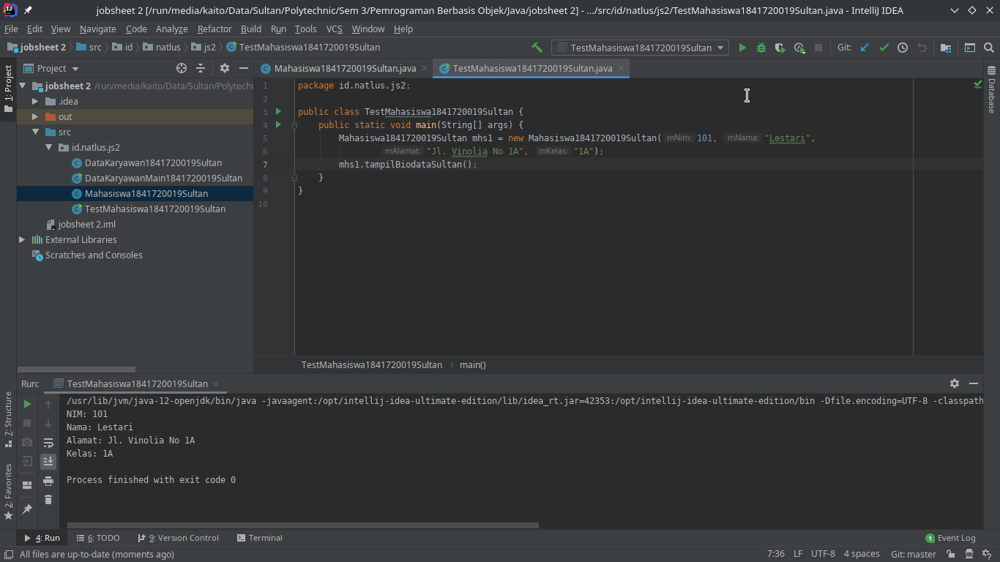

`Kode Program:`

* [Mahasiswa1841720019Sultan.java](../../src/2_Class_dan_Object/Mahasiswa1841720019Sultan.java)
* [TestMahasiswa1841720019Sultan.java](../../src/2_Class_dan_Object/TestMahasiswa1841720019Sultan.java)

`Screenshot Jobsheet:`

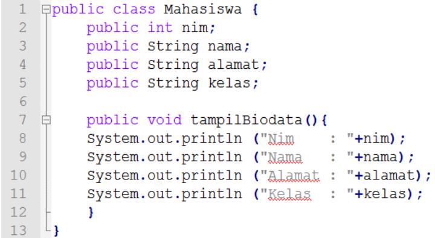
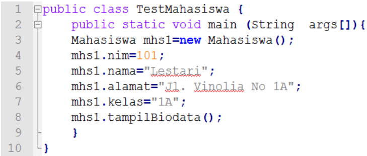

1. (7) Jelaskan pada bagian mana proses pendeklarasian atribut pada program diatas!

    Pendeklarasian atribut jika merujuk Screenshot Jobsheet maka dari line 2 - 5,

    `Screenshot:`

    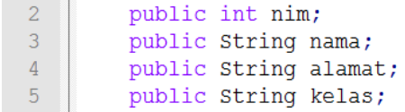

    tetapi jika merujuk pada Screenshot diatas, pendklarasian atribut dilakukan pada line 4 - 7 pada file [Mahasiswa1841720019Sultan.java](../../src/2_Class_dan_Object/Mahasiswa1841720019Sultan.java).

    `Screenshot:`

    

2. (8) Jelaskan pada bagian mana proses pendeklarasian method pada program diatas!

    Pendeklarasian method jika merujuk Screenshot Jobsheet maka pada line 7 dengan isi dari method dari line 8 - 11,

    `Screenshot:`

    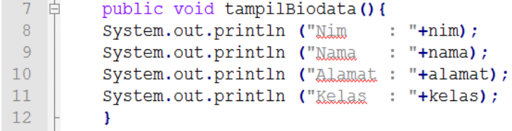

     tetapi jika merujuk pada Screenshot diatas, pendeklarasian method dilakukan pada line 16 dengan isi dari method dari line 17 - 21 pada file [TestMahasiswa1841720019Sultan.java](../../src/2_Class_dan_Object/TestMahasiswa1841720019Sultan.java).

     `Screenshot:`

     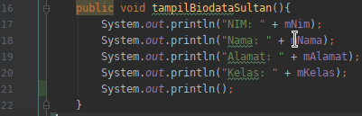

3. (9) Berapa banyak objek yang di instansiasi pada program diatas!

    Hanya 1 Objek yang yang di instansiasi yaitu yang bernama mhs1,

4. (10) Apakah yang sebenarnya dilakukan pada sintaks program “mhs1.nim=101” ?

    Pada sintaks program `mhs1.nim=101` yang ada pada Screenshot Jobsheet, maksudnya adalah untuk memberikan nilai `101` pada atribut `nim` dari objek `mhs1`

5. (11) Apakah yang sebenarnya dilakukan pada sintaks program “mhs1.tampilBiodata()” ?

    Pada sintaks program `mhs1.tampilBiodata()` yang ada pada Screenshot Jobsheet, maksudnya adalah untuk memanggil method `tampilBiodata()` dari objek `mhs1`.

6. (12) Instansiasi 2 objek lagi pada program diatas!

    `Screenshot Penambahan 2 objek:`
    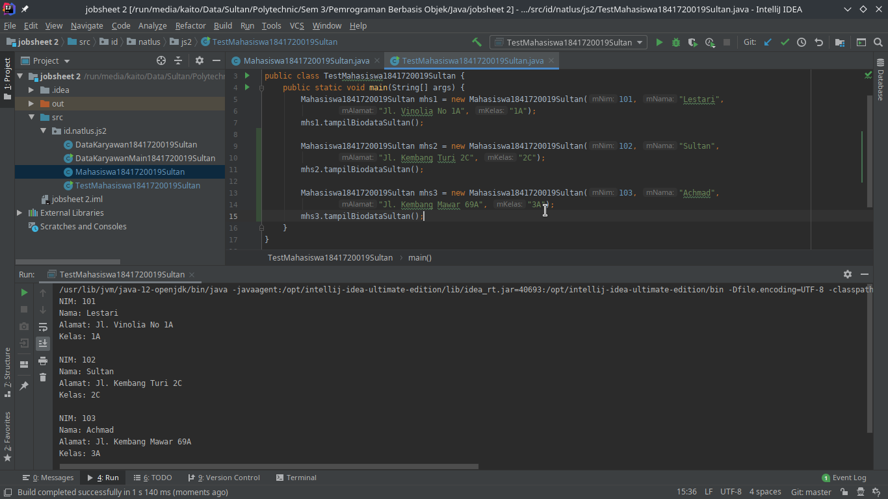

    `Kode Program:`
    * [Mahasiswa1841720019Sultan.java](../../src/2_Class_dan_Object/Mahasiswa1841720019Sultan.java).
    * [TestMahasiswa1841720019Sultan.java](../../src/2_Class_dan_Object/TestMahasiswa1841720019Sultan.java).

### Percobaan 3

Menulis method yang memiliki argument/parameter dan memiliki return.

`Screenshot:`
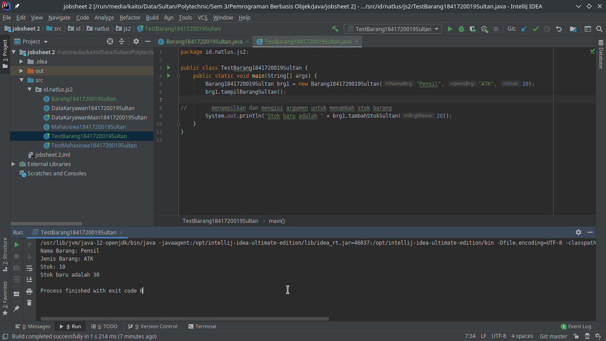

`Kode Program:`

* [Barang1841720019Sultan.java](../../src/2_Class_dan_Object/Barang1841720019Sultan.java)
* [TestBarang1841720019Sultan.java](../../src/2_Class_dan_Object/TestBarang1841720019Sultan.java)

1. (7) Apakah fungsi argumen dalam suatu method?

    Fungsi argumen/parameter dalam suatu method adalah untuk menambahkan data yang nantinya akan diproses dalam suatu method yang memiliki nilai kembalian atau return.

2. (8) Ambil kesimpulan tentang kegunaan dari kata kunci return , dan kapan suatu method harus memiliki return!

    Suatu method memiliki return jika method tersebut menerima inputan dan melakukan sebuah operasi yang mengembalikan sebuah nilai yang nantinya akan dioutputkan atau akan digunakan lagi pada fungsi yang lain.

## Tugas

### Tugas 1 & 2

1. Suatu toko persewaan video game salah satu yang diolah adalah peminjaman, dimana data yang dicatat ketika ada orang yang melakukan peminjaman adalah id, nama member, nama game, dan harga yang harus dibayar. Setiap peminjaman bisa menampilkan data hasil peminjaman dan harga yang harus dibayar. Buatlah class diagram pada studi kasus diatas! Penjelasan:

   * Harga yang harus dibayar diperoleh dari lama sewa x harga.
   * Diasumsikan 1x transaksi peminjaman game yang dipinjam hanya 1 game saja.

    `Class Diagram:`

    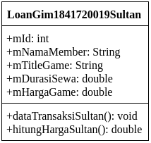
    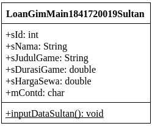

2. Buatlah program dari class diagram yang sudah anda buat di no 1!

    `Screenshot:`

    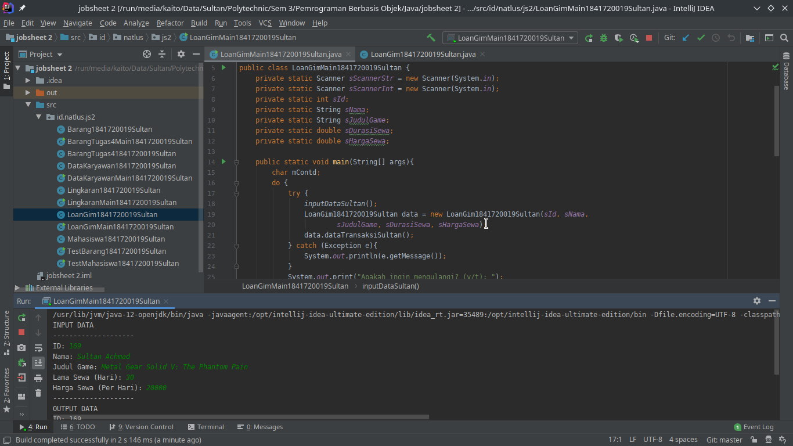
    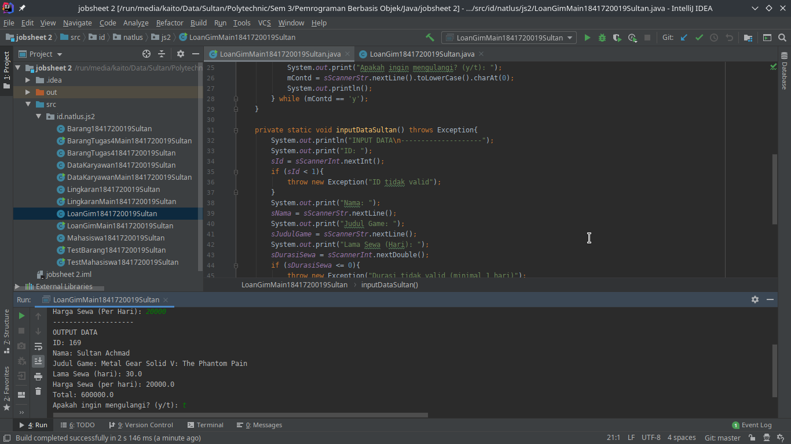
    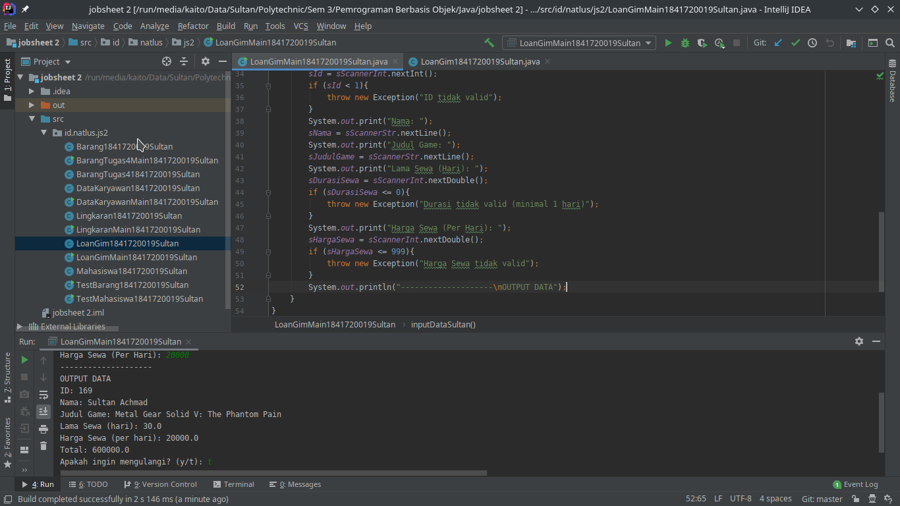

    `Kode Program:`

   * [LoanGim1841720019Sultan.java](../../src/2_Class_dan_Object/LoanGim1841720019Sultan.java)
   * [LoanGimMain1841720019Sultan.java](../../src/2_Class_dan_Object/LoanGimMain1841720019Sultan.java)

### Tugas 3

Buatlah program sesuai dengan class diagram berikut ini:

`Class Diagram:`

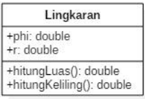

`Screenshot:`
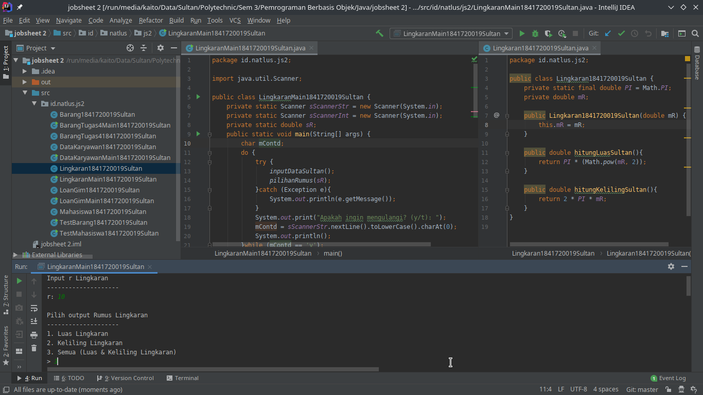
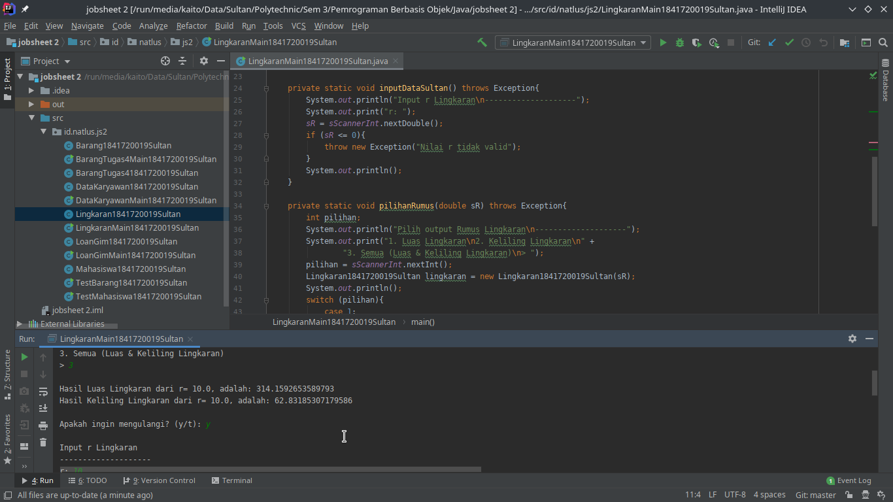
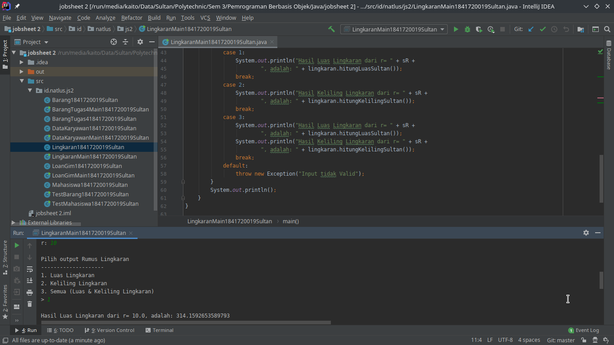

`Kode Program:`

* [Lingkaran1841720019Sultan.java](../../src/2_Class_dan_Object/Lingkaran1841720019Sultan.java)
* [LingkaranMain1841720019Sultan.java](../../src/2_Class_dan_Object/LingkaranMain1841720019Sultan.java)

### Tugas 4

Buatlah program sesuai dengan class diagram berikut ini:

`Class Diagram:`

Deskripsi / Penjelasan:

* Nilai atribut hargaDasar dalam rupiah dan atribut diskon dalam %
* Method hitungHargaJual() digunakan untuk menghitung harga jual dengan perhitungan berikut ini:

    **harga jual = harga dasar - (diskon * harga dasar)**

* Method tampilData() digunakan untuk menampilkan nilai dari kode, namaBarang, hargaDasar, diskon dan harga jual

`Screenshot:`
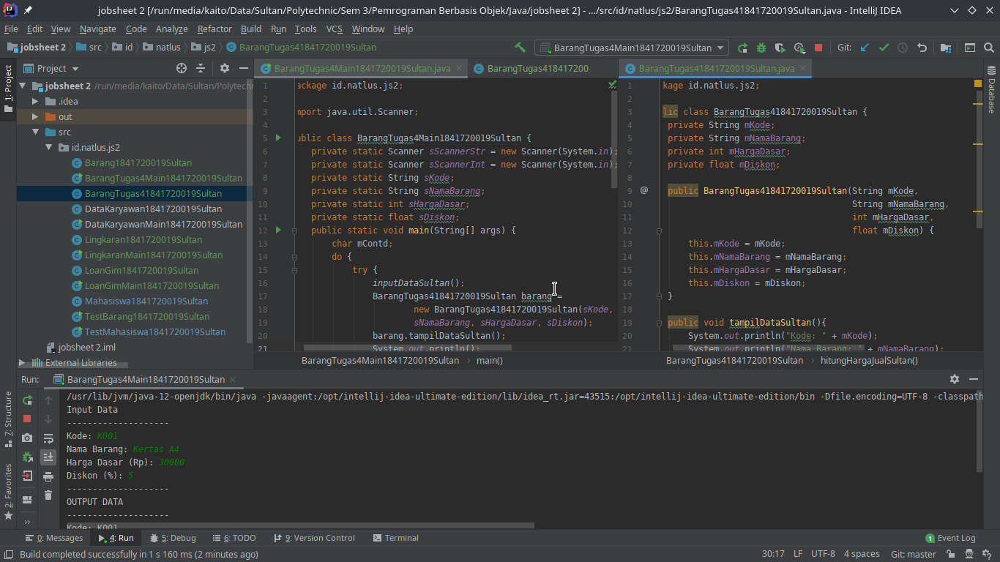
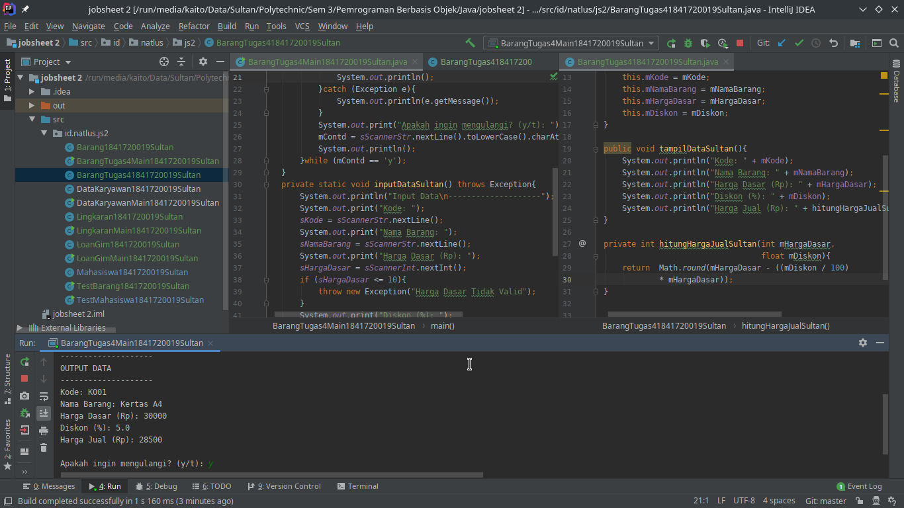
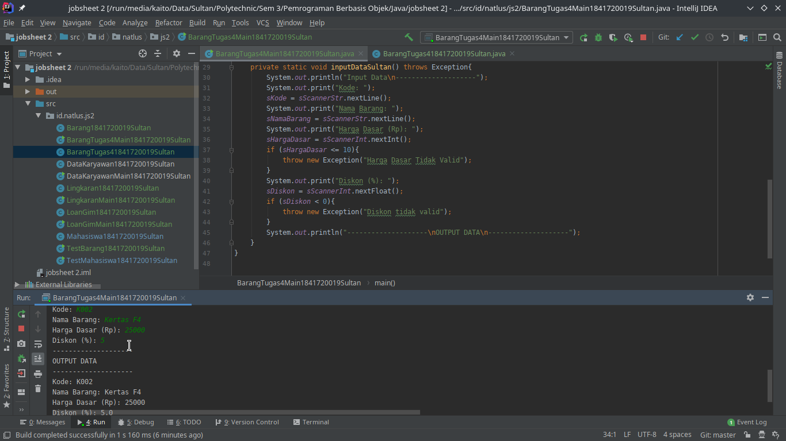

`Kode Program:`

* [BarangTugas41841720019Sultan.java](../../src/2_Class_dan_Object/BarangTugas41841720019Sultan.java)
* [BarangTugas4Main1841720019Sultan.java](../../src/2_Class_dan_Object/BarangTugas4Main1841720019Sultan.java)

## Kesimpulan

Kesimpulan yang dapat saya sampaikan adalah saya dapat memahami deskrpsi dari class dna object, memahami implementasi dari class, memahami implementasi dari attribute, memahami implementasi dari method, memahami implementasi dari proses instansiasi, memahami implementasi dari try-catch, memahami proses pemodelan class diagram menggunakan UML

## Pernyataan Diri

Saya menyatakan isi tugas, kode program, dan laporan praktikum ini dibuat oleh saya sendiri. Saya tidak melakukan plagiasi, kecurangan, menyalin/menggandakan milik orang lain.

Jika saya melakukan plagiasi, kecurangan, atau melanggar hak kekayaan intelektual, saya siap untuk mendapat sanksi atau hukuman sesuai peraturan perundang-undangan yang berlaku.

Ttd,

***Sultan Achmad Qum Masykuro NS***
