# Laporan Praktikum #3 - Enkapsulasi

## Kompetensi

Setelah melakukan percobaan pada modul ini, mahasiswa memahami konsep:

1. Konstruktor
2. Akses Modifier
3. Atribut/method pada class
4. Intansiasi atribut/method
5. Setter dan getter
6. Memahami notasi pada UML Class Diagram

## Ringkasan Materi

### Konstruktor

Konstruktor mirip dengan method cara deklarasinya akan tetapi tidak memiliki tipe return. Dan konstruktor dieksekusi ketika instan dari objek dibuat. Jadi setiap kali sebuat objek dibuat dengan keyword new() maka konstruktor akan dieksekusi. Cara untuk membuat konstruktor adalah sebagai berikut:

1. Nama konstruktor harus sama dengan nama class
2. Konstruktor tidak memiliki tipe data return
3. Konstruktor tidak boleh menggunakan modier abstract, static, final, dan syncronized

`Note: Di java kita dapat memiliki konstruktor dengan modifier private, protected, public or default.`

### Akses Modifier

Terdapat 2 tipe modifier di java yaitu : akses modifier dan non-access modifier. Dalam hal ini kita akan fokus pada akses modifier yang berguna untuk mengatur akses method, class, dan constructor. Terdapat 4 akses modifier yaitu:

1. private – hanya dapat diakses di dalam kelas yang sama
2. default – hanya dapat diakses di dalam package yang sama
3. protected – dapat diakases di luar package menggunakan subclass (membuat inheritance)
4. public – dapat diakases dari mana saja

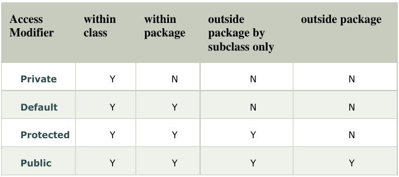

### Notasi UML Class Diagram

Notasi UML Class Diagram:

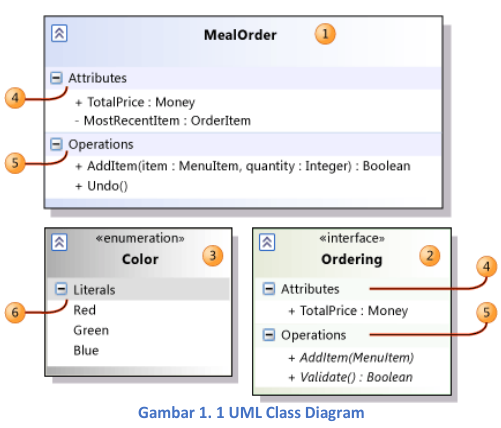

`Keterangan:`

1. class
2. Interface
3. Enumaration (enum) - adalah tipe data yang memiliki nilai atau literal terbatas
4. Attributes
5. Method
6. Literals

`Notasi Akses modifier pada UML:`

1. Tanda plus (+) untuk public
2. Tanda minus (-) untuk private
3. Tanda pagar (#) untuk protected
4. Untuk default, maka tidak diberi notasi

~~*`aman santuy`*~~

## Percobaan

### Percobaan 1

Didalam percobaan 1 inii, buatlah class Motor yang memiliki atribut kecepatan dan kontakOn,
dan memiliki method printStatus() untuk menampilkan status motor. Seperti berikut

bentuk UML class diagram class Motor adalah sebagai berikut:

`Class Diagram:`

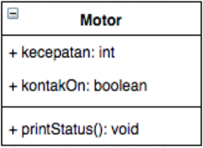

`Screenshot:`


`Kode Program:`

* [Motor1841720019Sultan](../../src/3_Enkapsulasi/Motor1841720019Sultan.java)
* [MotorDemo1841720019Sultan](../../src/3_Enkapsulasi/MotorDemo1841720019Sultan.java)

Menurut anda, adakah yang janggal?

Yaitu, kecepatan motor tiba-tiba saja berubah dari 0 ke 50. Lebih janggal lagi, posisi kontak motor masih dalam kondisi OFF. Bagaimana mungkin sebuah motor bisa sekejap berkecepatan dari nol ke 50, dan itupun kunci kontaknya OFF?

Nah dalam hal ini, akses ke atribut motor ternyata tidak terkontrol. Padahal, objek di dunia nyata selalu memiliki batasan dan mekanisme bagaimana objek tersebut dapat digunakan. Lalu, bagaimana kita bisa memperbaiki class Motor diatas agar dapat digunakan dengan baik? Kita bisa
pertimbangkan beberapa hal berikut ini:

1. Menyembunyikan atribut internal (kecepatan, kontakOn) dari pengguna (class lain)
2. Menyediakan method khusus untuk mengakses atribut.
Untuk itu mari kita lanjutkan percobaan berikutnya tentang Access Modifier.

### Percobaan 2

Pada percobaan ini akan digunakan access modifier untuk memperbaiki cara kerja class Motor pada
percobaan ke-1.

Ubah cara kerja class motor sesuai dengan UML class diagram berikut.

`Class Diagram:`

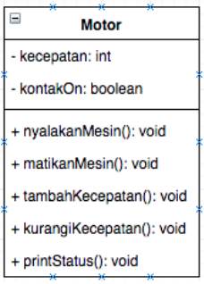

`Screenshot:`
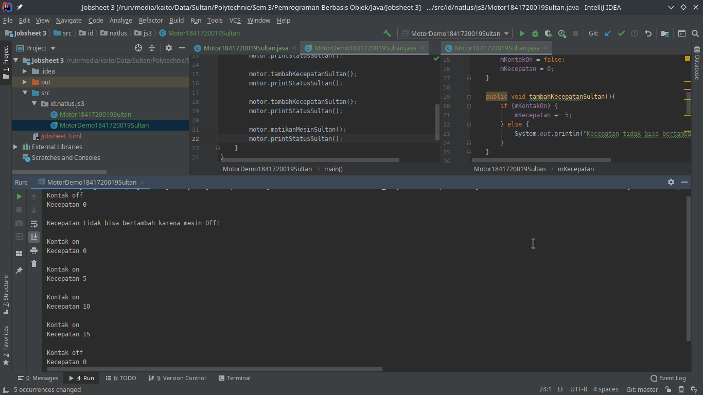

`Kode Program:`

* [Motor1841720019Sultan](../../src/3_Enkapsulasi/Motor1841720019Sultan.java)
* [MotorDemo1841720019Sultan](../../src/3_Enkapsulasi/MotorDemo1841720019Sultan.java)

Dari percobaan diatas, dapat kita amati sekarang atribut kecepatan tidak bisa diakses oleh pengguna dan diganti nilainya secara sembarangan. Bahkan ketika mencoba menambah kecepatan saat posisi kontak masih OFF, maka akan muncul notifikasi bahwa mesin OFF. Untuk mendapatkan kecepatan yang diinginkan, maka harus dilakukan secara gradual, yaitu dengan memanggil method tambahKecepatan() beberapa kali. Hal ini mirip seperti saat kita mengendarai motor.

### Pertanyaan Percobaan 2

1. Pada class TestMobil (Yang benar adalah MotorDemo jika dijobsheet, tapi pada laporan ini adalah MotorDemo1841720019Sultan), saat kita menambah kecepatan untuk pertama kalinya, mengapa muncul peringatan “Kecepatan tidak bisa bertambah karena Mesin Off!”?

    `Jawaban:`

    Karena saat kita menambah kecepatan pada method tambahKecepatanSultan terdapat kondisi percabangan yaitu mKontakOn harus berada dalam kondisi true agar dapat menambah kecepatan jika mKontakOn tidak dalam kondisi true maka akan keluar output `Kecepatan tidak bisa bertambah karena mesin Off!`

2. Mengapat atribut mKecepatan dan mkontakOn diset private?

    `Jawaban:`

    Agar variabel mKecepatan dan mKontakOn tidak dapat diakses sembarangan oleh class lain, ini adalah fungsi enkapsulasi.

3. Ubah class Motor sehingga kecepatan maksimalnya adalah 100!

   `Jawaban:`

   `Screenshot:`

   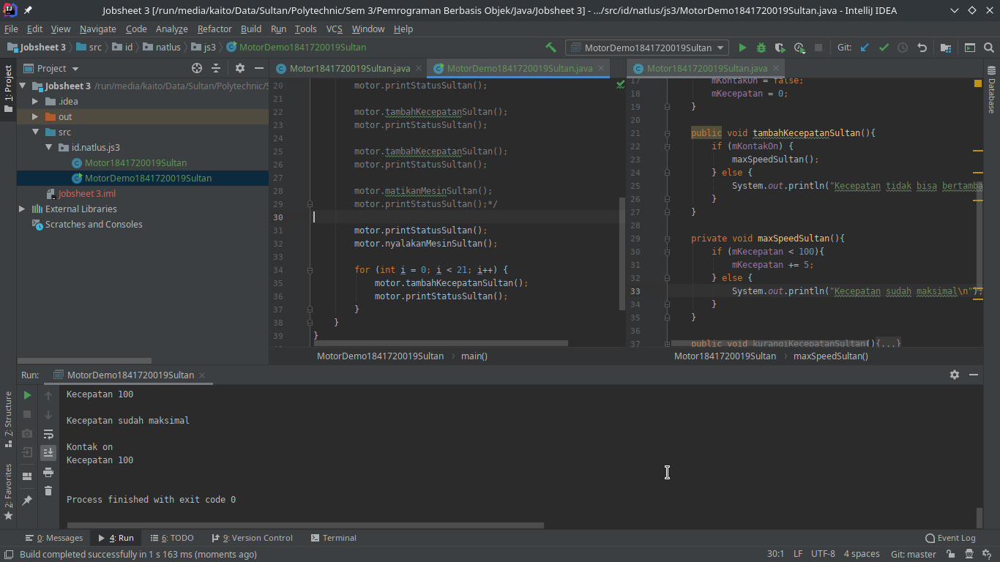

   `Kode Program:`

   * [Motor1841720019Sultan](../../src/3_Enkapsulasi/Motor1841720019Sultan.java)
   * [MotorDemo1841720019Sultan](../../src/3_Enkapsulasi/MotorDemo1841720019Sultan.java)

### Penyempurnaan Percobaan 2

Karena saya melihat masih ada kekurangan pada percobaan 2 maka saya lakukan penyempurnaan berupa pada saat mematikan mesin harus pada posisi berhenti atau kecepatan = 0 & minimun kecepatan nya adalah 0, berikut hasil jadinya

`Screenshot:`

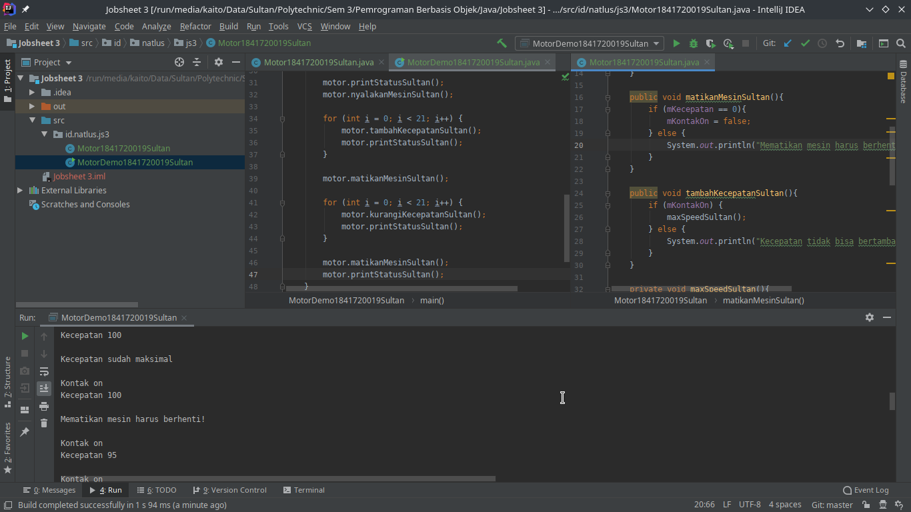
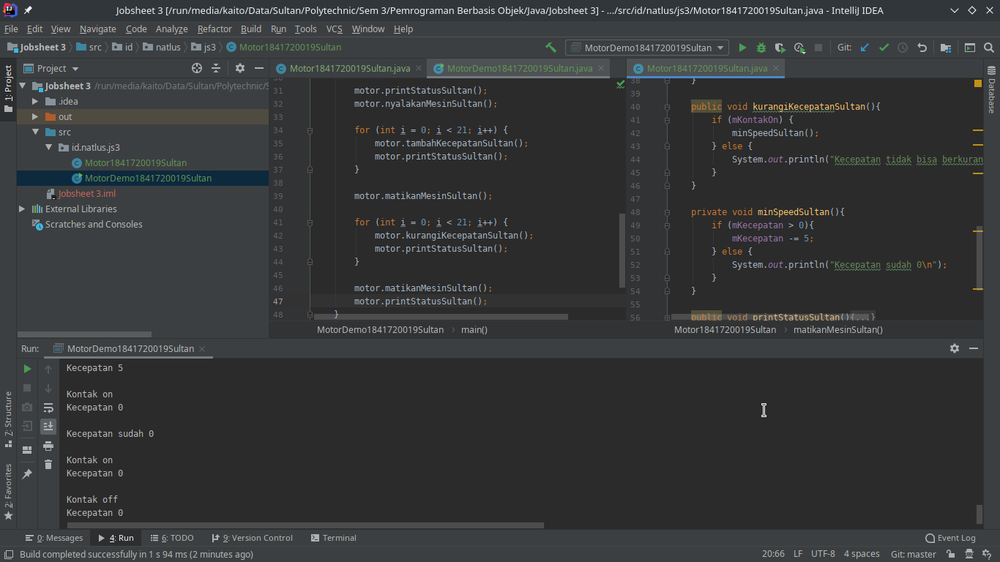

`Kode Program:`

* [Motor1841720019Sultan](../../src/3_Enkapsulasi/Motor1841720019Sultan.java)
* [MotorDemo1841720019Sultan](../../src/3_Enkapsulasi/MotorDemo1841720019Sultan.java)

### Percobaan 3

Misalkan di sebuah sistem informasi koperasi, terdapat class Anggota. Anggota memiliki atribut nama, alamat dan simpanan, dan method setter, getter dan setor dan pinjam. Semua atribut pada anggota tidak boleh diubah sembarangan, melainkan hanya dapat diubah melalui method setter, getter, setor dan tarik. Khusus untuk atribut simpanan tidak terdapat setter karena simpanan akan bertambah ketika melakukan transaksi setor dan akan berkurang ketika melakukan peminjaman/tarik.

`Class Diagram:`

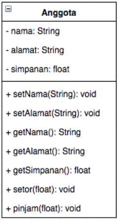

`Screenshot:`

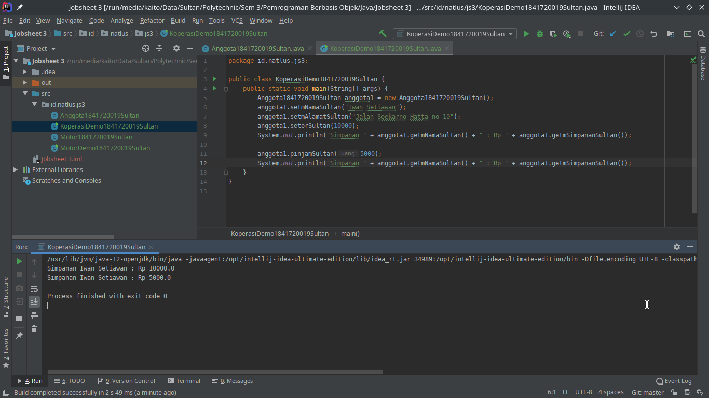

`Kode Program:`

* [Anggota1841720019Sultan](../../src/3_Enkapsulasi/Anggota1841720019Sultan.java)
* [KoperasiDemo1841720019Sultan](../../src/3_Enkapsulasi/KoperasiDemo1841720019Sultan.java)

Jika diperhatikan pada class [Anggota1841720019Sultan](../../src/3_Enkapsulasi/Anggota1841720019Sultan.java), atribut nama dan alamat memili masing-masing 1 getter dan setter. Sedangkan atribut simpanan hanya memiliki getSimpanan() saja, karena seperti tujuan awal, atribut simpanan akan berubah nilainya jika melakukan transaksi setor() dan pinjam/tarik().

Dapat dilihat pada hasil percobaan diatas, untuk mengubah simpanan tidak dilakukan secara langsung dengan mengubah atribut simpanan, melainkan melalui method setor() dan pinjam(). Untuk menampilkan nama pun harus melalui method getNama(), dan untuk menampilkan simpanan melalui getSimpanan().

### Percobaan 4

`Screenshot:`
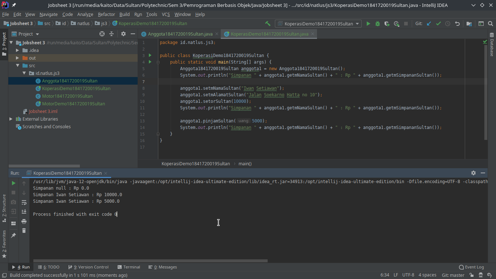

Dapat dilihat hasil running program, ketika dilakukan pemanggilan method getNama() hasilnya hal ini terjadi karena atribut nama belum diset nilai defaultnya. Hal ini dapat ditangani dengan membuat kontruktor.

`Screenshot:`
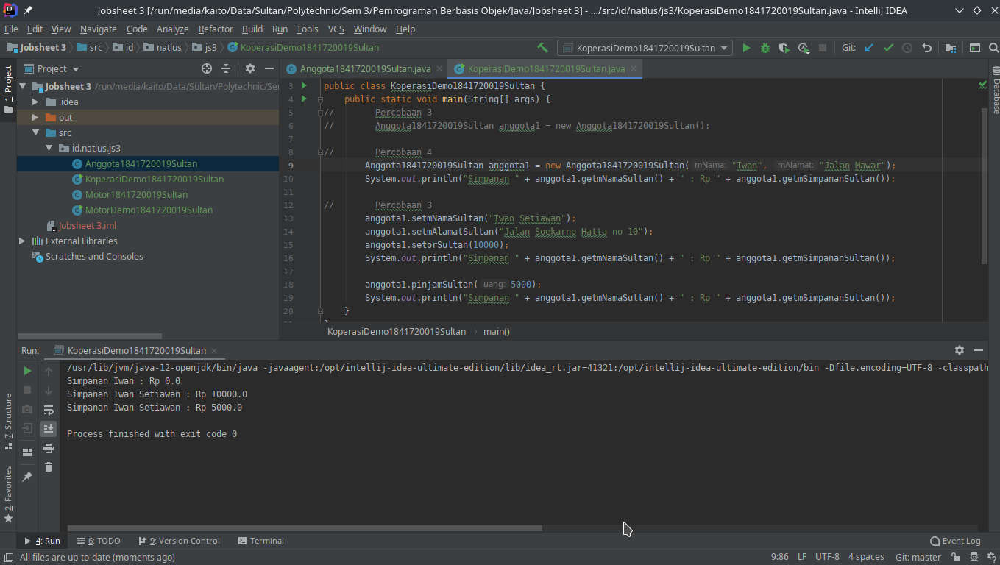

`Kode Program:`

* [Anggota1841720019Sultan](../../src/3_Enkapsulasi/Anggota1841720019Sultan.java)
* [KoperasiDemo1841720019Sultan](../../src/3_Enkapsulasi/KoperasiDemo1841720019Sultan.java)

Pada class Anggota dibuat kontruktor dengan access modifier default yang memiliki 2 parameter nama dan alamat. Dan didalam konstruktor tersebut dipastikan nilai simpanan untuk pertama kali adalah Rp. 0.

Setelah menambah konstruktor pada class Anggoata maka atribut nama dan alamat secara otomatis harus diset terlebih dahulu dengan melakukan passing parameter jika melakukan instansiasi class Anggota. Hal ini biasa dilakukan untuk atribut yang membutuhkan nilai yang spesifik. Jika tidak membutuhkan nilai spesifik dalam konstruktor tidak perlu parameter. Contohnya simpanan untuk anggota baru diset 0, maka simpanan tidak perlu untuk dijadikan parameter pada konstruktor.

### Pertanyaan Percobaan 3 dan 4

1. Apa yang dimaksud getter dan setter?

   `Jawaban:`

    Getter adalah suatu method atau fungsi yang berfungsi untuk mereturn suatu nilai pada variabel, sedangkan Setter adalah suatu method atau fungsi yang berfungsi untuk mengubah nilai dari suatu variabel tertentu

2. Apa kegunaan dari method getSimpanan() (getmSimpananSultan())?

   `Jawaban:`

    Kegunaan dari method tersebut adalah untuk mendapatkan nilai dari variabel private simpanan (mSimpanan) pada class [Anggota1841720019Sultan](../../src/3_Enkapsulasi/Anggota1841720019Sultan.java)

3. Method apa yang digunakan untk menambah saldo?

    `Jawaban:`

    Method yang digunakan untuk menambah saldo adalah method setorSultan().

4. Apa yand dimaksud konstruktor?

    `Jawaban:`

    Konstruktor adalah method khusus yang namanya sama seperti nama classnya, dan konstruktor inilah yang akan dieksekusi pada saat pembuatan objek pertama kali.

5. Sebutkan aturan dalam membuat konstruktor?

    `Jawaban:`

    * Nama konstruktor harus sama dengan nama class
    * Konstruktor tidak memiliki tipe data return
    * Konstruktor tidak boleh menggunakan modifier abstract, static final, dan syncronized

6. Apakah boleh konstruktor bertipe private?

   `Jawaban:`

   Konstruktor bertipe private, protected, public atau default diperbolehkan

7. Kapan menggunakan parameter dengan passsing parameter?

    `Jawaban:`

    Pada saat kita menginginkan sebuah objek tersebut pada saat di instansiasi telah memiliki suatu nilai tertentu yang spesifik.

8. Apa perbedaan atribut class dan instansiasi atribut?

    `Jawaban:`

    Perbedaanya adalah atribut class dideklarasikan, sedangkan instansiasi atribut sudah dideklarasikan dan kita tinggal memanggilnya saja melalui suatu objek.

9. Apa perbedaan class method dan instansiasi method?

    `Jawaban:`

    Perbadaannya adalah class method ada method yang berada dalam suatu class dan jika kita ingin memanggil atau mengaksesnya tinggal panggil method tersebut, jika instansiasi method adalah kita memanggil sebuah method dari class melalui object seperti `object.method()`

## Tugas

### Tugas 1

Cobalah program dibawah ini dan tuliskan hasil outputnya

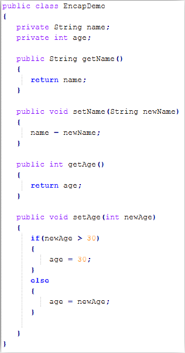
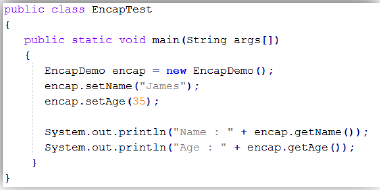

`Screenshot:`
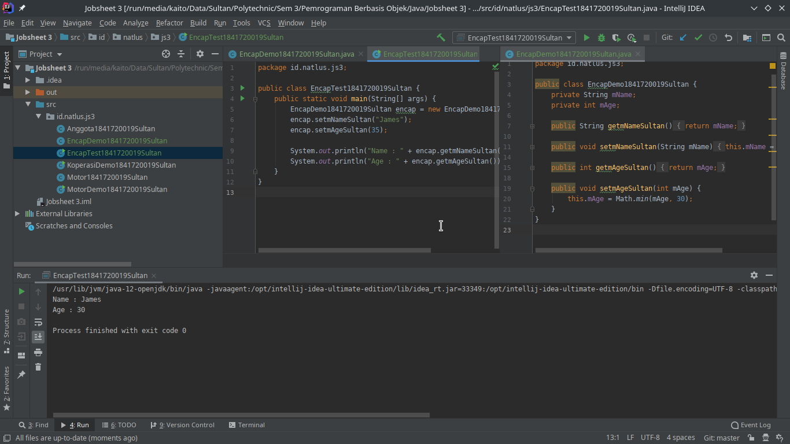

`Kode Program:`

* [EncapTest1841720019Sultan](../../src/3_Enkapsulasi/EncapTest1841720019Sultan.java)
* [EncapDemo1841720019Sultan](../../src/3_Enkapsulasi/EncapDemo1841720019Sultan.java)

### Tugas 2

Pada program diatas, pada class EncapTest kita mengeset age dengan nilai 35, namun pada
saat ditampilkan ke layar nilainya 30, jelaskan mengapa.

`Jawab:`

Karena pada method setmAgeSultan (jika pada Jobsheet setAge) terdapat percabangan jika Age diatas 30 maka age akan 30.

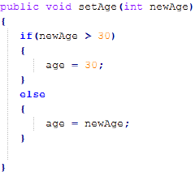

Terlihat pada potongan kode program diatas pada method setAge terdapat percabangan yaitu jika value dari newAge lebih dari 30 maka age akan static di value 30.

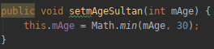

Jika pada kode program yang diatas agak sedikit berbeda syntaxnya, karena saya menggunakan `Math.min`, tapi outputnya sama saja

### Tugas 3

Ubah program diatas agar atribut age dapat diberi nilai maksimal 30 dan minimal 18.

`Screenshot:`

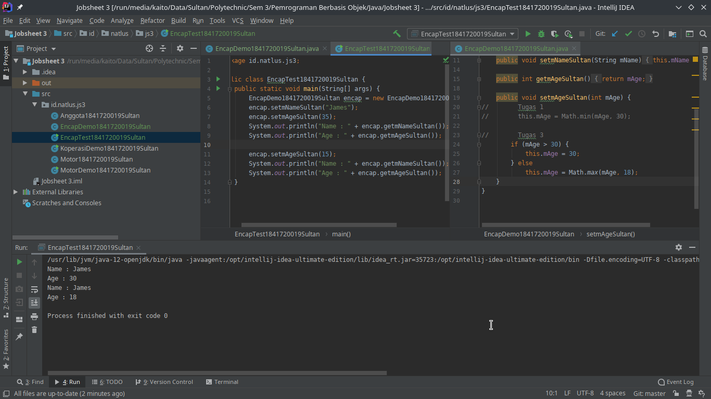

`Kode Program:`

* [EncapTest1841720019Sultan](../../src/3_Enkapsulasi/EncapTest1841720019Sultan.java)
* [EncapDemo1841720019Sultan](../../src/3_Enkapsulasi/EncapDemo1841720019Sultan.java)

### Tugas 4

Pada sebuah sistem informasi koperasi simpan pinjam, terdapat class Anggota yang memiliki atribut antara lain nomor KTP, nama, limit peminjaman, dan jumlah pinjaman. Anggota dapat meminjam uang dengan batas limit peminjaman yang ditentukan. Anggota juga dapat mengangsur pinjaman. Ketika Anggota tersebut mengangsur pinjaman, maka jumlah pinjaman akan berkurang sesuai dengan nominal yang diangsur. Buatlah class Anggota tersebut, berikan atribut, method dan konstruktor sesuai dengan kebutuhan. Uji dengan TestKoperasi berikut ini untuk memeriksa apakah class Anggota yang anda buat telah sesuai dengan yang diharapkan.

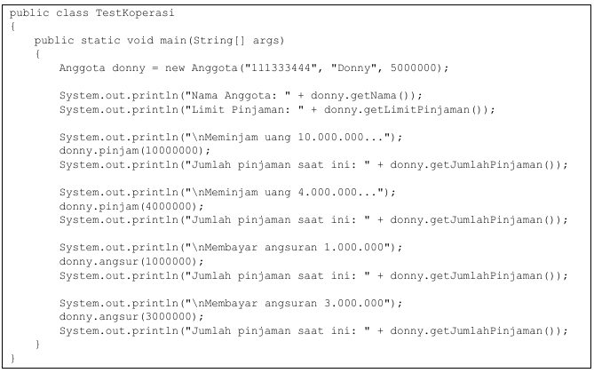

`Hasil yang diharapkan:`

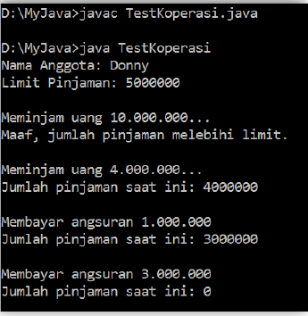

`Screenshot:`

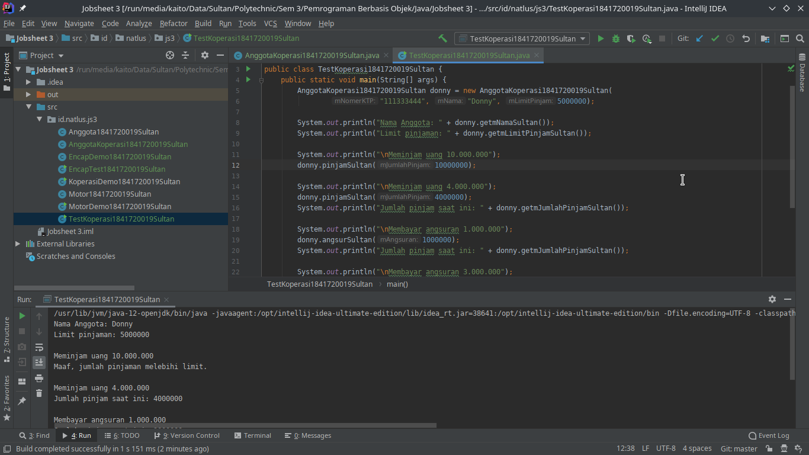

`Kode Program:`

* [AnggotaKoperasi1841720019Sultan](../../src/3_Enkapsulasi/AnggotaKoperasi1841720019Sultan.java)
* [TestKoperasi1841720019Sultan](../../src/3_Enkapsulasi/TestKoperasi1841720019Sultan.java)

### Tugas 5

Modifikasi soal no. 4 agar nominal yang dapat diangsur minimal adalah 10% dari jumlah pinjaman saat ini. Jika mengangsur kurang dari itu, maka muncul peringatan “Maaf, angsuran harus 10% dari jumlah pinjaman”.

Kunci dari penambahan ini terletak pada file [* [AnggotaKoperasi1841720019Sultan](../../src/3_Enkapsulasi/AnggotaKoperasi1841720019Sultan.java), Pada method angsurSultan(), yaitu syntax:

```Java
...
    if (mAngsuran >= (0.1 * mJumlahPinjam)) {
        ...
    } else
        ...
```

`Screenshot:`

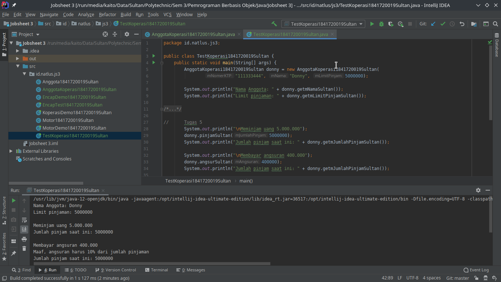
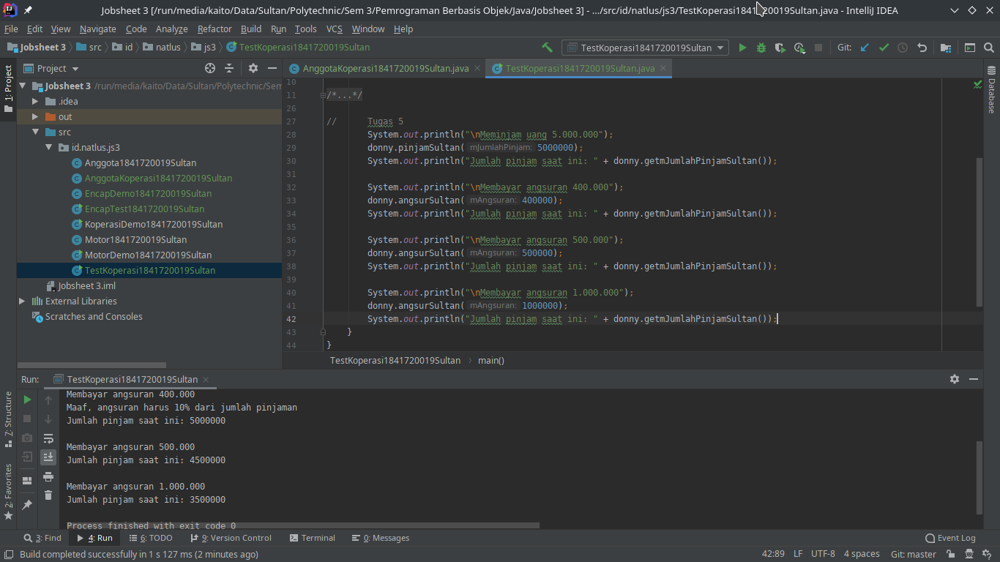

`Kode Program:`

* [AnggotaKoperasi1841720019Sultan](../../src/3_Enkapsulasi/AnggotaKoperasi1841720019Sultan.java)
* [TestKoperasi1841720019Sultan](../../src/3_Enkapsulasi/TestKoperasi1841720019Sultan.java)

### Tugas 6

Modifikasi class TestKoperasi, agar jumlah pinjaman dan angsuran dapat menerima input dari console.

Mengubah inputan agar menjadi dinamis menggunakan library `java.util.Scanner`

`Screenshot:`

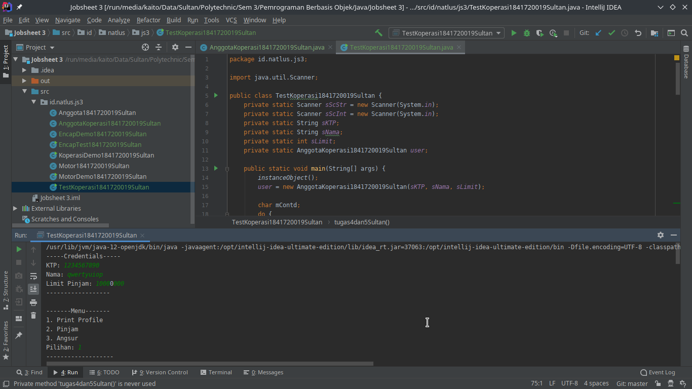
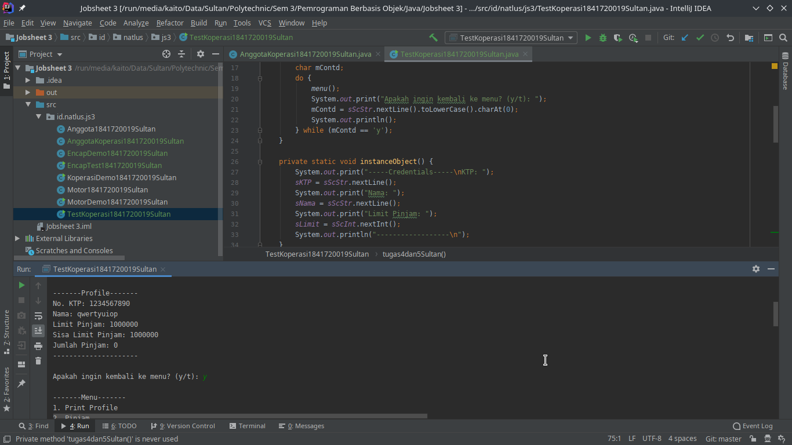
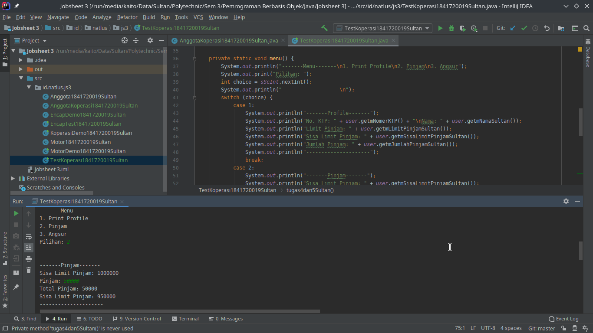
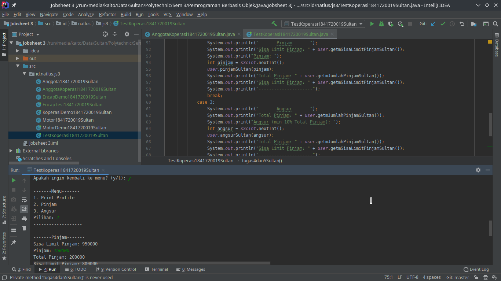
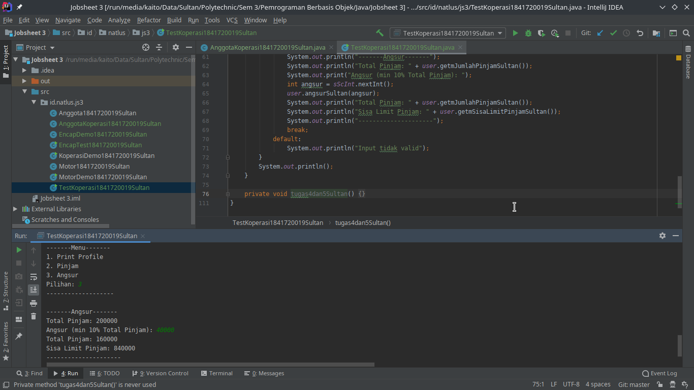

`Kode Program:`

* [AnggotaKoperasi1841720019Sultan](../../src/3_Enkapsulasi/AnggotaKoperasi1841720019Sultan.java)
* [TestKoperasi1841720019Sultan](../../src/3_Enkapsulasi/TestKoperasi1841720019Sultan.java)

## Kesimpulan

Dari percobaan diatas, telah dipelajari kosep dari enkapsulasi kontruktor, access modifier yang terdiri dari 4 jenis yaitu public, protected, default dan private. Konsep atribut atau method class yang ada di dalam blok code class dan konsep instansiasi atribut atau method. Cara penggunaan getter dan setter beserta fungsi dari getter dan setter. Dan juga telah dipelajari atau memahami notasi UML

## Pernyataan Diri

Saya menyatakan isi tugas, kode program, dan laporan praktikum ini dibuat oleh saya sendiri. Saya tidak melakukan plagiasi, kecurangan, menyalin/menggandakan milik orang lain.

Jika saya melakukan plagiasi, kecurangan, atau melanggar hak kekayaan intelektual, saya siap untuk mendapat sanksi atau hukuman sesuai peraturan perundang-undangan yang berlaku.

Ttd,

***Sultan Achmad Qum Masykuro NS***
