# Laporan Praktikum #4 - Relasi Class

## Kompetensi

Setelah menempuh pokok bahasan ini, mahasiswa mampu:

1. Memahami konsep relasi kelas.
2. Mengimplementasikan relasi has‐a dalam program.

## Ringkasan Materi

Tetapi ada kalanya relasi class melibatkan lebih dari satu. Hal ini disebut dengan multiplicity. Untuk relasi lebih rinci mengenai multiplicity, dapat dilihat pada tabel berikut.

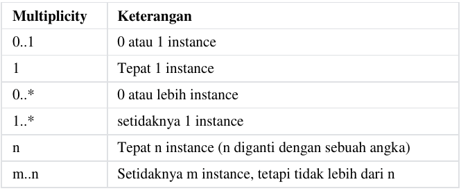

## Percobaan

### Percobaan 1

Perhatikan diagram *class* berikut:
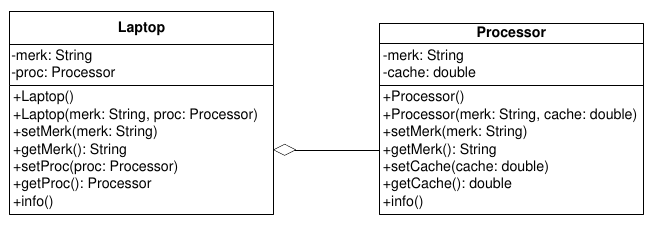

Mengikuti langkah-langkah yang diberikan di jobsheet mulai dari poin b - s.

`Screenshot:`
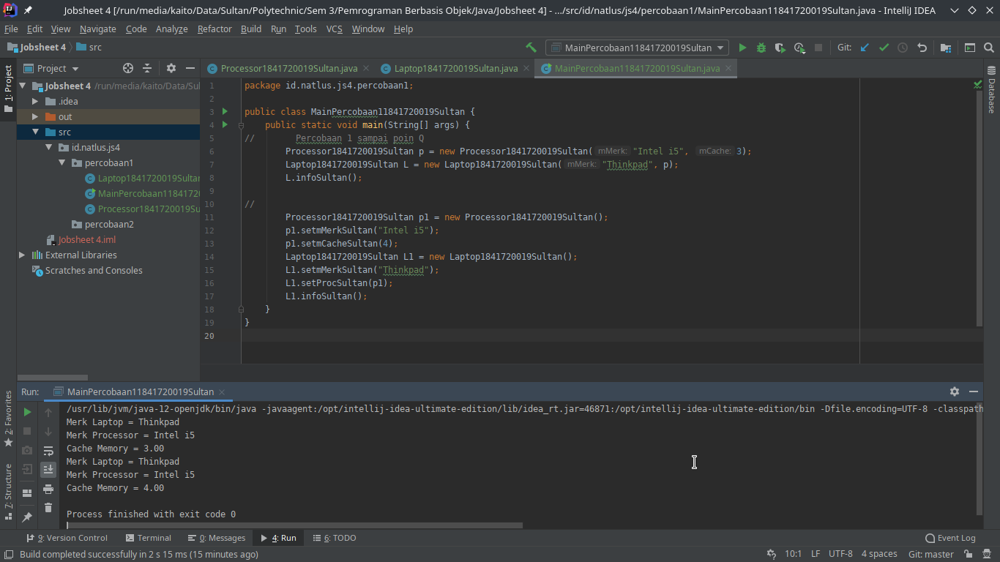

`Kode Program:`

* [Laptop1841720019Sultan.java](../../src/4_Relasi_Class/Laptop1841720019Sultan.java)
* [Processor1841720019Sultan.java](../../src/4_Relasi_Class/Processor1841720019Sultan.java)
* [MainPercobaan11841720019Sultan.java](../../src/4_Relasi_Class/MainPercobaan11841720019Sultan.java)

### Percobaan 2

Perhatikan diagram *class* berikut yang menggambarkan sistem rental mobil. Pelanggan bisa menyewa mobil sekaligus sopir. Biaya sopir dan biaya sewa mobil dihitung per hari.

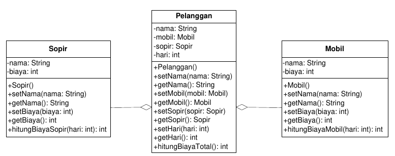

Mengikuti langkah-langkah yang diberikan di jobsheet mulai dari poin a - m.

`Screenshot:`
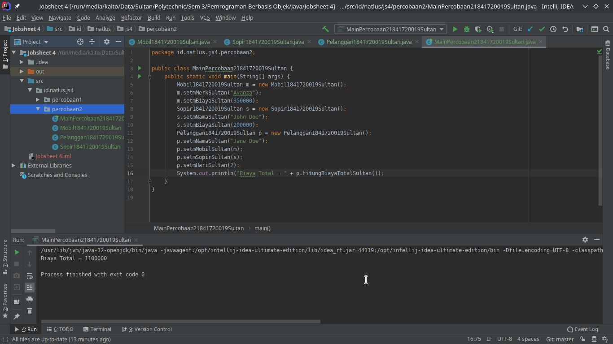

`Kode Program:`

* [Mobil1841720019Sultan.java](../../src/4_Relasi_Class/Mobil1841720019Sultan.java)
* [Sopir1841720019Sultan.java](../../src/4_Relasi_Class/Sopir1841720019Sultan.java)
* [Pelanggan1841720019Sultan.java](../../src/4_Relasi_Class/Pelanggan1841720019Sultan.java)
* [MainPercobaan21841720019Sultan.java](../../src/4_Relasi_Class/MainPercobaan21841720019Sultan.java)

### Percobaan 3

Mengikuti langkah-langkah yang diberikan di jobsheet mulai dari poin a - n.

`Diagram Class:`

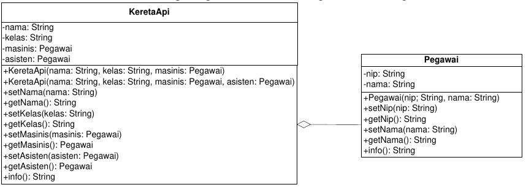

`Screenshot:`
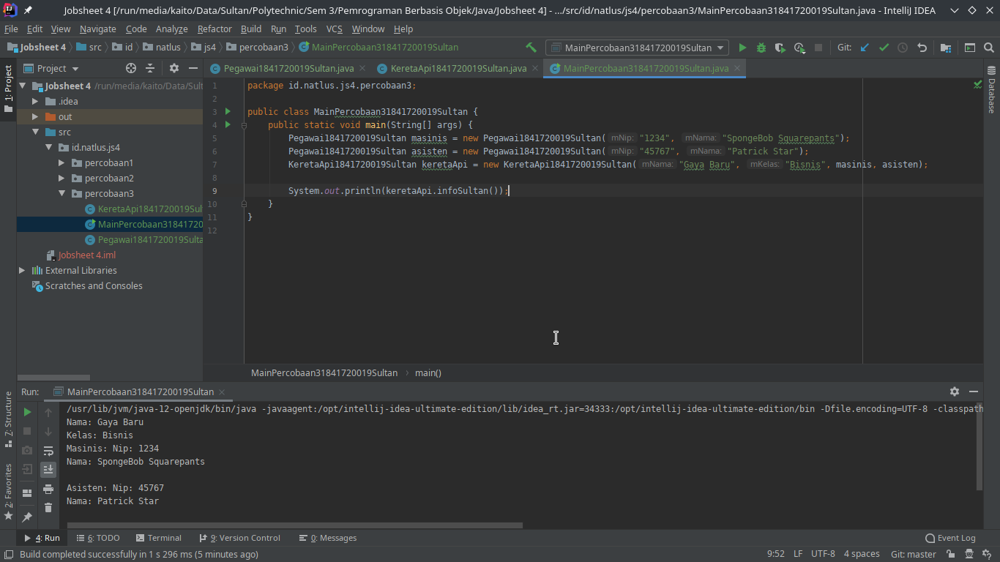

`Kode Program:`

* [Pegawai1841720019Sultan.java](../../src/4_Relasi_Class/Pegawai1841720019Sultan.java)
* [KeretaApi1841720019Sultan.java](../../src/4_Relasi_Class/KeretaApi1841720019Sultan.java)
* [MainPercobaan31841720019Sultan.java](../../src/4_Relasi_Class/MainPercobaan31841720019Sultan.java)

### Pecobaan 4

Mengikuti langkah-langkah yang diberikan di jobsheet mulai dari poin a - i.

`Diagram Class:`

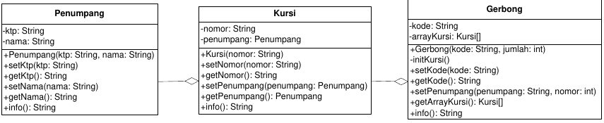

`Screenshot:`
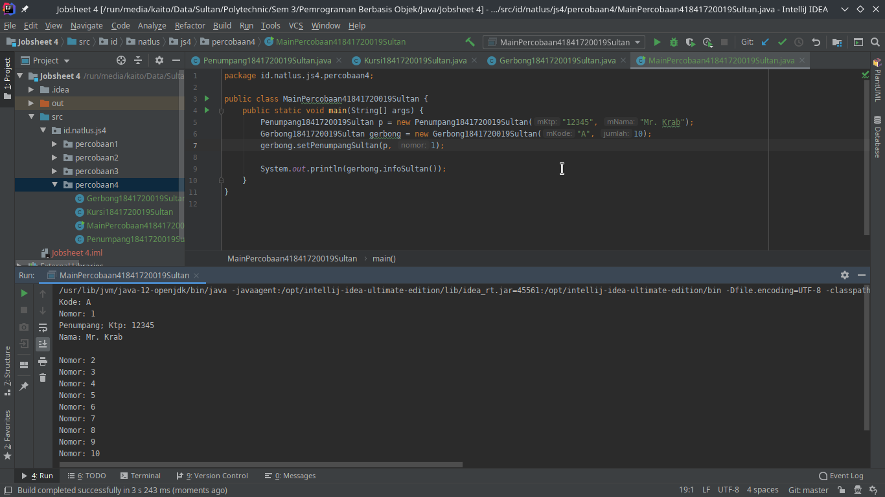

`Kode Program:`

* [Gerbong1841720019Sultan.java](../../src/4_Relasi_Class/Gerbong1841720019Sultan.java)
* [Kursi1841720019Sultan.java](../../src/4_Relasi_Class/Kursi1841720019Sultan.java)
* [Penumpang1841720019Sultan.java](../../src/4_Relasi_Class/Penumpang1841720019Sultan.java)
* [MainPercobaan41841720019Sultan.java](../../src/4_Relasi_Class/MainPercobaan41841720019Sultan.java)

## Pertanyaan

### Pertanyaan Percobaan 1

1. Di dalam *class* `Processor` dan *class* `Laptop`, terdapat method *setter* dan *getter* untuk masing‐masing atributnya. Apakah gunanya *method setter* dan *getter* tersebut ?

    `Jawaban:`

    Method *setter* digunakan untuk mengubah value dari variabel yang ada dalam class.

    Method *getter* digunakan untuk mendapatkan value dari variabel yang ada dalam class

2. Di dalam *class* `Processor` dan *class* `Laptop`, masing‐masing terdapat konstruktor default dan konstruktor berparameter. Bagaimanakah beda penggunaan dari kedua jenis konstruktor ters  ebut ?

    `Jawaban:`

    Konstruktor default digunakan pada saat kita ingin instansiasi object tanpa mengisi value untuk variabel class yang biasanya dilakukan lewat parameter konstruktor objek

    Konstruktor berparameter digunakan pada saat kita ingin instansiasi object yang variabel dalam classnya langsung terisi value lewat parameter konstruktor.

3. Perhatikan *class* `Laptop`, di antara 2 atribut yang dimiliki (*merk* dan *proc*), atribut manakah yang bertipe *object* ?

    `Jawaban:`

    atribut yang bertipe *object* adalah ***`proc`*** karena proc bertipe data bukan String, int atau yang lainnya melainkan bertipe data Processor yaitu class, sehingga jadi object

4. Perhatikan *class* `Laptop`, pada baris manakah yang menunjukan bahwa *class* `Laptop` memiliki relasi dengan *class* `Processor` ?

    `Jawaban:`

    Syntax yang menunjukkan *class* `Laptop` memiliki relasi dengan *class* `Processor`

   ```java
   private Processor1841720019Sultan proc;

   public Laptop1841720019Sultan(String mMerk, Processor1841720019Sultan proc) {
       this.mMerk = mMerk;
       this.proc = proc;
   }
   ```

   dapat dilihat pada syntax diatas bahwa variabel proc pada *class* `Laptop` adalah object dari *class* `Processor` dan pada constructor terdapat parameter yang membutuhkan class `Processor`.

5. Perhatikan pada *class* `Laptop` , Apakah guna dari sintaks `proc.info()` ?

    `Jawaban:`

    Kegunaan dari syntax `proc.info()` pada *class* `Laptop` adalah untuk menampilkan method info pada object proc

    ```Java
    public void infoSultan() {
        System.out.println("Merk Laptop = " + mMerk);
        proc.infoSultan();
    }
    ```

    `proc.info()` akan merujuk pada file [Processor1841720019Sultan.java](../../src/4_Relasi_Class/Processor1841720019Sultan.java) pada method `infoSultan()` yang berisi:

    ```Java
    public void infoSultan() {
        System.out.println("Merk Processor = " + mMerk);
        System.out.printf("Cache Memory = %.2f\n", mCache);
    }
    ```

6. Pada *class* `MainPercobaan1`, terdapat baris kode: `Laptop l = new Laptop("Thinkpad", p);`. Apakah `p` tersebut ?

    Dan apakah yang terjadi jika baris kode tersebut diubah menjadi:

    ```java
    Laptop l = new Laptop("Thinkpad", new Processor("Intel i5",3));
    ```

    Bagaimanakah hasil program saat dijalankan, apakah ada perubahan ?

    `Jawaban:`

    Saat sudah diubah baris kodenya seperti diatas dan dijalankan tidak terjadi perubahan, karena syntax

    ```java
    Laptop l = new Laptop("Thinkpad", new Processor("Intel i5",3));
    ```

    sama dengan syntax yang lama yaitu

    ```java
    Processor1841720019Sultan p = new Processor1841720019Sultan("Intel i5", 3);
    Laptop1841720019Sultan L = new Laptop1841720019Sultan("Thinkpad", p);
    ```

    hanya saja pada syntax yang baru lebih ringkas karena inisialisasi object processor yang akan digunakan oleh object laptop langsung pada saat inisialisasi object laptop.

### Pertanyaan Percobaan 2

1. Perhatikan *class* `Pelanggan`. Pada baris program manakah yang menunjukan bahwa *class* `Pelanggan` memiliki relasi dengan *class* `Mobil` dan *class* `Sopir` ?

    `Jawaban:`

    Pada syntax

    ```java
    private Mobil1841720019Sultan mMobil;
    private Sopir1841720019Sultan mSopir;
    ```

2. Perhatikan *method* `hitungBiayaSopir` pada class Sopir, serta method `hitungBiayaMobil` pada class Mobil. Mengapa menurut Anda *method* tersebut harus memiliki argument hari ?

    `Jawaban:`

    Karena jika tidak ditambahkan argument hari maka tidak akan bisa menhitung harga, dikarenakan perhitungan harga rental pada studi kasus ini menggunakan hitungan hari.

    dan penyebab hari menjadi argument karena data hari didapatkan dari class Pelanggan.

3. Perhatikan kode dari class Pelanggan. Untuk apakah perintah `mobil.hitungBiayaMobil(hari)` dan `sopir.hitungBiayaSopir(hari)` ?

    `Jawaban:`

    perintah `mobil.hitungBiayaMobil(hari)` dan `sopir.hitungBiayaSopir(hari)` digunakan untuk memanggil method `hitungBiayaMobil` yang ada pada *class* `mobil` yang akan mereturn biaya harga mobil berdasarkan per hari, dan method `hitungBiayaSopir` pada *class* `sopir` yang akan mereturn biaya harga sopir berdasarkan per hari

4. Perhatikan *class* `MainPercobaan2`. Untuk apakah sintaks `p.setMobil(m)` dan `p.setSopir(s)` ?

    `Jawaban:`

    sintaks `p.setMobil(m)` dan `p.setSopir(s)` digunakan untuk mengisi value dari variabel object `mobil` dan `sopir` yang ada pada *class* `pelanggan` menggunakan object `m` dan `s` yang telah diinstansiasi sebelumnya

5. Perhatikan class `MainPercobaan2`. Untuk apakah proses `p.hitungBiayaTotal()` tersebut ?

    `Jawaban:`

    proses `p.hitungBiayaTotal()` digunakan untuk mereturn total dari method `hitungBiayaMobilSultan` pada class `mobil` ditambah method `hitungBiayaSopirSultan` pada class `sopir`

6. Perhatikan class `MainPercobaan2`, coba tambahkan pada baris terakhir dari *method main* dan amati perubahan saat di‐*run*!

    ```Java
    System.out.println(p.getMobil().getMerk());
    ```

    Jadi untuk apakah sintaks `p.getMobil().getMerk()` yang ada di dalam method main tersebut?

    `Jawaban:`

    sintaks `p.getMobil().getMerk()` digunakan untuk mendapatkan value dari variabel `merk` yang berada pada *class* `mobil` melalui *class* `pelanggan`.

    berikut hasil outputnya:

    `Screenshot:`
    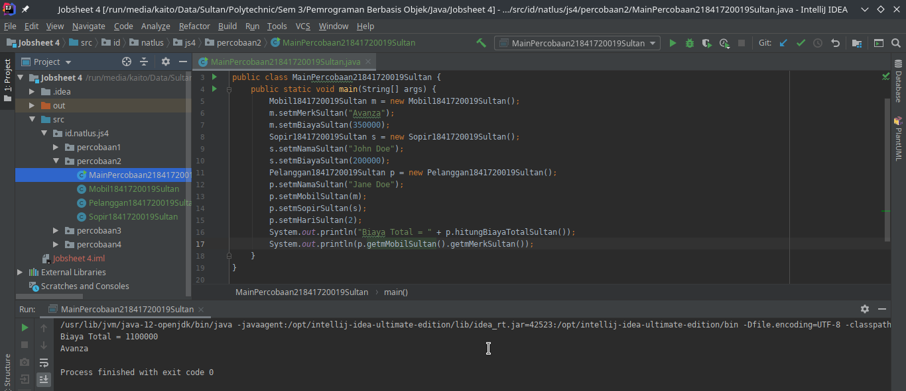

### Pertanyaan Percobaan 3

1. Di dalam *method* `info()` pada *class* `KeretaApi`, baris `this.masinis.info()` dan `this.asisten.info()` digunakan untuk apa ?

    `Jawaban:`

    Digunakan untuk memanggil method `info` yang akan mereturn value `Nip dan Nama` pegawai, dalam konteks diatas adalah `Masinis` dan `Asisten`.

2. Buatlah *main* program baru dengan nama *class* `MainPertanyaan` pada *package* yang sama. Tambahkan kode berikut pada *method* `main()` !

    ```Java
    Pegawai masinis = new Pegawai("1234", "Spongebob Squarepants");
    KeretaApi keretaApi = new KeretaApi("Gaya Baru", "Bisnis" masinis);

    System.out.println(keretaApi.info());
    ```

    `Jawaban:`

    sudah saya buat.

    `Screenshot:`
    

    `Kode Program:`

    * [Pegawai1841720019Sultan.java](../../src/4_Relasi_Class/Pegawai1841720019Sultan.java)
    * [KeretaApi1841720019Sultan.java](../../src/4_Relasi_Class/KeretaApi1841720019Sultan.java)
    * [MainPertanyaan1841720019Sultan.java](../../src/4_Relasi_Class/MainPertanyaan1841720019Sultan.java)

3. Apa hasil output dari main program tersebut ? Mengapa hal tersebut dapat terjadi ?

    `Jawaban:`

    Hasil output akan error seperti berikut:

    `Screenshot:`
    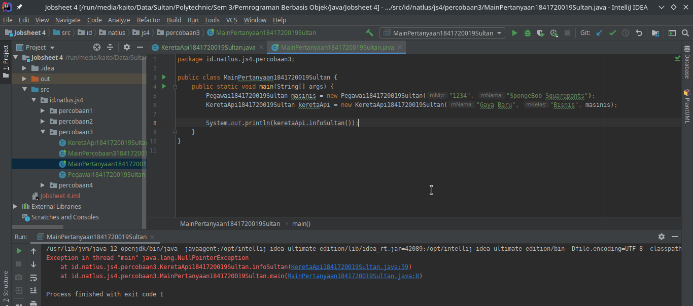

    `Text:`

    ```java
    Exception in thread "main" java.lang.NullPointerException
    at id.natlus.js4.percobaan3.KeretaApi1841720019Sultan.infoSultan(KeretaApi1841720019Sultan.java:59)
    at id.natlus.js4.percobaan3.MainPertanyaan1841720019Sultan.main(MainPertanyaan1841720019Sultan.java:8)
    ```

    dikarenakan pada class `KeretaApi` method `infoSultan` terdapat syntax yang akan selalu memanggil method `infoSultan` dari object `mAsisten` dimanana `mAsisten` dalam keadaan `null` sehingga akan selalu error `Null Pointer Exception` saat tidak ada value untuk `mAsisten`.

4. Perbaiki class KeretaApi sehingga program dapat berjalan !

    `Jawaban:`

    Sudah saya perbaiki.

    `Screenshot:`
    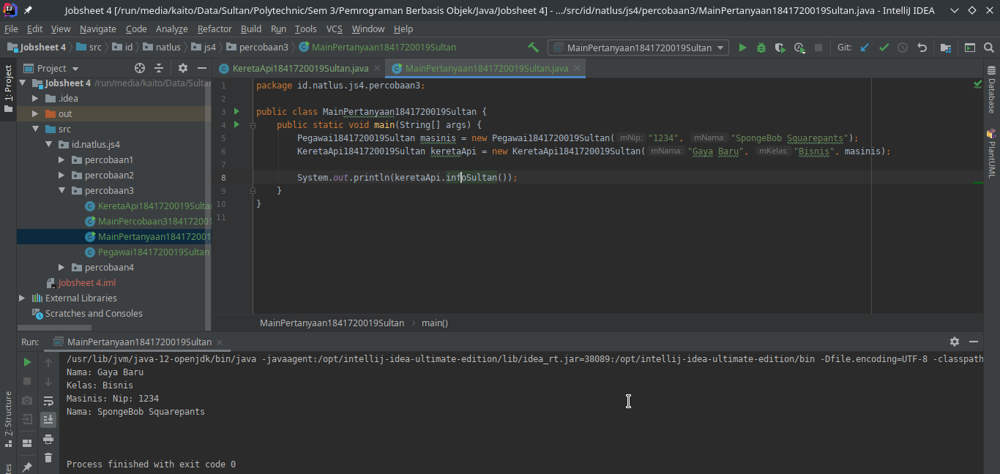

    `Kode Program:`

    * [Pegawai1841720019Sultan.java](../../src/4_Relasi_Class/Pegawai1841720019Sultan.java)
    * [KeretaApi1841720019Sultan.java](../../src/4_Relasi_Class/KeretaApi1841720019Sultan.java)
    * [MainPertanyaan1841720019Sultan.java](../../src/4_Relasi_Class/MainPertanyaan1841720019Sultan.java)

    Saya hanya menambahkan percabangan agar tidak sampai terjadi error `Null Pointer Exception` berikut adalah kode program yang saya tambahkan:

    ```java
    if (this.mAsisten != null)
        info += "Asisten: " + this.mAsisten.infoSultan() + "\n";
    ```

### Pertanyaan Percobaan 4

1. Pada *main* program dalam *class* `MainPercobaan4`, berapakah jumlah kursi dalam Gerbong A ?

    `Jawaban:`

    Jumlah kursi pada gerbong A berjumlah 10 Kursi.

2. Perhatikan potongan kode pada *method* `info()` dalam *class* `Kursi`. Apa maksud kode tersebut ?

    ```java
    ...
    if (this.penumpang != null) {
        info += "Penumpang: " + penumpang.info() + "\n";
    }
    ...
    ```

    `Jawaban:`

    Maksud dari kode program tersebut adalah jika value dari `penumpang` tidak `null` maka akan menambahkan String Penumpang ditambah return dari method `info` dari class `Penumpang` pada variabel info yang lama.

3. Mengapa pada *method* `setPenumpang()` dalam *class* `Gerbong`, nilai nomor dikurangi dengan angka 1 ?

    `Jawaban:`

    Karena kursi menggunakan Array, dan Array index awalnya adalah 0.

4. Instansiasi objek baru budi dengan tipe `Penumpang`, kemudian masukkan objek baru tersebut pada gerbong dengan `gerbong.setPenumpang(budi, 1)`. Apakah yang terjadi ?

    `Jawaban:`

    Yang akan terjadi adalah data penumpang akan terganti menjadi budi dikarenakan kursi nomor 1 yang sebelumnya terdapat penumpang `Mr. Krab` ditimpa kembali dengan object penumpang baru `budi` dengan mengisi kursi nomor 1.

    `Screenshot:`
    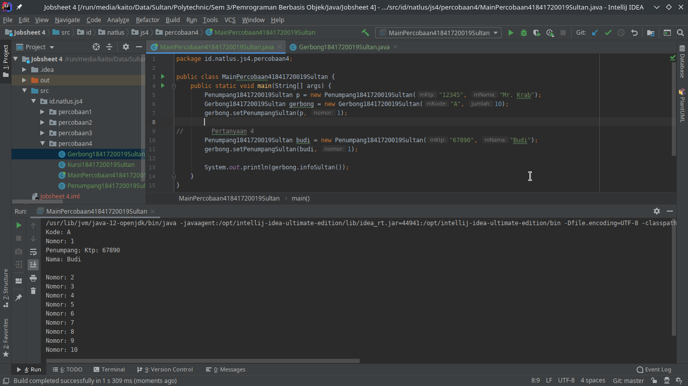

    `Kode Program:`

    * [Gerbong1841720019Sultan.java](../../src/4_Relasi_Class/Gerbong1841720019Sultan.java)
    * [Kursi1841720019Sultan.java](../../src/4_Relasi_Class/Kursi1841720019Sultan.java)
    * [Penumpang1841720019Sultan.java](../../src/4_Relasi_Class/Penumpang1841720019Sultan.java)
    * [MainPercobaan41841720019Sultan.java](../../src/4_Relasi_Class/MainPercobaan41841720019Sultan.java)

5. Modifikasi program sehingga tidak diperkenankan untuk menduduki kursi yang sudah ada penumpang lain !

    `Jawaban:`

    `Screenshot:`
    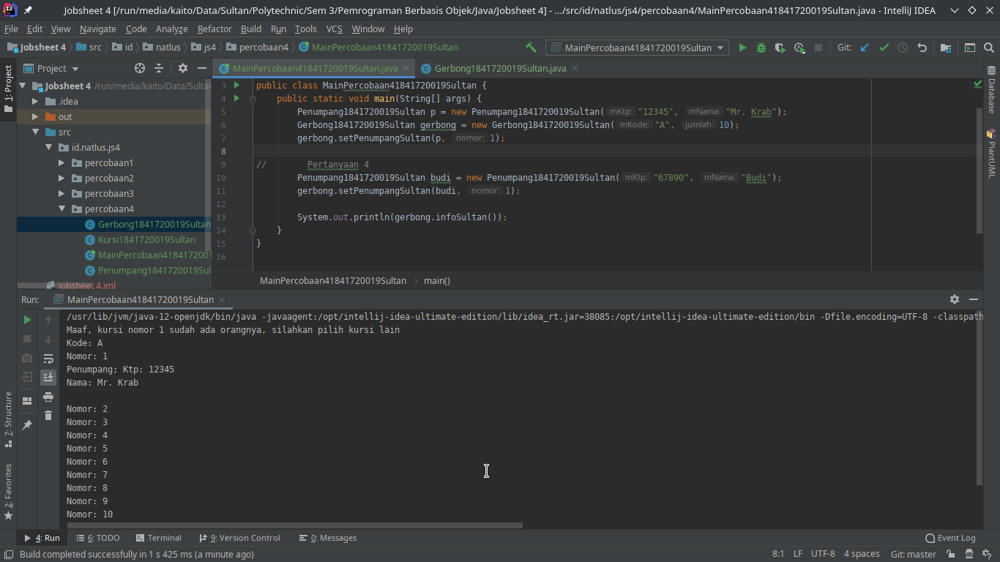

    `Kode Program:`

    * [Gerbong1841720019Sultan.java](../../src/4_Relasi_Class/Gerbong1841720019Sultan.java)
    * [Kursi1841720019Sultan.java](../../src/4_Relasi_Class/Kursi1841720019Sultan.java)
    * [Penumpang1841720019Sultan.java](../../src/4_Relasi_Class/Penumpang1841720019Sultan.java)
    * [MainPercobaan41841720019Sultan.java](../../src/4_Relasi_Class/MainPercobaan41841720019Sultan.java)

    Saya hanya menambahakn percabangan, kode program yang saya tambahkan seperti berikut:

    ```java
    if (mArrayKursi[nomor - 1].getmPenumpangSultan() != null)
        System.out.println("Maaf, kursi nomor " + nomor + " sudah ada orangnya, silahkan pilih kursi lain");
    else
        this.mArrayKursi[nomor - 1].setmPenumpangSultan(penumpang);
    ```

### Tugas

Buatlah sebuah studi kasus, rancang dengan class diagram, kemudian implementasikan ke dalam program! Studi kasus harus mewakili relasi class dari percobaan‐percobaan yang telah dilakukan pada materi ini, setidaknya melibatkan minimal 4 class (class yang berisi main tidak dihitung).

`Diagram Class:`

`Screenshot:`

`Kode Program:`

## Kesimpulan

Dari percobaan diatas, telah dipelajari konsep relasi kelas, dan mempelajari relasi has-a dalam program

## Pernyataan Diri

Saya menyatakan isi tugas, kode program, dan laporan praktikum ini dibuat oleh saya sendiri. Saya tidak melakukan plagiasi, kecurangan, menyalin/menggandakan milik orang lain.

Jika saya melakukan plagiasi, kecurangan, atau melanggar hak kekayaan intelektual, saya siap untuk mendapat sanksi atau hukuman sesuai peraturan perundang-undangan yang berlaku.

Ttd,

***Sultan Achmad Qum Masykuro NS***
