# Laporan Praktikum #7 - Overriding dan Overloading

## Kompetensi

Setelah menempuh pokok bahasan ini, mahasiswa mampu :

1. Memahami konsep overloading dan overriding,
2. Memahami perbedaan overloading dan overriding,
3. Ketepatan dalam mengidentifikasi method overriding dan overloading
4. Ketepatan dalam mempraktekkan instruksi pada jobsheet
5. Mengimplementasikan method overloading dan overriding.
  
## Ringkasan Materi

1. **Overloading**

    Adalah menuliskan kembali method dengan nama yang sama pada suatu class. Tujuannya dapat memudahkan penggunaan/pemanggilan method dengan fungsionalitas yang mirip. Untuk aturan pendeklarasian method Overloading sebagai berikut:

    1. Nama method harus sama.
    2. Daftar parameter harus berbeda
    3. Return type boleh sama, juga boleh berbeda

    Ada beberapa daftar parameter pada Overloading dapat dilihat sebagai berikut

    1. Perbedaan daftar parameter bukan hanya terjadi pada perbedaan banyaknya parameter, tetapi juga urutan dari parameter tersebut.
    2. Misalnya saja dua buah parameter berikut ini:
        * Function_member (int x, String n)
        * Function_member (String n, int x)
    3. Dua parameter tersebut juga di anggap berbeda daftar parameternya
    4. Misalntya saja 2 daftar parameter berikut:
        * Function_member (int x)
        * Function_member (int y)
    5. Dua daftar parameter diatas dianggap sama karena yang berbeda hanya penamaan variabel parameter saja

    Overloading juga bisa terjadi antara parent class dengan subclass-nya jika memenuhi ketiga syarat overload. ada beberapa aturan overloading yaitu:

    1. Primitive widening conversion didahulukan dalam overloading dibandingkan boxing dan var args
    2. Kita tidak dapat melakukan proses widening dari tipe wrapper ke tipe wrapper lainnya (mengubah Integer ke Long)
    3. Kita tidak dapat melakukan proses widening dilanjutkan boxing (dari int menjadi Long)
    4. Kita tidak dapat melakukan boxing dilanjutkan dengan widening (int dapat menjadi Object melalui Integer)
    5. Kita dapat menggabungkan var args dengan salah satu yaitu widening atau boxing

2. **Overriding**

    Adalah Sublass yang berusaha memodifkasi tingkah laku yang diwarisi dari superclass. Tujuannya subclass dapat memiliki tingkah laku yang lebih spesifik sehingga dapat dilakukan dengan cara mendeklarasikan kembali method milik parent class di subclass. Deklarasi method pada subclass harus sama dengan yang terdapat di super class. Kesamaan pada:

    1. Nama
    2. Return Type (untuk return type : class Aatau merupakan subclass dari class A)
    3. Daftar parameter (jumlah, tipe dan urutan)

    Sehingga method pada parent class disebut overriden method dan method pada subclass disebut overriding method, Ada beberapa aturan method didalam overriding:

    1. Mode akses overriding method harus sama atau lebih luas dari pada overriden method.
    2. Subclass hanya boleh meng-override method superclass satu kali saja, tidak boleh ada lebih dari satu method pada kelas yang sama persis
    3. Overriding method tidak boleh throw checked exceptions yang tidak dideklarasikan oleh overriden method

## Percobaan

Untuk kasus contoh berikut ini, terdapat tiga kelas, yaitu Karyawan, Manager, dan Staff. Class Karyawan merupakan superclass dari Manager dan Staff dimana subclass Manager dan Staff memiliki method untuk menghitung gaji yang berbeda.

`UML:`

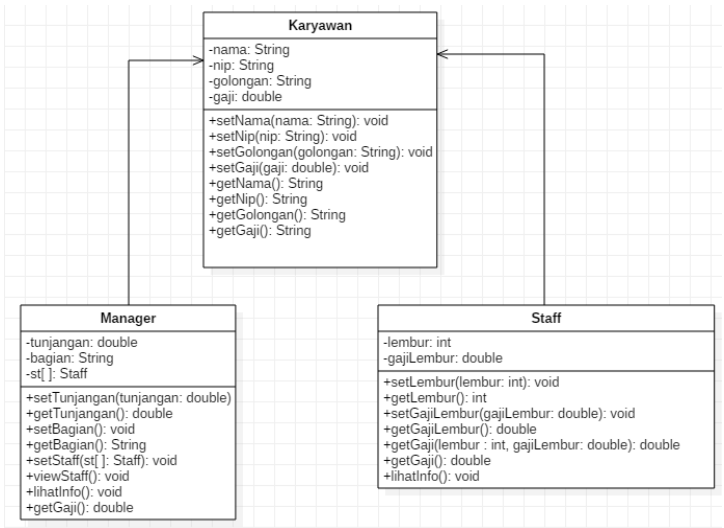

`Screenshot:`

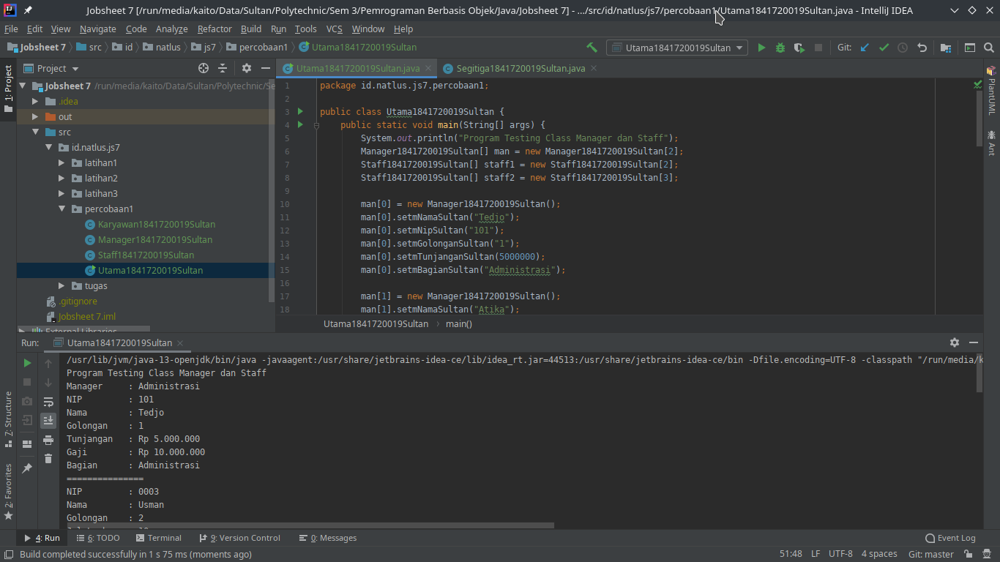
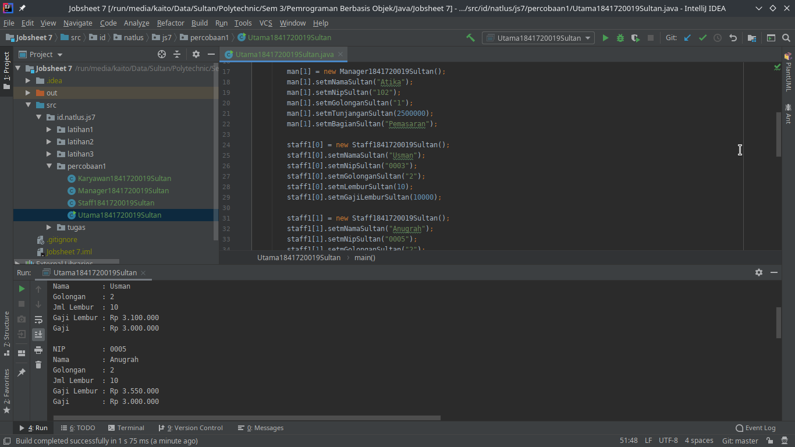
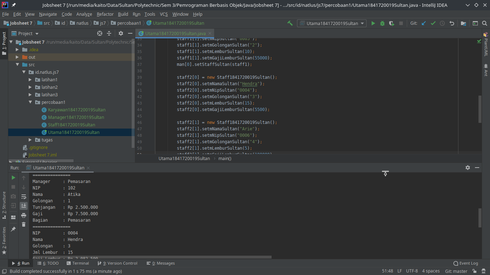
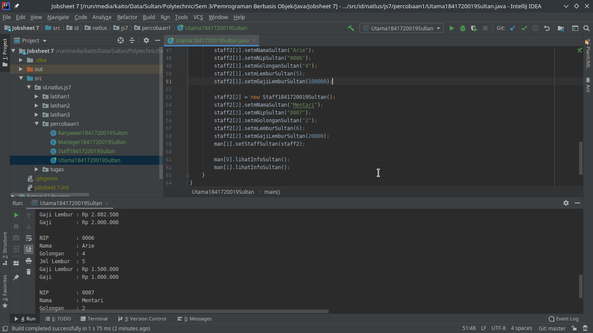
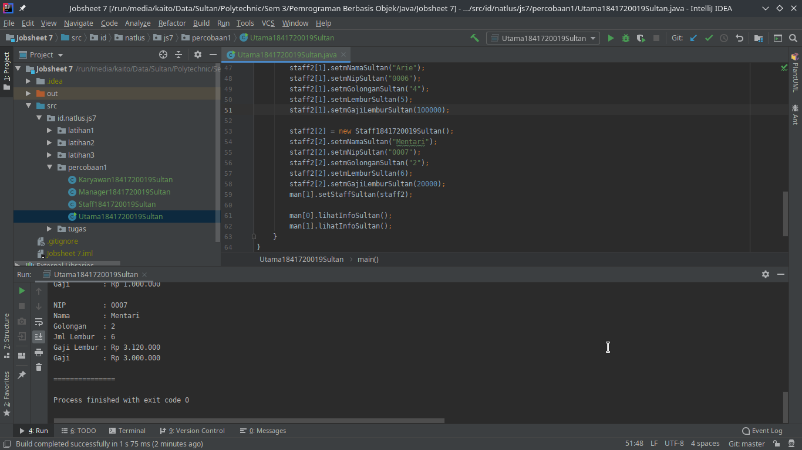

`Kode Program:`

* [Karyawan1841720019Sultan.java](../../src/7_Overriding_dan_Overloading/percobaan1/Karyawan1841720019Sultan.java)
* [Manager1841720019Sultan.java](../../src/7_Overriding_dan_Overloading/percobaan1/Manager1841720019Sultan.java)
* [Staff1841720019Sultan.java](../../src/7_Overriding_dan_Overloading/percobaan1/Staff1841720019Sultan.javat)
* [Utama1841720019Sultan.java](../../src/7_Overriding_dan_Overloading/percobaan1/Utama1841720019Sultan.java)

## Pertanyaan

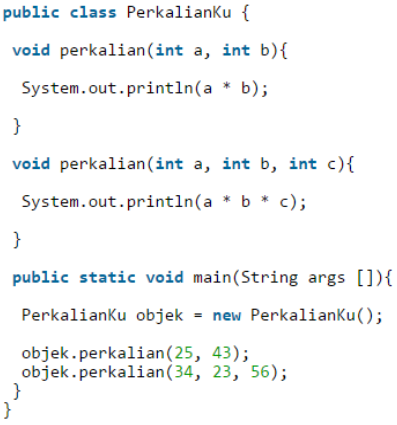

`Screenshot:`

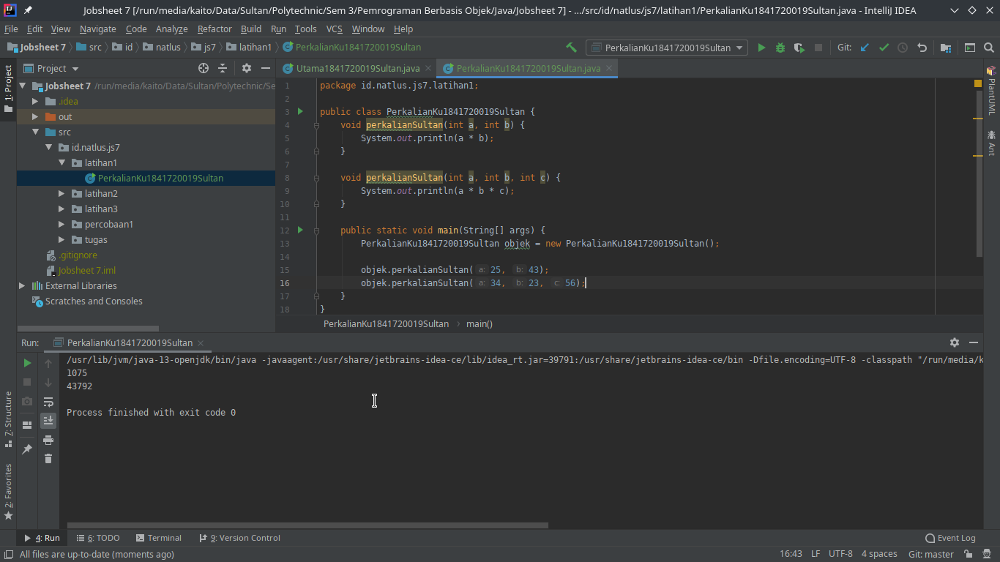

`Kode Program:`

* [PerkalianKu1841720019Sultan.java](../../src/7_Overriding_dan_Overloading/latihan1/PerkalianKu1841720019Sultan.java)

1. Dari Source coding diatas terletak dimanakah Overloading?

    `Jawaban:`

    Overloading terletak pada *method* `perkalian`.

2. Jika terdapat overloading ada berapa jumlah parameter yang berbeda?

    `Jawaban:`

    Jumlah paramater yang berbeda ada 1 yaitu ditambahkannya parameter `int c` pada *method* `perkalian` yang ke 2.

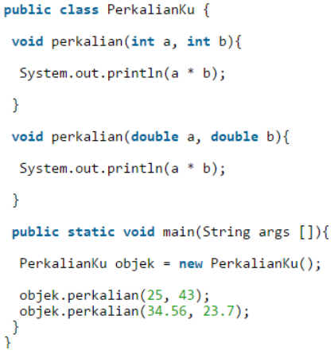

`Screenshot:`

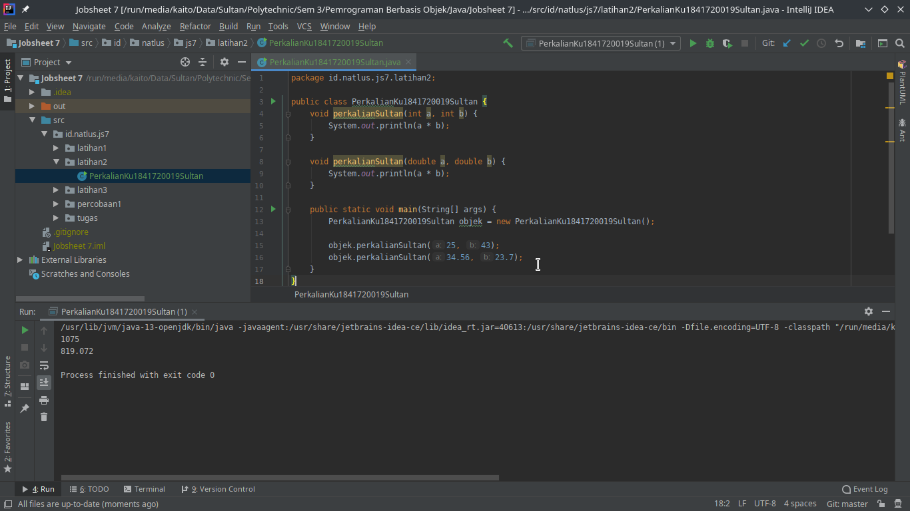

`Kode Program:`

* [PerkalianKu1841720019Sultan.java](../../src/7_Overriding_dan_Overloading/latihan2/PerkalianKu1841720019Sultan.java)

3. Dari Source coding diatas terletak dimanakah Overloading?

    `Jawaban:`

    Overloading terletak pada *method* `perkalian` dimana pada *method* `perkalian` ke 2 menggunakan tipe data parameter yang berbeda yaitu `double`

4. Jika terdapat overloading ada berapa tipe parameter yang berbeda?

    `Jawaban:`

    Parameter yang berbeda dari method sebelumnya ada 2 parameter yaitu parameter `a` dan `b`, yang semula semua parameter tersebut beripe data `int` menjadi bertipe data `double`.

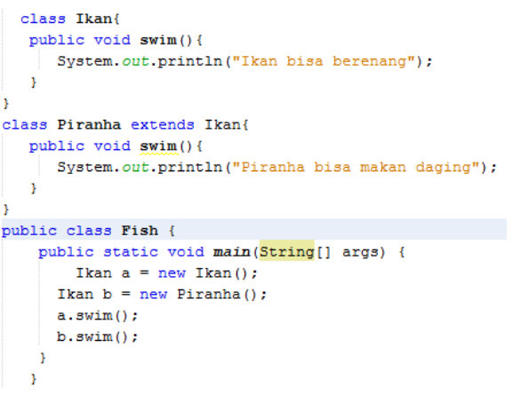

`Screenshot:`

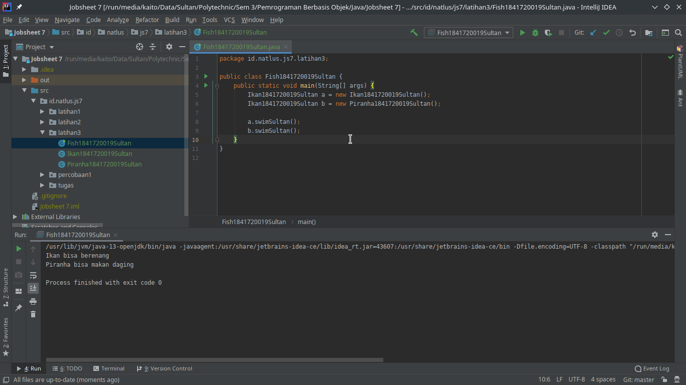

`Kode Program:`

* [Ikan1841720019Sultan.java](../../src/7_Overriding_dan_Overloading/latihan3/Ikan1841720019Sultan.java)
* [Piranha1841720019Sultan.java](../../src/7_Overriding_dan_Overloading/latihan3/Piranha1841720019Sultan.java)
* [Fish1841720019Sultan.java](../../src/7_Overriding_dan_Overloading/latihan3/Fish1841720019Sultan.java)

5. Dari Source coding diatas terletak dimanakah Overriding?

    `Jawaban:`

    Overriding terletak pada class `Piranha` pada method `swim`.

6. Jabarkanlah apabila source code diatas terdapat Overriding

    `Jawaban:`

    Karena method `swim` sudah ada di class parentnya yaitu class `Ikan` maka pada class Piranha method `swim` adalah Overriding, dan pada method `swim` di class Piranha yang diubah adalah isi method bukanlah parameter juga seperti ciri - ciri Overloading.

## Tugas

### Overloading

Implementasikan konsep overloading pada class diagram dibawah ini:

`UML:`

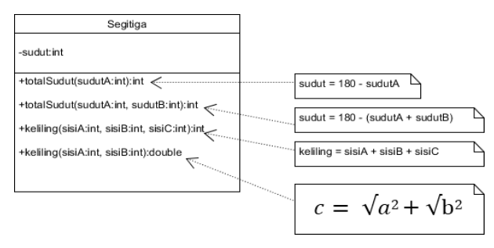

***Catatan: Atas permintaan Dosen maka untuk method keliling dengan return double diganti menjadi rumus pythagoras.***

`Screenshot:`

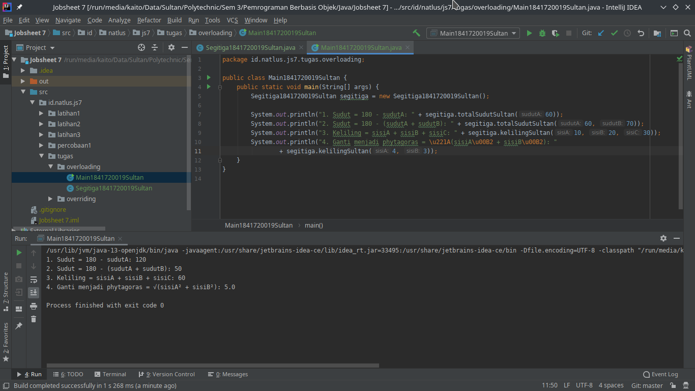

`Kode Program:`

* [Segitiga1841720019Sultan.java](../../src/7_Overriding_dan_Overloading/tugas/overloading/Segitiga1841720019Sultan.java)
* [Main1841720019Sultan.java](../../src/7_Overriding_dan_Overloading/tugas/overloading/Main1841720019Sultan.java)

### Overriding

Implementasikan class diagram dibawah ini dengan menggunakan teknik dynamic method dispatch.

`UML:`

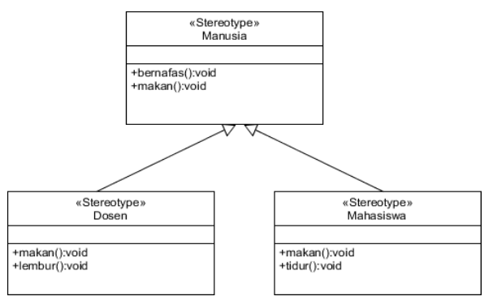

`Screenshot:`

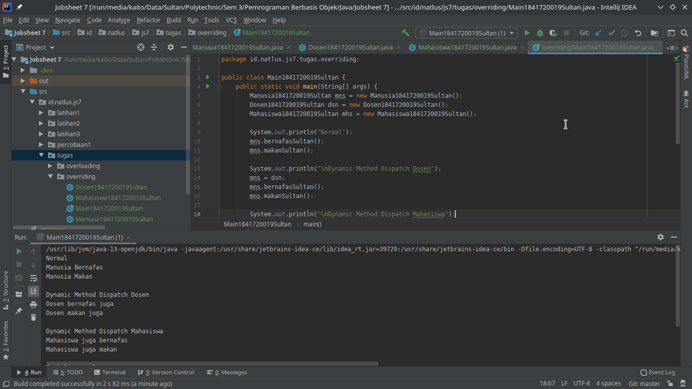
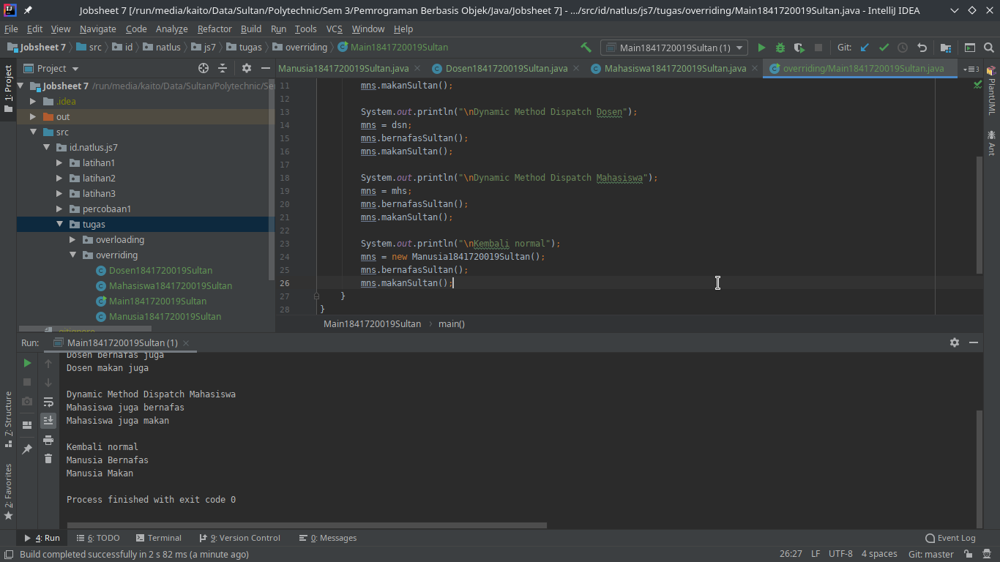

`Kode Program:`

* [Manusia1841720019Sultan.java](../../src/7_Overriding_dan_Overloading/tugas/overriding/Manusia1841720019Sultan.java)
* [Dosen1841720019Sultan.java](../../src/7_Overriding_dan_Overloading/tugas/overriding/Dosen1841720019Sultan.java)
* [Mahasiswa1841720019Sultan.java](../../src/7_Overriding_dan_Overloading/tugas/overriding/Mahasiswa1841720019Sultan.java)
* [Main1841720019Sultan.java](../../src/7_Overriding_dan_Overloading/tugas/overriding/Main1841720019Sultan.java)

## Kesimpulan

Kesimpulan yang saya dapat setelah menyelesaikan Percobaan, Pertanyaan, dan Tugas diatas adalah :

1. Saya mampu memahami konsep overloading dan overriding,
2. Saya mampu memahami perbedaan overloading dan overriding,
3. saya mampu dalam mengidentifikasi method overriding dan overloading secara tepat.
4. Saya mampu dalam mempraktekkan instruksi pada jobsheet secara tepat.
5. Saya mampu mengimplementasikan method overloading dan overriding.

## Pernyataan Diri

Saya menyatakan isi tugas, kode program, dan laporan praktikum ini dibuat oleh saya sendiri. Saya tidak melakukan plagiasi, kecurangan, menyalin/menggandakan milik orang lain.

Jika saya melakukan plagiasi, kecurangan, atau melanggar hak kekayaan intelektual, saya siap untuk mendapat sanksi atau hukuman sesuai peraturan perundang-undangan yang berlaku.

Ttd,

***Sultan Achmad Qum Masykuro NS***
