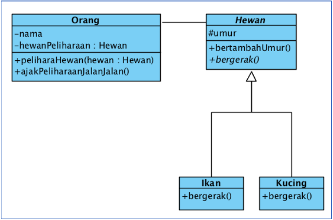
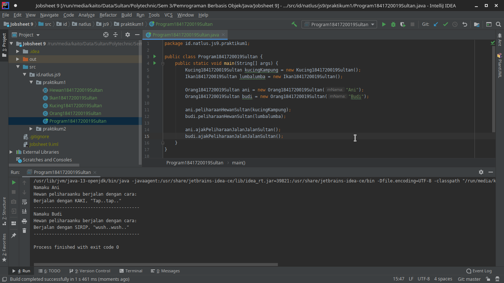
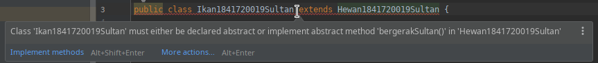
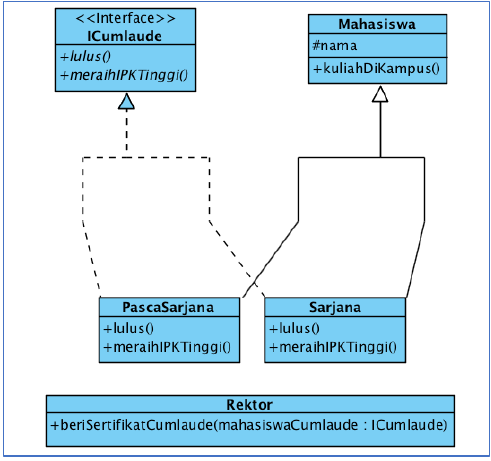
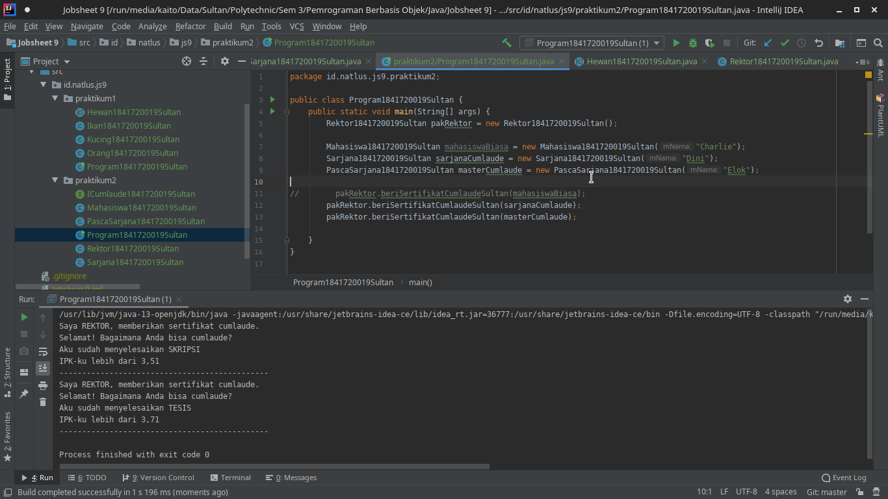
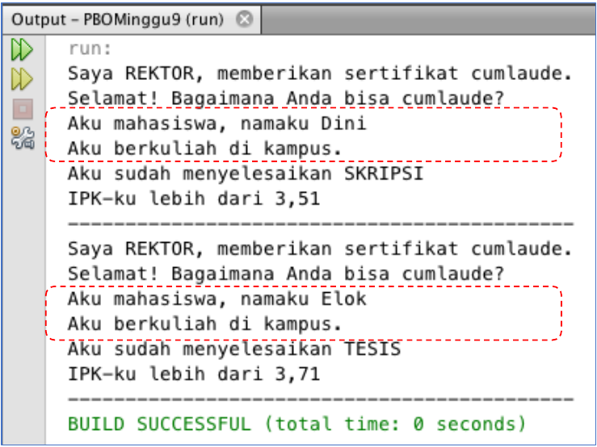
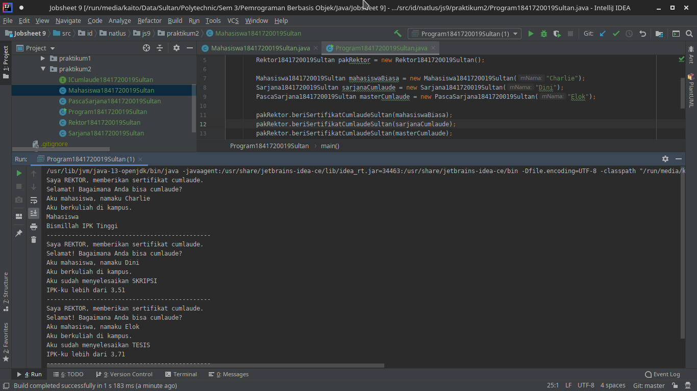
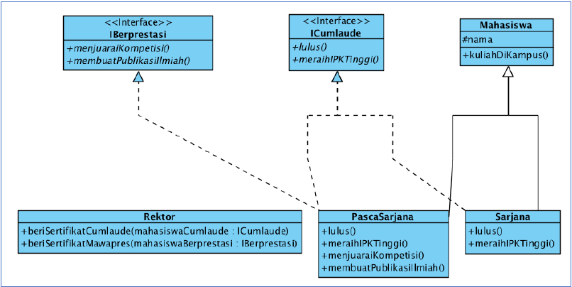
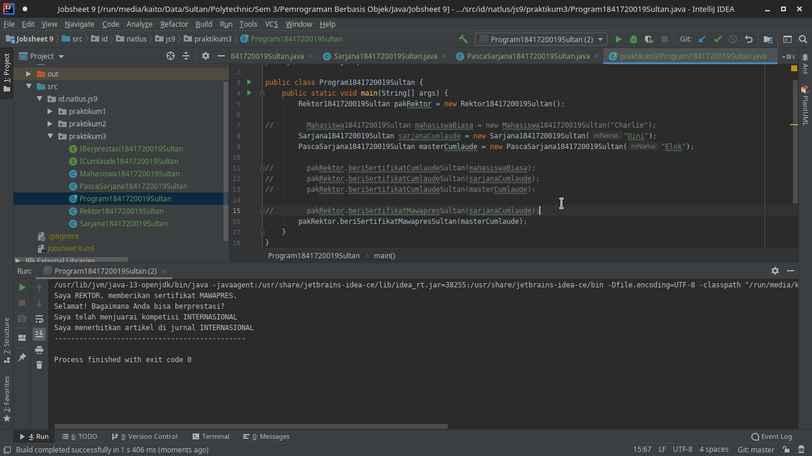
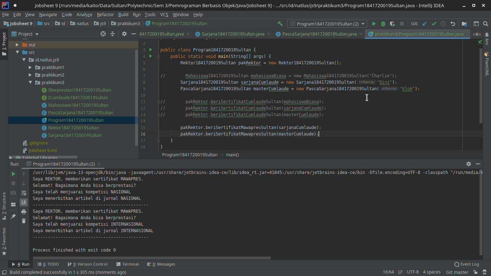

# Laporan Praktikum #9 - Abstract Class dan Interface

## Kompetensi

Setelah menyelesaikan lembar kerja ini mahasiswa diharapkan mampu:

1. Menjelaskan maksud dan tujuan penggunaan Abstract Class;
2. Menjelaskan maksud dan tujuan penggunaan Interface;
3. Menerapkan Abstract Class dan Interface di dalam pembuatan program.

## Ringkasan Materi

### Abstract Class

`example`

```java
public abstract class Test() {
    privaate int mUmur;

    public abstract void bergerakSultan();
}
```

* Karakteristik
  
  1. Dapat memeiliki *properties* dan *methods* seperti class biasa.
  2. Selalu memeiliki *methods* yang tidak memiliki *body* (hanya deklarasi saja), disebut juga *abstract method*.
  3. Selalu dideklarasikan dengan menggunakan kata kunci `abstract class`

* Kegunaan

    Mengggambarkan sesuatu yang bersifat umum, yang hanya bisa berfungsi setelah ia dideskripsikan ke dalam bentuk yang lebih spesifik

### Interface

`example`

```java
public interface ITest {
    void lulusSulltan();
}
```

* Karakteristik
  
  1. Tidak ada apa-apa di dalamnya selain *abstract methods*.
  2. Di konvensi bahasa pemrograman Java, namanya dianjurkan untuk selalu diawali dengan huruf kapital ‘I’.
  3. Selalu dideklarasikan dengan menggunakan kata kunci *interface*.
  4. Diimplementasikan dengan menggunakan kata kunci *implements*.

* Kegunaan

    Bertindak seperti semacam kontrak/syarat yang HARUS dipenuhi bagi suatu class agar class tersebut dapat dianggap sebagai ‘sesuatu yang lain’.

## Percobaan

### Percobaan 1



`Screenshot`



`Kode Program`

* [Hewan1841720019Sultan.java](../../src/9_Abstract_Class_dan_Interface//praktikum1/Hewan1841720019Sultan.java)
* [Kucing1841720019Sultan.java](../../src/9_Abstract_Class_dan_Interface//praktikum1/Kucing1841720019Sultan.java)
* [Ikan1841720019Sultan.java](../../src/9_Abstract_Class_dan_Interface//praktikum1/Ikan1841720019Sultan.java)
* [Orang1841720019Sultan.java](../../src/9_Abstract_Class_dan_Interface//praktikum1/Orang1841720019Sultan.java)
* [Program1841720019Sultan.java](../../src/9_Abstract_Class_dan_Interface//praktikum1/Program1841720019Sultan.java)

### Pertanyaan Percobaan 1

1. Bolehkah apabila sebuah class yang meng-*extend* suatu *abstract class* tidak mengimplementasikan *method abstract* yang ada di class induknya? Buktikan!

    `Jawaban`

    Tidak boleh, jika kita meng-*extend* suatu *abstract class* dan tidak mengimplementasikan *method abstract*  maka akan muncul error dan cara untuk mengatasinya adalah dengan cara mengimplementasikannya.

    `Screenshot`

    

### Percobaan 2



`Screenshot`



`Kode Program`

* [ICumlaude1841720019Sultan.java](../../src/9_Abstract_Class_dan_Interface/praktikum2/ICumlaude1841720019Sultan.java)
* [Mahasiswa1841720019Sultan.java](../../src/9_Abstract_Class_dan_Interface/praktikum2/Mahasiswa1841720019Sultan.java)
* [Sarjana1841720019Sultan.java](../../src/9_Abstract_Class_dan_Interface/praktikum2/Sarjana1841720019Sultan.java)
* [PascaSarjana1841720019Sultan.java](../../src/9_Abstract_Class_dan_Interface/praktikum2/PascaSarjana1841720019Sultan.java)
* [Rektor1841720019Sultan.java](../../src/9_Abstract_Class_dan_Interface/praktikum2/Rektor1841720019Sultan.java)
* [Program1841720019Sultan.java](../../src/9_Abstract_Class_dan_Interface/praktikum2/Program1841720019Sultan.java)

### Pertanyaan Percobaan 2

1. Mengapa pada langkah nomor 9 terjadi error? Jelaskan!

    `Jawaban`

    Dikarenakan tipe data parameter pada method `beriSertifikatCumlaude`  di*class* `Rektor` yang digunakan adalah `ICumlaude` dan pada *class* `Mahasiswa` belum implements `ICumlaude`.

2. Dapatkah method **kuliahDiKampus()** dipanggil dari objek **sarjanaCumlaude** di class **Program**? Mengapa demikian?

   `Jawaban`

    Bisa, dikarenakan *class* `Sarjana` yang merupakan objek `sarjanaCumlaude` merupakan subclass dari `Mahasiswa`.

3. Dapatkah method **kuliahDiKampus()** dipanggil dari parameter **mahasiswa** di method **beriSertifikatCumlaude()** pada class **Rektor?** Mengapa demikian?

    `Jawaban`

    Tidak bisa, dikarenakan parameter *mahasiswa* bertipe data *ICumlaude*.

4. Modifikasilah method **beriSertifikatCumlaude()** pada class **Rektor** agar hasil eksekusi class **Program** menjadi seperti berikut ini:

    

    `Jawaban`

    `Screenshot`

    

    `Kode Program`

   * [ICumlaude1841720019Sultan.java](../../src/9_Abstract_Class_dan_Interface/praktikum2/ICumlaude1841720019Sultan.java)
   * [Mahasiswa1841720019Sultan.java](../../src/9_Abstract_Class_dan_Interface/praktikum2/Mahasiswa1841720019Sultan.java)
   * [Sarjana1841720019Sultan.java](../../src/9_Abstract_Class_dan_Interface/praktikum2/Sarjana1841720019Sultan.java)
   * [PascaSarjana1841720019Sultan.java](../../src/9_Abstract_Class_dan_Interface/praktikum2/PascaSarjana1841720019Sultan.java)
   * [Rektor1841720019Sultan.java](../../src/9_Abstract_Class_dan_Interface/praktikum2/Rektor1841720019Sultan.java)
   * [Program1841720019Sultan.java](../../src/9_Abstract_Class_dan_Interface/praktikum2/Program1841720019Sultan.java)

### Percobaan 3



`Screenshot`



`Kode Program`

* [ICumlaude1841720019Sultan.java](../../src/9_Abstract_Class_dan_Interface/praktikum3/ICumlaude1841720019Sultan.java)
* [IBerprestasi1841720019Sultan.java](../../src/9_Abstract_Class_dan_Interface/praktikum3/IBerprestasi1841720019Sultan.java)
* [Mahasiswa1841720019Sultan.java](../../src/9_Abstract_Class_dan_Interface/praktikum3/Mahasiswa1841720019Sultan.java)
* [Sarjana1841720019Sultan.java](../../src/9_Abstract_Class_dan_Interface/praktikum3/Sarjana1841720019Sultan.java)
* [PascaSarjana1841720019Sultan.java](../../src/9_Abstract_Class_dan_Interface/praktikum3/PascaSarjana1841720019Sultan.java)
* [Rektor1841720019Sultan.java](../../src/9_Abstract_Class_dan_Interface/praktikum3/Rektor1841720019Sultan.java)
* [Program1841720019Sultan.java](../../src/9_Abstract_Class_dan_Interface/praktikum3/Program1841720019Sultan.java)

### Pertanyaan Percobaan 3

1. Apabila Sarjana Berprestasi harus menjuarai kompetisi NASIONAL dan menerbitkan artikel di jurnal NASIONAL, maka modifikasilah class-class yang terkait pada aplikasi Anda agar di class Program objek pakRektor dapat memberikan sertifikat mawapres pada objek sarjanaCumlaude.

    `Jawaban`

    `Screenshot`

    

    `Kode Program`

   * [ICumlaude1841720019Sultan.java](../../src/9_Abstract_Class_dan_Interface/praktikum3/ICumlaude1841720019Sultan.java)
   * [IBerprestasi1841720019Sultan.java](../../src/9_Abstract_Class_dan_Interface/praktikum3/IBerprestasi1841720019Sultan.java)
   * [Mahasiswa1841720019Sultan.java](../../src/9_Abstract_Class_dan_Interface/praktikum3/Mahasiswa1841720019Sultan.java)
   * [Sarjana1841720019Sultan.java](../../src/9_Abstract_Class_dan_Interface/praktikum3/Sarjana1841720019Sultan.java)
   * [PascaSarjana1841720019Sultan.java](../../src/9_Abstract_Class_dan_Interface/praktikum3/PascaSarjana1841720019Sultan.java)
   * [Rektor1841720019Sultan.java](../../src/9_Abstract_Class_dan_Interface/praktikum3/Rektor1841720019Sultan.java)
   * [Program1841720019Sultan.java](../../src/9_Abstract_Class_dan_Interface/praktikum3/Program1841720019Sultan.java)

## Kesimpulan

1. Saya mampu menjelaskan maksud dan tujuan penggunaan Abstract Class;
2. Saya mampu menjelaskan maksud dan tujuan penggunaan Interface;
3. Saya mampu menerapkan Abstract Class dan Interface di dalam pembuatan program.

## Pernyataan Diri

Saya menyatakan isi tugas, kode program, dan laporan praktikum ini dibuat oleh saya sendiri. Saya tidak melakukan plagiasi, kecurangan, menyalin/menggandakan milik orang lain.

Jika saya melakukan plagiasi, kecurangan, atau melanggar hak kekayaan intelektual, saya siap untuk mendapat sanksi atau hukuman sesuai peraturan perundang-undangan yang berlaku.

Ttd,

***Sultan Achmad Qum Masykuro NS***
